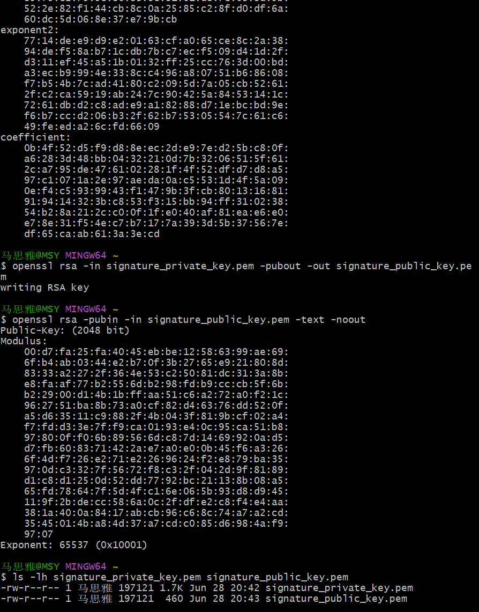

# Lab11：数字签名 —— 验证消息的真实性与完整性

## 实验简介

### 从哈希函数到数字签名

在前面的实验中，你已经学习了：

- **对称加密**（Lab1-Lab4）：使用相同的密钥进行加密和解密，适合大量数据的快速加密
- **非对称加密**（Lab5-Lab8）：使用公钥加密、私钥解密，解决了密钥分发问题
- **哈希函数**（Lab9）：将任意长度的数据映射为固定长度的摘要，具有单向性和抗碰撞性
- **公钥密码学应用**（Lab10）：RSA、ElGamal 等公钥加密系统的原理和实现

这些都是密码学的基础工具。但它们单独使用时，都有各自的局限：

- **对称加密**能保证机密性，但无法证明发送者身份
- **非对称密码学**可以用私钥生成签名来证明身份，但直接对大文件使用非对称运算效率太低
- **哈希函数**能检测数据是否被篡改，但无法证明哈希值本身是谁计算的

**数字签名**就是将这些工具组合起来，解决一个核心问题：**如何在不安全的网络中，让接收者确信一条消息确实来自声称的发送者，且内容未被篡改？**

### 数字签名解决的问题

想象以下场景：

**场景一：软件发布**
你从网上下载了一个软件安装包。网站上提供了文件的 SHA-256 哈希值。你下载后计算哈希，发现和网站上的一致。但问题来了：**网站本身可能被黑客入侵，哈希值也被替换了**。你如何确认这个哈希值确实是软件开发者发布的，而不是攻击者伪造的？

**场景二：电子邮件**
你收到一封"来自老板"的邮件，要求立即转账。邮件地址看起来很像老板的邮箱。但你如何确认这封邮件真的是老板发的，而不是钓鱼邮件？

**场景三：代码提交**
开源项目中，有人提交了一个 Pull Request。代码看起来没问题，但你如何确认这个提交真的来自声称的开发者，而不是有人冒用了他的 GitHub 账号？

这些场景的共同点是：**你需要验证消息的来源和完整性**。数字签名提供了这种能力。

### 数字签名的三大保证

数字签名技术提供了三个关键保证：

1. **身份认证（Authentication）**
   - 证明消息确实来自持有私钥的发送者
   - 就像手写签名证明文件是你本人签署的

2. **完整性保护（Integrity）**
   - 确保消息在传输过程中未被篡改
   - 任何微小的修改都会导致签名验证失败

3. **不可否认性（Non-repudiation）**
   - 发送者无法否认自己发送过该消息
   - 因为只有他持有生成签名所需的私钥

### Lab11 的目标

本次实验将带你深入理解数字签名的工作原理，并通过实际操作掌握"先加密、再对密文签名、验证后解密"的完整流程。

完成本实验后，你应该能够：

1. **理解数字签名的数学原理**：为什么"先哈希后签名"是必要的？哈希函数在签名中扮演什么角色？
2. **掌握加密后签名的完整流程**：从密钥生成、消息加密、密文哈希、密文签名到签名验证和解密的每一步操作
3. **理解签名的安全性**：为什么签名能防止篡改？为什么签名能证明身份？什么情况下签名会失效？
4. **理解 RSA 加密与数字签名的异同**：通过同一个消息文件串联加密、签名、验证和解密，区分"保密性"与"身份认证/完整性保护"
5. **理解签名在实际系统中的应用**：软件签名、代码签名、数字证书等场景

> **说明**：本实验使用 OpenSSL 工具，推荐在 Linux 或 macOS 环境下完成。Windows 用户可以使用 WSL 或 Git Bash。

---

## 数字签名的核心原理

在动手之前，先把数字签名的关键概念理解透彻。

### 数字签名 vs 手写签名

手写签名的特点：

- **固定不变**：同一个人的签名基本一致
- **难以伪造**：每个人的笔迹特征独特
- **绑定文件**：签名直接写在文件上，和文件内容物理绑定

但手写签名有个致命问题：**可以复制**。如果你在一份合同上签了名，别人可以扫描这个签名，粘贴到另一份你从未见过的合同上。

数字签名解决了这个问题：

- **签名和消息绑定**：签名是针对特定消息内容计算出来的，无法"复制粘贴"到其他消息上
- **不可伪造**：只有持有私钥的人才能生成有效签名
- **可验证**：任何人都可以用公钥验证签名的有效性

### 数字签名的基本流程

数字签名最基本的对象是"一段数据"。这段数据可以是明文消息，也可以是密文、软件安装包、代码提交或证书内容。本实验为了同时理解加密和签名，会先把明文加密成密文，再对密文进行哈希和签名。

#### 签名生成（发送方）

```text
待签名数据（本实验中是密文）
   ↓
计算哈希值（SHA-256）
   ↓
用签名私钥对哈希值签名
   ↓
得到数字签名
   ↓
发送：待签名数据 + 签名
```

#### 签名验证（接收方）

```text
收到：待签名数据 + 签名
   ↓
路径1：计算接收到的数据的哈希值 → 哈希值A
   ↓
路径2：用签名公钥验证签名 → 哈希值B
   ↓
比较哈希值A 和 哈希值B
   ↓
相同？ → 验证通过 ✓
不同？ → 验证失败 ✗（数据被篡改或签名伪造）
```

本实验中的完整顺序是：

```text
明文 message.txt
   ↓
用加密公钥加密 → encrypted_message.bin
   ↓
计算密文哈希
   ↓
用签名私钥对密文哈希签名 → signature.bin
   ↓
接收方先验证密文签名
   ↓
验证通过后，用加密私钥解密密文
```

### 为什么要先计算哈希值？

你可能会问：既然 RSA 签名本质上也是用私钥做数学运算，为什么不直接对整个消息或密文进行 RSA 运算作为签名？

原因有三个：

**1. 效率问题**

RSA 等非对称加密算法的运算速度远低于对称加密。对一个 1GB 的文件进行 RSA 运算是不现实的。

而哈希函数的计算速度很快，无论文件多大，都能快速生成固定长度的哈希值（例如 SHA-256 输出 256 位）。然后只需要对这 256 位进行 RSA 签名即可。


| 操作对象 | 大小 | RSA 签名耗时 |
| :------- | :--- | :---------- |
| 直接对 1GB 文件签名 | 1GB | 不可行 |
| 先计算 SHA-256，对哈希值签名 | 256 位（32 字节） | 毫秒级 |

**2. 输入长度问题**

RSA 一次只能处理不超过模数长度的数据块，签名标准也不是为直接处理任意长度文件设计的。先计算哈希值，可以把任意大小的文件压缩成固定长度摘要，再对摘要进行签名。

**3. 标准化问题**

哈希值是固定长度的，这使得签名算法的接口统一、简洁。无论消息是 1KB 还是 1GB，签名的输入都是固定的哈希值。


### RSA 签名的数学原理

回顾 RSA 加密的基本原理：

- **密钥生成**：选择两个大素数 $p$ 和 $q$，计算 $N = p \times q$，选择公钥指数 $e$ 和私钥指数 $d$，满足 $e \times d \equiv 1 \pmod{\varphi(N)}$
- **加密**：密文 $c = m^e \bmod N$
- **解密**：明文 $m = c^d \bmod N$

RSA 签名利用了 RSA 的**可逆性**：

- **签名**：签名 $\sigma = H(m)^d \bmod N$（用私钥 $d$）
- **验证**：计算 $\sigma^e \bmod N$，应该等于 $H(m)$（用公钥 $e$）

关键点：

1. **只有持有私钥 $d$ 的人才能计算 $\sigma = H(m)^d \bmod N$**
2. **任何人都可以用公钥 $e$ 验证：$\sigma^e \bmod N = H(m)$**
3. **如果消息被篡改**，$H(m)$ 改变，$\sigma^e \bmod N$ 就不会等于新的 $H(m')$，验证失败

### 为什么签名能防止篡改？

假设攻击者想要篡改消息：

**场景：修改消息内容**

1. Alice 发送消息 $m_1$："转账 100 元" + 签名 $\sigma_1 = H(m_1)^d \bmod N$
2. 攻击者截获后，想改成 $m_2$："转账 10000 元"
3. 攻击者把消息改为 $m_2$，但签名 $\sigma_1$ 还是原来的
4. Bob 收到后验证：$\sigma_1^e \bmod N = H(m_1)$，但现在消息是 $m_2$，$H(m_2) \ne H(m_1)$
5. 验证失败！Bob 发现消息被篡改

**场景：伪造签名**

1. 攻击者想为消息 $m_2$ 生成签名 $\sigma_2 = H(m_2)^d \bmod N$
2. 但攻击者没有私钥 $d$，无法计算 $H(m_2)^d \bmod N$
3. 攻击者试图暴力破解私钥 $d$？对于 2048 位 RSA，这需要数十亿年
4. 攻击者无法伪造签名

本实验中，签名对象不是明文消息，而是 `encrypted_message.bin`。把上面例子里的"消息"替换成"密文"，验证逻辑完全相同：密文一旦被篡改，签名验证就会失败。

### 哈希函数在签名中的关键作用

哈希函数必须满足三个性质，才能保证签名的安全：

**1. 抗原像性（Preimage Resistance）**

给定哈希值 $h$，找到满足 $H(m) = h$ 的消息 $m$ 在计算上不可行。

- **对签名的意义**：攻击者即使知道签名 $\sigma = H(m)^d \bmod N$，也无法反推出原始消息 $m$

**2. 抗第二原像性（Second Preimage Resistance）**

给定消息 $m_1$，找到另一个消息 $m_2 \ne m_1$ 使得 $H(m_1) = H(m_2)$ 在计算上不可行。

- **对签名的意义**：攻击者无法找到另一个消息 $m_2$，使得它的哈希值和原消息 $m_1$ 相同，从而重用签名

**3. 抗碰撞性（Collision Resistance）**

找到任意两个不同的消息 $m_1 \ne m_2$ 使得 $H(m_1) = H(m_2)$ 在计算上不可行。

- **对签名的意义**：攻击者无法事先准备两个内容不同但哈希值相同的消息，然后用其中一个签名，替换为另一个

### 为什么 SHA-1 不再安全？

SHA-1 曾经被广泛用于文件校验和数字签名，但它已经不再适合安全场景。2017 年，Google 和 CWI Amsterdam 公开了 SHA-1 碰撞攻击：攻击者可以构造两个内容不同、但 SHA-1 哈希值相同的文件。

这对数字签名非常危险。假设攻击者准备了两个文件：

1. 文件 A：看起来正常、愿意让别人签名的内容
2. 文件 B：攻击者真正想替换进去的恶意内容

如果两个文件的 SHA-1 哈希值相同，那么对文件 A 的签名也可能被拿去验证文件 B。也就是说，签名者以为自己签的是 A，验证者却可能看到 B 也能通过验证。

因此，现代数字签名不应使用 SHA-1。本实验使用 SHA-256。

### 常见的数字签名算法

| 算法 | 基础 | 签名长度 | 特点 |
| :--- | :--- | :------ | :--- |
| **RSA 签名** | RSA 公钥系统 | 与密钥长度相同（2048 位密钥 → 256 字节签名） | 最广泛使用，签名和验证速度适中 |
| **ECDSA** | 椭圆曲线密码学 | 较短（256 位曲线 → 64 字节签名） | 签名更短，验证较快，广泛用于区块链 |
| **EdDSA** | Edwards 曲线 | 64 字节（Ed25519） | 签名速度快，安全性高，抗侧信道攻击 |
| **DSA** | 离散对数 | 40-64 字节 | 已过时，不推荐使用 |

本实验主要使用 **RSA 签名**，因为它最容易理解，也最广泛使用。

---

## 实验环境准备

### 检查 OpenSSL 版本

OpenSSL 是一个强大的密码学工具库，提供了完整的数字签名功能。

检查你的系统是否已安装 OpenSSL：

```bash
openssl version
```

命令说明：

| 部分 | 含义 |
| :--- | :--- |
| `openssl` | OpenSSL 命令行工具 |
| `version` | 显示当前安装的 OpenSSL 版本 |

期望输出类似：

```
OpenSSL 3.0.2 15 Mar 2022 (Library: OpenSSL 3.0.2 15 Mar 2022)
```

或者：

```
OpenSSL 1.1.1s  1 Nov 2022
```

如果提示 `command not found`，需要安装 OpenSSL：

**Ubuntu/Debian**：
```bash
sudo apt update
sudo apt install openssl
```

命令说明：

| 部分 | 含义 |
| :--- | :--- |
| `sudo apt update` | 更新软件包索引 |
| `sudo apt install openssl` | 安装 OpenSSL 命令行工具 |

**macOS**（通常已预装）：
```bash
brew install openssl
```

命令说明：

| 部分 | 含义 |
| :--- | :--- |
| `brew install openssl` | 使用 Homebrew 安装 OpenSSL |

**Windows**（使用 Git Bash 或 WSL）：
Git Bash 通常已包含 OpenSSL。如果没有，可以通过 WSL 安装 Ubuntu 后再安装 OpenSSL。

### 创建实验目录

建议创建一个专门的目录来存放本次实验的所有文件：

```bash
mkdir -p ~/cryptography-lab11
cd ~/cryptography-lab11
```

命令说明：

| 部分 | 含义 |
| :--- | :--- |
| `mkdir -p` | 创建目录，`-p` 参数表示如果父目录不存在则一并创建 |
| `~/cryptography-lab11` | 在用户主目录下创建 `cryptography-lab11` 目录 |
| `cd` | 切换到该目录 |

### 清理残留文件（可选）

如果你之前做过本实验或中途出错需要重来，可以清理所有生成的文件：

```bash
rm -f signature_private_key.pem signature_public_key.pem encryption_private_key.pem encryption_public_key.pem message.txt signature.bin encrypted_message.bin tampered_encrypted_message.bin decrypted_message.txt
```

命令说明：

| 部分 | 含义 |
| :--- | :--- |
| `rm -f` | 强制删除文件，即使文件不存在也不报错 |
| `signature_private_key.pem` / `signature_public_key.pem` | 签名密钥文件 |
| `encryption_private_key.pem` / `encryption_public_key.pem` | 加密密钥文件 |
| 其他文件名 | 本实验过程中生成的消息、签名、密文和解密结果 |

---

## 任务一：生成签名密钥对和加密密钥对

本实验需要两对 RSA 密钥：

| 密钥对 | 私钥用途 | 公钥用途 |
| :----- | :------- | :------- |
| 签名密钥对 | 生成数字签名 | 验证数字签名 |
| 加密密钥对 | 解密密文 | 加密明文 |

实际系统中通常会区分签名密钥和加密密钥。本实验也采用这种方式，避免把同一对密钥混用于不同安全目标。

### 第一步：生成签名私钥

执行命令：

```bash
openssl genrsa -out signature_private_key.pem 2048
```

命令说明：

| 部分 | 含义 |
| :--- | :--- |
| `openssl` | OpenSSL 命令行工具 |
| `genrsa` | 生成 RSA 密钥对 |
| `-out signature_private_key.pem` | 输出文件名为 `signature_private_key.pem` |
| `2048` | 密钥长度为 2048 位 |

OpenSSL 版本不同，输出可能不同。有些版本没有任何输出，有些版本会显示类似下面的生成过程：

```
Generating RSA private key, 2048 bit long modulus (2 primes)
....................+++++
.............................+++++
e is 65537 (0x010001)
```

输出说明：

| 部分 | 含义 |
| :--- | :--- |
| `2048 bit long modulus` | 模数 N 的长度是 2048 位 |
| `+++++` | 生成过程中的进度指示 |
| `e is 65537` | 公钥指数 e 的值是 65537（常用值） |

生成的 `signature_private_key.pem` 文件包含了完整的 RSA 私钥信息，包括：
- 模数 N
- 公钥指数 e
- 私钥指数 d
- 素数 p 和 q
- 以及一些优化计算用的参数

### 第二步：查看私钥内容

执行命令：

```bash
openssl rsa -in signature_private_key.pem -text -noout
```

命令说明：

| 部分 | 含义 |
| :--- | :--- |
| `rsa` | RSA 密钥管理命令 |
| `-in signature_private_key.pem` | 输入文件 |
| `-text` | 以文本格式显示密钥详细信息 |
| `-noout` | 不输出编码后的密钥（只显示文本信息） |

期望输出（部分）：

```
Private-Key: (2048 bit, 2 primes)
modulus:
    00:c4:7e:3b:a1:2f:5d:8c:9e:f1:23:45:67:89:ab:
    cd:ef:01:23:45:67:89:ab:cd:ef:...（很长的十六进制数）
publicExponent: 65537 (0x10001)
privateExponent:
    00:8f:23:45:67:89:ab:cd:ef:01:23:45:67:89:ab:
    cd:ef:...（很长的十六进制数）
prime1:
    00:f1:23:45:67:89:ab:cd:ef:...（素数 p）
prime2:
    00:e9:87:65:43:21:ab:cd:ef:...（素数 q）
exponent1:
    00:d3:45:67:89:ab:cd:ef:...
exponent2:
    00:c7:65:43:21:fe:dc:ba:...
coefficient:
    00:b9:87:65:43:21:ab:cd:...
```

输出说明：

| 字段 | 含义 |
| :--- | :--- |
| `modulus` | RSA 模数 $N = p \times q$ |
| `publicExponent` | 公钥指数 $e$，通常是 65537 |
| `privateExponent` | 私钥指数 $d$，满足 $e \times d \equiv 1 \pmod{\varphi(N)}$ |
| `prime1` / `prime2` | 两个大素数 $p$ 和 $q$ |
| `exponent1` / `exponent2` | 用于中国剩余定理优化的参数 |
| `coefficient` | 用于中国剩余定理的系数 |

**重要提示**：私钥文件包含了所有敏感信息，**绝对不能泄露**！如果私钥泄露，任何人都可以伪造你的签名。

### 第三步：从签名私钥中提取签名公钥

签名公钥是可以公开分享的，用于验证签名。执行命令：

```bash
openssl rsa -in signature_private_key.pem -pubout -out signature_public_key.pem
```

命令说明：

| 部分 | 含义 |
| :--- | :--- |
| `-in signature_private_key.pem` | 从私钥文件读取 |
| `-pubout` | 输出公钥 |
| `-out signature_public_key.pem` | 输出到 `signature_public_key.pem` 文件 |

期望输出：

```
writing RSA key
```

### 第四步：查看公钥内容

执行命令：

```bash
openssl rsa -pubin -in signature_public_key.pem -text -noout
```

命令说明：

| 部分 | 含义 |
| :--- | :--- |
| `-pubin` | 输入的是公钥文件（不是私钥） |
| `-in signature_public_key.pem` | 输入文件 |
| `-text` | 以文本格式显示 |
| `-noout` | 不输出编码后的密钥 |

期望输出：

```
Public-Key: (2048 bit)
Modulus:
    00:c4:7e:3b:a1:2f:5d:8c:9e:f1:23:45:67:89:ab:
    cd:ef:01:23:45:67:89:ab:cd:ef:...（和私钥中的 modulus 相同）
Exponent: 65537 (0x10001)
```

输出说明：

公钥只包含两个信息：
- **Modulus（模数 N）**：和私钥中的模数相同
- **Exponent（公钥指数 e）**：通常是 65537

公钥可以安全地公开，不会泄露私钥信息。

### 第五步：比较签名密钥文件大小

执行命令：

```bash
ls -lh signature_private_key.pem signature_public_key.pem
```

命令说明：

| 部分 | 含义 |
| :--- | :--- |
| `ls -lh` | 以易读格式显示文件大小和权限 |
| `signature_private_key.pem` | 签名私钥文件 |
| `signature_public_key.pem` | 签名公钥文件 |

期望输出类似：

```
-rw------- 1 user user 1.7K Jun 22 10:30 signature_private_key.pem
-rw-r--r-- 1 user user  451 Jun 22 10:31 signature_public_key.pem
```

观察：
- 私钥文件大约 1.7KB（包含 N, e, d, p, q 等完整信息）
- 公钥文件大约 451 字节（只包含 N 和 e）
- 私钥文件的权限是 `600`（只有所有者可读写），公钥是 `644`（所有人可读）

### 第六步：生成加密专用 RSA 密钥对

生成加密专用私钥：

```bash
openssl genpkey -algorithm RSA -pkeyopt rsa_keygen_bits:2048 -out encryption_private_key.pem
```

命令说明：

| 部分 | 含义 |
| :--- | :--- |
| `genpkey` | 生成通用公钥算法密钥 |
| `-algorithm RSA` | 指定生成 RSA 密钥 |
| `-pkeyopt rsa_keygen_bits:2048` | 设置密钥长度为 2048 位 |
| `-out encryption_private_key.pem` | 输出加密专用私钥文件 |

从加密专用私钥中提取加密公钥：

```bash
openssl rsa -in encryption_private_key.pem -pubout -out encryption_public_key.pem
```

命令说明：

| 部分 | 含义 |
| :--- | :--- |
| `rsa` | RSA 密钥管理命令 |
| `-in encryption_private_key.pem` | 输入加密私钥文件 |
| `-pubout` | 从私钥中导出公钥 |
| `-out encryption_public_key.pem` | 输出加密公钥文件 |

查看文件大小：

```bash
ls -lh encryption_private_key.pem encryption_public_key.pem
```

命令说明：

| 部分 | 含义 |
| :--- | :--- |
| `ls -lh` | 以易读格式显示文件大小和权限 |
| `encryption_private_key.pem` | 加密私钥文件 |
| `encryption_public_key.pem` | 加密公钥文件 |

这对密钥只用于后续的 RSA 加密和解密，不用于数字签名。

### 任务一小结

完成这一步后，你应该有：
- ✅ `signature_private_key.pem` - RSA 签名私钥（保密）
- ✅ `signature_public_key.pem` - RSA 签名公钥（可公开）
- ✅ `encryption_private_key.pem` - RSA 加密私钥（保密）
- ✅ `encryption_public_key.pem` - RSA 加密公钥（可公开）

**截图要求**：
请对"生成签名密钥和加密密钥"的完整过程截图，截图应包含：
1. `openssl genrsa` 命令，以及随后能看到 `signature_private_key.pem` 已生成的结果
2. `openssl rsa -pubout` 命令提取公钥
3. `openssl rsa -pubin -text -noout` 显示公钥详情
4. 生成加密专用密钥对并查看文件大小

截图：



---

## 任务二：创建消息并使用 RSA 加密文件

现在我们先模拟发送方保护消息内容：创建明文文件，然后用接收方的加密公钥把它加密成密文。

注意：RSA 只能直接加密较短的数据。本实验的 `message.txt` 很短，可以直接用 RSA-OAEP 加密；真实系统通常使用混合加密。

### 第一步：创建测试消息

创