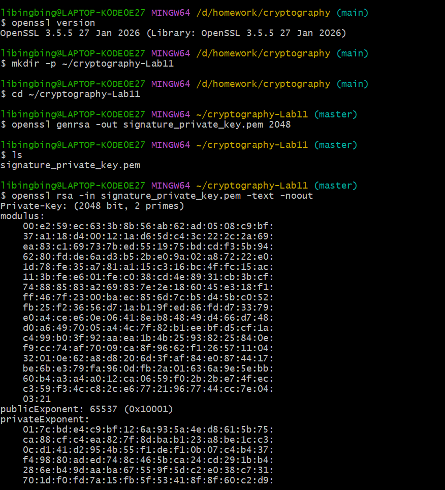
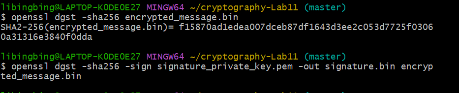
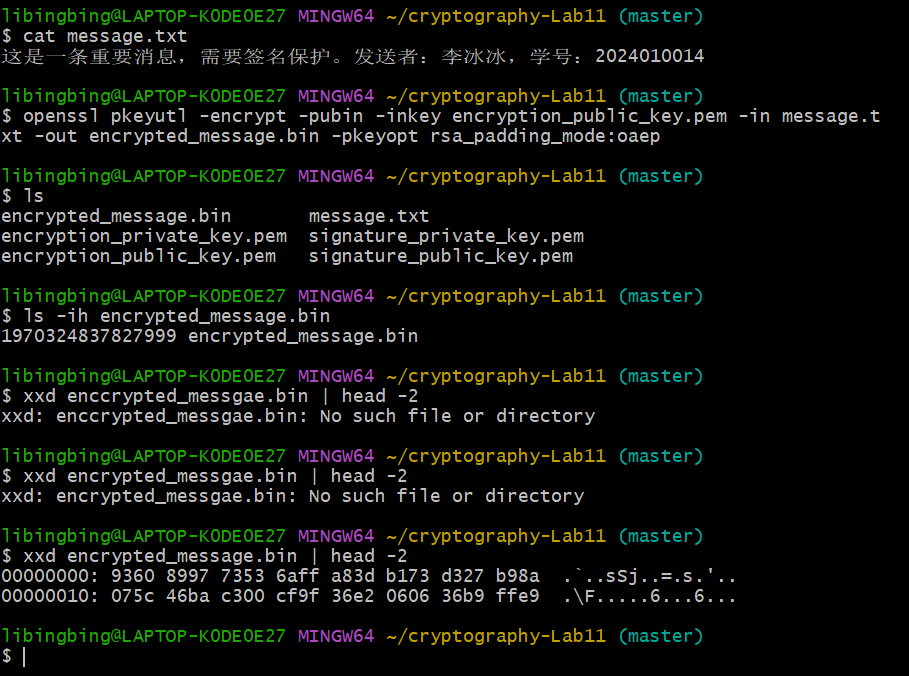
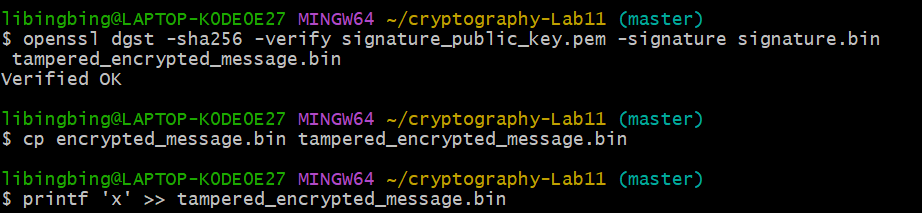
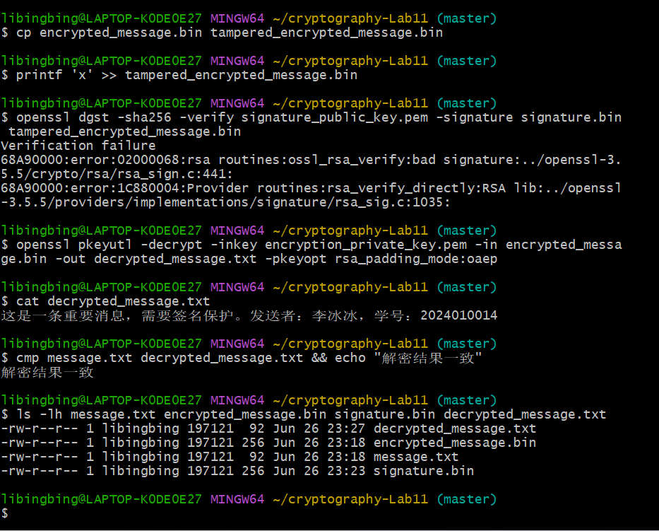
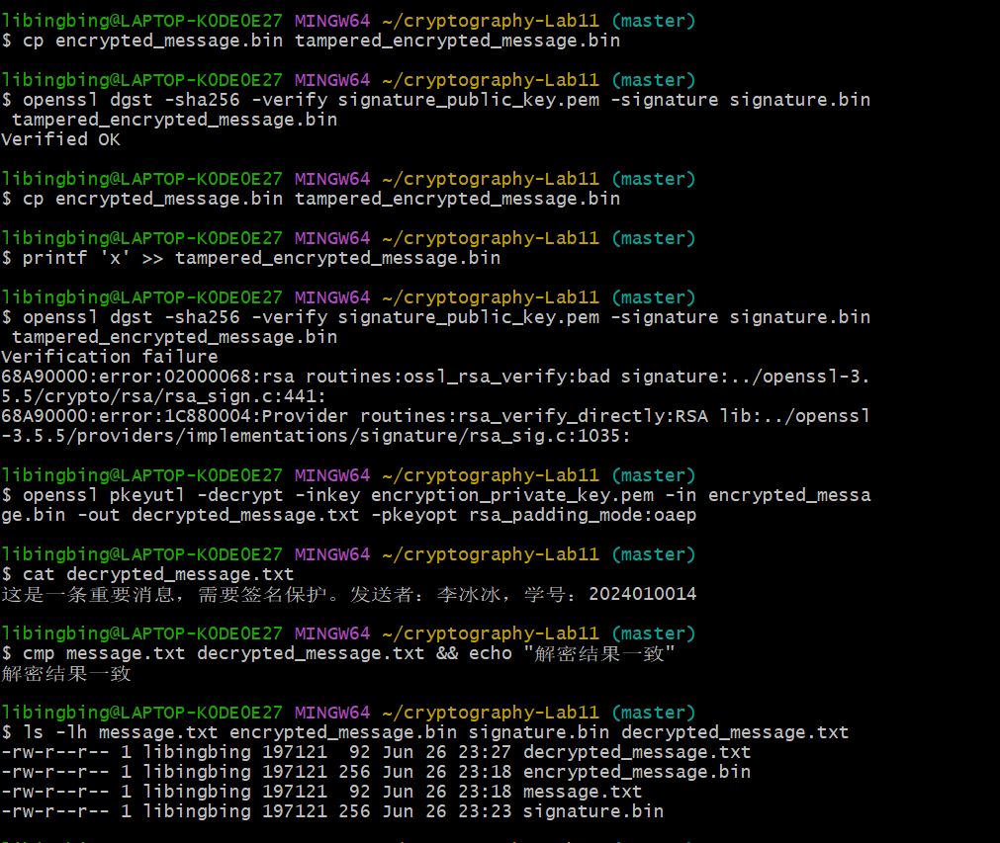

# Lab11：数字签名 —— 验证消息的真实性与完整性

## 实验简介

### 从哈希函数到数字签名

在前面的实验中，你已经学习了：

- **对称加密**（Lab1-Lab4）：使用相同的密钥进行加密和解密，适合大量数据的快速加密
- **非对称加密**（Lab5-Lab8）：使用公钥加密、私钥解密，解决了密钥分发问题
- **哈希函数**（Lab9）：将任意长度的数据映射为固定长度的摘要，具有单向性和抗碰撞性
- **公钥密码学应用**（Lab10）：RSA、ElGamal 等公钥加密系统的原理和实现

这些都是密码学的基础工具。但它们单独使用时，都有各自的局限：

- **对称加密**能保证机密性，但无法证明发送者身份
- **非对称密码学**可以用私钥生成签名来证明身份，但直接对大文件使用非对称运算效率太低
- **哈希函数**能检测数据是否被篡改，但无法证明哈希值本身是谁计算的

**数字签名**就是将这些工具组合起来，解决一个核心问题：**如何在不安全的网络中，让接收者确信一条消息确实来自声称的发送者，且内容未被篡改？**

### 数字签名解决的问题

想象以下场景：

**场景一：软件发布**
你从网上下载了一个软件安装包。网站上提供了文件的 SHA-256 哈希值。你下载后计算哈希，发现和网站上的一致。但问题来了：**网站本身可能被黑客入侵，哈希值也被替换了**。你如何确认这个哈希值确实是软件开发者发布的，而不是攻击者伪造的？

**场景二：电子邮件**
你收到一封"来自老板"的邮件，要求立即转账。邮件地址看起来很像老板的邮箱。但你如何确认这封邮件真的是老板发的，而不是钓鱼邮件？

**场景三：代码提交**
开源项目中，有人提交了一个 Pull Request。代码看起来没问题，但你如何确认这个提交真的来自声称的开发者，而不是有人冒用了他的 GitHub 账号？

这些场景的共同点是：**你需要验证消息的来源和完整性**。数字签名提供了这种能力。

### 数字签名的三大保证

数字签名技术提供了三个关键保证：

1. **身份认证（Authentication）**
   - 证明消息确实来自持有私钥的发送者
   - 就像手写签名证明文件是你本人签署的

2. **完整性保护（Integrity）**
   - 确保消息在传输过程中未被篡改
   - 任何微小的修改都会导致签名验证失败

3. **不可否认性（Non-repudiation）**
   - 发送者无法否认自己发送过该消息
   - 因为只有他持有生成签名所需的私钥

### Lab11 的目标

本次实验将带你深入理解数字签名的工作原理，并通过实际操作掌握"先加密、再对密文签名、验证后解密"的完整流程。

完成本实验后，你应该能够：

1. **理解数字签名的数学原理**：为什么"先哈希后签名"是必要的？哈希函数在签名中扮演什么角色？
2. **掌握加密后签名的完整流程**：从密钥生成、消息加密、密文哈希、密文签名到签名验证和解密的每一步操作
3. **理解签名的安全性**：为什么签名能防止篡改？为什么签名能证明身份？什么情况下签名会失效？
4. **理解 RSA 加密与数字签名的异同**：通过同一个消息文件串联加密、签名、验证和解密，区分"保密性"与"身份认证/完整性保护"
5. **理解签名在实际系统中的应用**：软件签名、代码签名、数字证书等场景

> **说明**：本实验使用 OpenSSL 工具，推荐在 Linux 或 macOS 环境下完成。Windows 用户可以使用 WSL 或 Git Bash。

---

## 数字签名的核心原理

在动手之前，先把数字签名的关键概念理解透彻。

### 数字签名 vs 手写签名

手写签名的特点：

- **固定不变**：同一个人的签名基本一致
- **难以伪造**：每个人的笔迹特征独特
- **绑定文件**：签名直接写在文件上，和文件内容物理绑定

但手写签名有个致命问题：**可以复制**。如果你在一份合同上签了名，别人可以扫描这个签名，粘贴到另一份你从未见过的合同上。

数字签名解决了这个问题：

- **签名和消息绑定**：签名是针对特定消息内容计算出来的，无法"复制粘贴"到其他消息上
- **不可伪造**：只有持有私钥的人才能生成有效签名
- **可验证**：任何人都可以用公钥验证签名的有效性

### 数字签名的基本流程

数字签名最基本的对象是"一段数据"。这段数据可以是明文消息，也可以是密文、软件安装包、代码提交或证书内容。本实验为了同时理解加密和签名，会先把明文加密成密文，再对密文进行哈希和签名。

#### 签名生成（发送方）

```text
待签名数据（本实验中是密文）
   ↓
计算哈希值（SHA-256）
   ↓
用签名私钥对哈希值签名
   ↓
得到数字签名
   ↓
发送：待签名数据 + 签名
```

#### 签名验证（接收方）

```text
收到：待签名数据 + 签名
   ↓
路径1：计算接收到的数据的哈希值 → 哈希值A
   ↓
路径2：用签名公钥验证签名 → 哈希值B
   ↓
比较哈希值A 和 哈希值B
   ↓
相同？ → 验证通过 ✓
不同？ → 验证失败 ✗（数据被篡改或签名伪造）
```

本实验中的完整顺序是：

```text
明文 message.txt
   ↓
用加密公钥加密 → encrypted_message.bin
   ↓
计算密文哈希
   ↓
用签名私钥对密文哈希签名 → signature.bin
   ↓
接收方先验证密文签名
   ↓
验证通过后，用加密私钥解密密文
```

### 为什么要先计算哈希值？

你可能会问：既然 RSA 签名本质上也是用私钥做数学运算，为什么不直接对整个消息或密文进行 RSA 运算作为签名？

原因有三个：

**1. 效率问题**

RSA 等非对称加密算法的运算速度远低于对称加密。对一个 1GB 的文件进行 RSA 运算是不现实的。

而哈希函数的计算速度很快，无论文件多大，都能快速生成固定长度的哈希值（例如 SHA-256 输出 256 位）。然后只需要对这 256 位进行 RSA 签名即可。

| 操作对象 | 大小 | RSA 签名耗时 |
| :------- | :--- | :---------- |
| 直接对 1GB 文件签名 | 1GB | 不可行 |
| 先计算 SHA-256，对哈希值签名 | 256 位（32 字节） | 毫秒级 |

**2. 输入长度问题**

RSA 一次只能处理不超过模数长度的数据块，签名标准也不是为直接处理任意长度文件设计的。先计算哈希值，可以把任意大小的文件压缩成固定长度摘要，再对摘要进行签名。

**3. 标准化问题**

哈希值是固定长度的，这使得签名算法的接口统一、简洁。无论消息是 1KB 还是 1GB，签名的输入都是固定的哈希值。

### RSA 签名的数学原理

回顾 RSA 加密的基本原理：

- **密钥生成**：选择两个大素数 $p$ 和 $q$，计算 $N = p \times q$，选择公钥指数 $e$ 和私钥指数 $d$，满足 $e \times d \equiv 1 \pmod{\varphi(N)}$
- **加密**：密文 $c = m^e \bmod N$
- **解密**：明文 $m = c^d \bmod N$

RSA 签名利用了 RSA 的**可逆性**：

- **签名**：签名 $\sigma = H(m)^d \bmod N$（用私钥 $d$）
- **验证**：计算 $\sigma^e \bmod N$，应该等于 $H(m)$（用公钥 $e$）

关键点：

1. **只有持有私钥 $d$ 的人才能计算 $\sigma = H(m)^d \bmod N$**
2. **任何人都可以用公钥 $e$ 验证：$\sigma^e \bmod N = H(m)$**
3. **如果消息被篡改**，$H(m)$ 改变，$\sigma^e \bmod N$ 就不会等于新的 $H(m')$，验证失败

### 为什么签名能防止篡改？

假设攻击者想要篡改消息：

**场景：修改消息内容**

1. Alice 发送消息 $m_1$："转账 100 元" + 签名 $\sigma_1 = H(m_1)^d \bmod N$
2. 攻击者截获后，想改成 $m_2$："转账 10000 元"
3. 攻击者把消息改为 $m_2$，但签名 $\sigma_1$ 还是原来的
4. Bob 收到后验证：$\sigma_1^e \bmod N = H(m_1)$，但现在消息是 $m_2$，$H(m_2) \ne H(m_1)$
5. 验证失败！Bob 发现消息被篡改

**场景：伪造签名**

1. 攻击者想为消息 $m_2$ 生成签名 $\sigma_2 = H(m_2)^d \bmod N$
2. 但攻击者没有私钥 $d$，无法计算 $H(m_2)^d \bmod N$
3. 攻击者试图暴力破解私钥 $d$？对于 2048 位 RSA，这需要数十亿年
4. 攻击者无法伪造签名

本实验中，签名对象不是明文消息，而是 `encrypted_message.bin`。把上面例子里的"消息"替换成"密文"，验证逻辑完全相同：密文一旦被篡改，签名验证就会失败。

### 哈希函数在签名中的关键作用

哈希函数必须满足三个性质，才能保证签名的安全：

**1. 抗原像性（Preimage Resistance）**

给定哈希值 $h$，找到满足 $H(m) = h$ 的消息 $m$ 在计算上不可行。

- **对签名的意义**：攻击者即使知道签名 $\sigma = H(m)^d \bmod N$，也无法反推出原始消息 $m$

**2. 抗第二原像性（Second Preimage Resistance）**

给定消息 $m_1$，找到另一个消息 $m_2 \ne m_1$ 使得 $H(m_1) = H(m_2)$ 在计算上不可行。

- **对签名的意义**：攻击者无法找到另一个消息 $m_2$，使得它的哈希值和原消息 $m_1$ 相同，从而重用签名

**3. 抗碰撞性（Collision Resistance）**

找到任意两个不同的消息 $m_1 \ne m_2$ 使得 $H(m_1) = H(m_2)$ 在计算上不可行。

- **对签名的意义**：攻击者无法事先准备两个内容不同但哈希值相同的消息，然后用其中一个签名，替换为另一个

### 为什么 SHA-1 不再安全？

SHA-1 曾经被广泛用于文件校验和数字签名，但它已经不再适合安全场景。2017 年，Google 和 CWI Amsterdam 公开了 SHA-1 碰撞攻击：攻击者可以构造两个内容不同、但 SHA-1 哈希值相同的文件。

这对数字签名非常危险。假设攻击者准备了两个文件：

1. 文件 A：看起来正常、愿意让别人签名的内容
2. 文件 B：攻击者真正想替换进去的恶意内容

如果两个文件的 SHA-1 哈希值相同，那么对文件 A 的签名也可能被拿去验证文件 B。也就是说，签名者以为自己签的是 A，验证者却可能看到 B 也能通过验证。

因此，现代数字签名不应使用 SHA-1。本实验使用 SHA-256。

### 常见的数字签名算法

| 算法 | 基础 | 签名长度 | 特点 |
| :--- | :--- | :------ | :--- |
| **RSA 签名** | RSA 公钥系统 | 与密钥长度相同（2048 位密钥 → 256 字节签名） | 最广泛使用，签名和验证速度适中 |
| **ECDSA** | 椭圆曲线密码学 | 较短（256 位曲线 → 64 字节签名） | 签名更短，验证较快，广泛用于区块链 |
| **EdDSA** | Edwards 曲线 | 64 字节（Ed25519） | 签名速度快，安全性高，抗侧信道攻击 |
| **DSA** | 离散对数 | 40-64 字节 | 已过时，不推荐使用 |

本实验主要使用 **RSA 签名**，因为它最容易理解，也最广泛使用。

---

## 实验环境准备

### 检查 OpenSSL 版本

OpenSSL 是一个强大的密码学工具库，提供了完整的数字签名功能。

检查你的系统是否已安装 OpenSSL：

```bash
openssl version
```

命令说明：

| 部分 | 含义 |
| :--- | :--- |
| `openssl` | OpenSSL 命令行工具 |
| `version` | 显示当前安装的 OpenSSL 版本 |

期望输出类似：

```
OpenSSL 3.0.2 15 Mar 2022 (Library: OpenSSL 3.0.2 15 Mar 2022)
```

或者：

```
OpenSSL 1.1.1s  1 Nov 2022
```

如果提示 `command not found`，需要安装 OpenSSL：

**Ubuntu/Debian**：
```bash
sudo apt update
sudo apt install openssl
```

命令说明：

| 部分 | 含义 |
| :--- | :--- |
| `sudo apt update` | 更新软件包索引 |
| `sudo apt install openssl` | 安装 OpenSSL 命令行工具 |

**macOS**（通常已预装）：
```bash
brew install openssl
```

命令说明：

| 部分 | 含义 |
| :--- | :--- |
| `brew install openssl` | 使用 Homebrew 安装 OpenSSL |

**Windows**（使用 Git Bash 或 WSL）：
Git Bash 通常已包含 OpenSSL。如果没有，可以通过 WSL 安装 Ubuntu 后再安装 OpenSSL。

### 创建实验目录

建议创建一个专门的目录来存放本次实验的所有文件：

```bash
mkdir -p ~/cryptography-lab11
cd ~/cryptography-lab11
```

命令说明：

| 部分 | 含义 |
| :--- | :--- |
| `mkdir -p` | 创建目录，`-p` 参数表示如果父目录不存在则一并创建 |
| `~/cryptography-lab11` | 在用户主目录下创建 `cryptography-lab11` 目录 |
| `cd` | 切换到该目录 |

### 清理残留文件（可选）

如果你之前做过本实验或中途出错需要重来，可以清理所有生成的文件：

```bash
rm -f signature_private_key.pem signature_public_key.pem encryption_private_key.pem encryption_public_key.pem message.txt signature.bin encrypted_message.bin tampered_encrypted_message.bin decrypted_message.txt
```

命令说明：

| 部分 | 含义 |
| :--- | :--- |
| `rm -f` | 强制删除文件，即使文件不存在也不报错 |
| `signature_private_key.pem` / `signature_public_key.pem` | 签名密钥文件 |
| `encryption_private_key.pem` / `encryption_public_key.pem` | 加密密钥文件 |
| 其他文件名 | 本实验过程中生成的消息、签名、密文和解密结果 |

---

## 任务一：生成签名密钥对和加密密钥对

本实验需要两对 RSA 密钥：

| 密钥对 | 私钥用途 | 公钥用途 |
| :----- | :------- | :------- |
| 签名密钥对 | 生成数字签名 | 验证数字签名 |
| 加密密钥对 | 解密密文 | 加密明文 |

实际系统中通常会区分签名密钥和加密密钥。本实验也采用这种方式，避免把同一对密钥混用于不同安全目标。

### 第一步：生成签名私钥

执行命令：

```bash
openssl genrsa -out signature_private_key.pem 2048
```

命令说明：

| 部分 | 含义 |
| :--- | :--- |
| `openssl` | OpenSSL 命令行工具 |
| `genrsa` | 生成 RSA 密钥对 |
| `-out signature_private_key.pem` | 输出文件名为 `signature_private_key.pem` |
| `2048` | 密钥长度为 2048 位 |

OpenSSL 版本不同，输出可能不同。有些版本没有任何输出，有些版本会显示类似下面的生成过程：

```
Generating RSA private key, 2048 bit long modulus (2 primes)
....................+++++
.............................+++++
e is 65537 (0x010001)
```

输出说明：

| 部分 | 含义 |
| :--- | :--- |
| `2048 bit long modulus` | 模数 N 的长度是 2048 位 |
| `+++++` | 生成过程中的进度指示 |
| `e is 65537` | 公钥指数 e 的值是 65537（常用值） |

生成的 `signature_private_key.pem` 文件包含了完整的 RSA 私钥信息，包括：
- 模数 N
- 公钥指数 e
- 私钥指数 d
- 素数 p 和 q
- 以及一些优化计算用的参数

### 第二步：查看私钥内容

执行命令：

```bash
openssl rsa -in signature_private_key.pem -text -noout
```

命令说明：

| 部分 | 含义 |
| :--- | :--- |
| `rsa` | RSA 密钥管理命令 |
| `-in signature_private_key.pem` | 输入文件 |
| `-text` | 以文本格式显示密钥详细信息 |
| `-noout` | 不输出编码后的密钥（只显示文本信息） |

期望输出（部分）：

```
Private-Key: (2048 bit, 2 primes)
modulus:
    00:c4:7e:3b:a1:2f:5d:8c:9e:f1:23:45:67:89:ab:
    cd:ef:01:23:45:67:89:ab:cd:ef:...（很长的十六进制数）
publicExponent: 65537 (0x10001)
privateExponent:
    00:8f:23:45:67:89:ab:cd:ef:01:23:45:67:89:ab:
    cd:ef:...（很长的十六进制数）
prime1:
    00:f1:23:45:67:89:ab:cd:ef:...（素数 p）
prime2:
    00:e9:87:65:43:21:ab:cd:ef:...（素数 q）
exponent1:
    00:d3:45:67:89:ab:cd:ef:...
exponent2:
    00:c7:65:43:21:fe:dc:ba:...
coefficient:
    00:b9:87:65:43:21:ab:cd:...
```

输出说明：

| 字段 | 含义 |
| :--- | :--- |
| `modulus` | RSA 模数 $N = p \times q$ |
| `publicExponent` | 公钥指数 $e$，通常是 65537 |
| `privateExponent` | 私钥指数 $d$，满足 $e \times d \equiv 1 \pmod{\varphi(N)}$ |
| `prime1` / `prime2` | 两个大素数 $p$ 和 $q$ |
| `exponent1` / `exponent2` | 用于中国剩余定理优化的参数 |
| `coefficient` | 用于中国剩余定理的系数 |

**重要提示**：私钥文件包含了所有敏感信息，**绝对不能泄露**！如果私钥泄露，任何人都可以伪造你的签名。

### 第三步：从签名私钥中提取签名公钥

签名公钥是可以公开分享的，用于验证签名。执行命令：

```bash
openssl rsa -in signature_private_key.pem -pubout -out signature_public_key.pem
```

命令说明：

| 部分 | 含义 |
| :--- | :--- |
| `-in signature_private_key.pem` | 从私钥文件读取 |
| `-pubout` | 输出公钥 |
| `-out signature_public_key.pem` | 输出到 `signature_public_key.pem` 文件 |

期望输出：

```
writing RSA key
```

### 第四步：查看公钥内容

执行命令：

```bash
openssl rsa -pubin -in signature_public_key.pem -text -noout
```

命令说明：

| 部分 | 含义 |
| :--- | :--- |
| `-pubin` | 输入的是公钥文件（不是私钥） |
| `-in signature_public_key.pem` | 输入文件 |
| `-text` | 以文本格式显示 |
| `-noout` | 不输出编码后的密钥 |

期望输出：

```
Public-Key: (2048 bit)
Modulus:
    00:c4:7e:3b:a1:2f:5d:8c:9e:f1:23:45:67:89:ab:
    cd:ef:01:23:45:67:89:ab:cd:ef:...（和私钥中的 modulus 相同）
Exponent: 65537 (0x10001)
```

输出说明：

公钥只包含两个信息：
- **Modulus（模数 N）**：和私钥中的模数相同
- **Exponent（公钥指数 e）**：通常是 65537

公钥可以安全地公开，不会泄露私钥信息。

### 第五步：比较签名密钥文件大小

执行命令：

```bash
ls -lh signature_private_key.pem signature_public_key.pem
```

命令说明：

| 部分 | 含义 |
| :--- | :--- |
| `ls -lh` | 以易读格式显示文件大小和权限 |
| `signature_private_key.pem` | 签名私钥文件 |
| `signature_public_key.pem` | 签名公钥文件 |

期望输出类似：

```
-rw------- 1 user user 1.7K Jun 22 10:30 signature_private_key.pem
-rw-r--r-- 1 user user  451 Jun 22 10:31 signature_public_key.pem
```

观察：
- 私钥文件大约 1.7KB（包含 N, e, d, p, q 等完整信息）
- 公钥文件大约 451 字节（只包含 N 和 e）
- 私钥文件的权限是 `600`（只有所有者可读写），公钥是 `644`（所有人可读）

### 第六步：生成加密专用 RSA 密钥对

生成加密专用私钥：

```bash
openssl genpkey -algorithm RSA -pkeyopt rsa_keygen_bits:2048 -out encryption_private_key.pem
```

命令说明：

| 部分 | 含义 |
| :--- | :--- |
| `genpkey` | 生成通用公钥算法密钥 |
| `-algorithm RSA` | 指定生成 RSA 密钥 |
| `-pkeyopt rsa_keygen_bits:2048` | 设置密钥长度为 2048 位 |
| `-out encryption_private_key.pem` | 输出加密专用私钥文件 |

从加密专用私钥中提取加密公钥：

```bash
openssl rsa -in encryption_private_key.pem -pubout -out encryption_public_key.pem
```

命令说明：

| 部分 | 含义 |
| :--- | :--- |
| `rsa` | RSA 密钥管理命令 |
| `-in encryption_private_key.pem` | 输入加密私钥文件 |
| `-pubout` | 从私钥中导出公钥 |
| `-out encryption_public_key.pem` | 输出加密公钥文件 |

查看文件大小：

```bash
ls -lh encryption_private_key.pem encryption_public_key.pem
```

命令说明：

| 部分 | 含义 |
| :--- | :--- |
| `ls -lh` | 以易读格式显示文件大小和权限 |
| `encryption_private_key.pem` | 加密私钥文件 |
| `encryption_public_key.pem` | 加密公钥文件 |

这对密钥只用于后续的 RSA 加密和解密，不用于数字签名。

### 任务一小结

完成这一步后，你应该有：
- ✅ `signature_private_key.pem` - RSA 签名私钥（保密）
- ✅ `signature_public_key.pem` - RSA 签名公钥（可公开）
- ✅ `encryption_private_key.pem` - RSA 加密私钥（保密）
- ✅ `encryption_public_key.pem` - RSA 加密公钥（可公开）

**截图要求**：
请对"生成签名密钥和加密密钥"的完整过程截图，截图应包含：
1. `openssl genrsa` 命令，以及随后能看到 `signature_private_key.pem` 已生成的结果
2. `openssl rsa -pubout` 命令提取公钥
3. `openssl rsa -pubin -text -noout` 显示公钥详情
4. 生成加密专用密钥对并查看文件大小

截图：



---

## 任务二：创建消息并使用 RSA 加密文件

现在我们先模拟发送方保护消息内容：创建明文文件，然后用接收方的加密公钥把它加密成密文。

注意：RSA 只能直接加密较短的数据。本实验的 `message.txt` 很短，可以直接用 RSA-OAEP 加密；真实系统通常使用混合加密。

### 第一步：创建测试消息

创建一个测试文件 `message.txt`：

```bash
echo "这是一条重要消息，需要签名保护。发送者：张三，学号：2024010001" > message.txt
```

命令说明：

| 部分 | 含义 |
| :--- | :--- |
| `echo "..."` | 输出引号中的测试消息 |
| `>` | 将输出写入文件，会覆盖同名旧文件 |
| `message.txt` | 保存原始明文消息的文件 |

> **提示**：建议在消息中包含你自己的姓名和学号，便于解密后确认消息内容来自你的实验。

查看文件内容：

```bash
cat message.txt
```

命令说明：

| 部分 | 含义 |
| :--- | :--- |
| `cat` | 显示文件内容 |
| `message.txt` | 要查看的原始明文文件 |

期望输出：

```
这是一条重要消息，需要签名保护。发送者：张三，学号：2024010001
```

### 第二步：使用加密公钥加密消息

使用加密公钥 `encryption_public_key.pem` 加密 `message.txt`：

```bash
openssl pkeyutl -encrypt -pubin -inkey encryption_public_key.pem -in message.txt -out encrypted_message.bin -pkeyopt rsa_padding_mode:oaep
```

命令说明：

| 部分 | 含义 |
| :--- | :--- |
| `pkeyutl -encrypt` | 使用公钥算法执行加密操作 |
| `-pubin -inkey encryption_public_key.pem` | 输入的是加密公钥文件 |
| `-in message.txt` | 要加密的原始消息 |
| `-out encrypted_message.bin` | 输出密文文件 |
| `-pkeyopt rsa_padding_mode:oaep` | 使用 OAEP 填充，避免裸 RSA 加密 |

### 第三步：查看密文文件

查看密文文件大小：

```bash
ls -lh encrypted_message.bin
```

命令说明：

| 部分 | 含义 |
| :--- | :--- |
| `ls -lh` | 以易读格式显示文件大小和权限 |
| `encrypted_message.bin` | 要查看的密文文件 |

对于 2048 位 RSA 密钥，密文长度通常是 256 字节，因为 RSA 运算结果的长度等于模数 $N$ 的长度。

尝试直接查看密文：

```bash
xxd encrypted_message.bin | head -2
```

命令说明：

| 部分 | 含义 |
| :--- | :--- |
| `xxd encrypted_message.bin` | 以十六进制形式显示密文文件 |
| `head -2` | 只显示前 2 行输出 |
| `|` | 将前一个命令的输出传给后一个命令 |

期望输出类似：

```
00000000: 8f23 4567 89ab cdef 0123 4567 89ab cdef  .#Eg.....#Eg....
00000010: fedc ba98 7654 3210 0123 4567 89ab cdef  .....T2..#Eg....
```

你会看到一段不可读的二进制数据。密文的作用是隐藏消息内容，不能直接看出原始消息。

### 任务二小结

完成这一步后，你应该有：
- ✅ `message.txt` - 原始消息
- ✅ `encrypted_message.bin` - 加密后的密文

**截图要求**：
请对以下操作截图：
1. 创建并查看 `message.txt`
2. 使用 `encryption_public_key.pem` 加密消息
3. 查看 `encrypted_message.bin` 的大小和十六进制内容

截图：


---

## 任务三：对密文计算哈希并生成数字签名

发送方现在已经有了密文 `encrypted_message.bin`。接下来不要签名明文，而是对密文计算哈希并生成签名。这样接收方可以先验证密文是否来自发送方、是否被篡改，再决定是否解密。

### 第一步：计算密文的哈希值

使用 SHA-256 计算密文哈希：

```bash
openssl dgst -sha256 encrypted_message.bin
```

命令说明：

| 部分 | 含义 |
| :--- | :--- |
| `dgst` | 摘要（digest）计算命令 |
| `-sha256` | 使用 SHA-256 哈希算法 |
| `encrypted_message.bin` | 输入文件是密文 |

期望输出类似：

```
SHA256(encrypted_message.bin)= a7f4c92e8b1234567890abcdef1234567890abcdef1234567890abcdef123456
```

> 不同 OpenSSL 版本可能显示为 `SHA2-256(encrypted_message.bin)= ...`，含义相同。

**重要观察**：
- 哈希值绑定的是密文内容，而不是明文内容
- 只要密文改动 1 个字节，哈希值就会完全不同

### 第二步：使用签名私钥对密文签名

使用签名私钥 `signature_private_key.pem` 对 `encrypted_message.bin` 生成签名：

```bash
openssl dgst -sha256 -sign signature_private_key.pem -out signature.bin encrypted_message.bin
```

命令说明：

| 部分 | 含义 |
| :--- | :--- |
| `dgst -sha256` | 先计算 SHA-256 哈希值 |
| `-sign signature_private_key.pem` | 使用签名私钥对哈希值签名 |
| `-out signature.bin` | 签名输出到 `signature.bin` 文件 |
| `encrypted_message.bin` | 要签名的密文文件 |

这个命令执行了什么？

1. 读取 `encrypted_message.bin` 的内容
2. 计算 SHA-256 哈希值
3. 用签名私钥对哈希值进行 RSA 签名：$\sigma = H(\text{encrypted\_message})^d \bmod N$
4. 将签名写入 `signature.bin`

### 第三步：查看签名文件

```bash
ls -lh signature.bin
```

命令说明：

| 部分 | 含义 |
| :--- | :--- |
| `ls -lh` | 以易读格式显示文件大小和权限 |
| `signature.bin` | 要查看的数字签名文件 |

期望输出：

```
-rw-r--r-- 1 user user 256 Jun 22 10:35 signature.bin
```

观察：
- 签名文件大小是 **256 字节**
- 签名长度由签名 RSA 密钥长度决定
- 签名不是密文，也不能用于恢复明文

### 任务三小结

完成这一步后，你应该有：
- ✅ `encrypted_message.bin` - 要发送的密文
- ✅ `signature.bin` - 对密文生成的数字签名

**截图要求**：
请对以下操作截图：
1. 计算密文的 SHA-256 哈希值（`openssl dgst -sha256 encrypted_message.bin`）
2. 生成密文签名（`openssl dgst -sha256 -sign ... encrypted_message.bin`）
3. 查看签名文件大小（`ls -lh signature.bin`）

截图：





---

## 任务四：验证密文签名并解密

接收方收到的是 `encrypted_message.bin` 和 `signature.bin`。正确处理顺序是：**先验证签名，再解密密文**。如果签名验证失败，不应继续解密或信任该密文。

### 第一步：验证密文签名

使用签名公钥 `signature_public_key.pem` 验证 `encrypted_message.bin` 的签名：

```bash
openssl dgst -sha256 -verify signature_public_key.pem -signature signature.bin encrypted_message.bin
```

命令说明：

| 部分 | 含义 |
| :--- | :--- |
| `dgst -sha256` | 使用 SHA-256 哈希算法 |
| `-verify signature_public_key.pem` | 使用签名公钥验证签名 |
| `-signature signature.bin` | 输入签名文件 |
| `encrypted_message.bin` | 被验证的是密文文件 |

期望输出：

```
Verified OK
```

这证明：
- 密文确实由对应签名私钥签名
- 密文内容在传输过程中没有被篡改

截图：



### 第二步：测试密文被篡改后的验证结果

先复制一份密文：

```bash
cp encrypted_message.bin tampered_encrypted_message.bin
```

命令说明：

| 部分 | 含义 |
| :--- | :--- |
| `cp encrypted_message.bin tampered_encrypted_message.bin` | 复制一份密文用于篡改测试 |

再向复制出的密文末尾追加 1 个字节：

```bash
printf 'x' >> tampered_encrypted_message.bin
```

命令说明：

| 部分 | 含义 |
| :--- | :--- |
| `printf 'x'` | 输出一个字符 `x` |
| `>> tampered_encrypted_message.bin` | 将字符追加到篡改后的密文文件末尾 |

用原签名验证被篡改的密文：

```bash
openssl dgst -sha256 -verify signature_public_key.pem -signature signature.bin tampered_encrypted_message.bin
```

命令说明：

| 部分 | 含义 |
| :--- | :--- |
| `dgst -sha256` | 对被验证文件计算 SHA-256 哈希 |
| `-verify signature_public_key.pem` | 使用签名公钥验证签名 |
| `-signature signature.bin` | 使用原始密文对应的签名 |
| `tampered_encrypted_message.bin` | 被篡改后的密文文件 |

期望输出：

```
Verification failure
```

这证明：签名绑定的是密文内容。密文只要发生变化，验证就会失败。

截图：



### 第三步：验证通过后解密密文

使用加密私钥 `encryption_private_key.pem` 解密原始密文：

```bash
openssl pkeyutl -decrypt -inkey encryption_private_key.pem -in encrypted_message.bin -out decrypted_message.txt -pkeyopt rsa_padding_mode:oaep
```

命令说明：

| 部分 | 含义 |
| :--- | :--- |
| `pkeyutl -decrypt` | 使用公钥算法执行解密操作 |
| `-inkey encryption_private_key.pem` | 使用加密私钥解密 |
| `-in encrypted_message.bin` | 输入原始密文文件 |
| `-out decrypted_message.txt` | 输出解密后的明文文件 |
| `-pkeyopt rsa_padding_mode:oaep` | 使用与加密时一致的 OAEP 填充模式 |

查看解密结果：

```bash
cat decrypted_message.txt
```

命令说明：

| 部分 | 含义 |
| :--- | :--- |
| `cat` | 显示文件内容 |
| `decrypted_message.txt` | 解密后得到的明文文件 |

比较原始明文和解密结果是否一致：

```bash
cmp message.txt decrypted_message.txt && echo "解密结果一致"
```

命令说明：

| 部分 | 含义 |
| :--- | :--- |
| `cmp message.txt decrypted_message.txt` | 比较原始明文和解密结果是否完全一致 |
| `&&` | 前一个命令成功时才执行后一个命令 |
| `echo "解密结果一致"` | 两个文件一致时输出提示 |

期望输出：

```
解密结果一致
```

### 第四步：观察完整流程中的文件

```bash
ls -lh message.txt encrypted_message.bin signature.bin decrypted_message.txt
```

命令说明：

| 部分 | 含义 |
| :--- | :--- |
| `ls -lh` | 以易读格式显示文件大小和权限|
| `message.txt` | 原始明文文件|
| `encrypted_message.bin` | RSA 加密后的密文|
| `signature.bin` | 对密文生成的数字签名|
| `decrypted_message.txt` | 解密后得到的明文|

观察：

| 文件 | 含义 | 作用 |
| :--- | :--- | :--- |
| `message.txt` | 原始明文 | 发送前的消息 |
| `encrypted_message.bin` | 密文 | 保护消息内容 |
| `signature.bin` | 密文签名 | 证明密文来源并检测篡改 |
| `decrypted_message.txt` | 解密后的明文 | 接收方恢复出的消息 |

### 任务四小结

完成这一步后，你应该理解：
- ✅ 发送方流程：加密明文 -> 计算密文哈希 -> 对密文签名
- ✅ 接收方流程：验证密文签名 -> 解密密文
- ✅ 验证签名解决来源和完整性问题
- ✅ 解密解决内容保密问题

截图：



---

## 实验报告要求

### 截图要求

实验截图须清晰，终端文字可读，文件格式必须为 PNG。截图文件需与本 `Lab11.md` 放在同一目录下，并保证它们能在上方对应任务位置正常显示。只需提交以下 7 张实验截图：

| 截图内容 | 文件名 |
| :------- | :----- |
| 生成签名密钥对和加密密钥对 | `keygen.png` |
| 创建消息并使用 RSA 加密 | `encrypt.png` |
| 计算密文哈希值 | `hash.png` |
| 生成密文数字签名并查看签名文件大小 | `sign.png` |
| 验证签名成功 | `verify_ok.png` |
| 篡改密文后验证失败 | `verify_fail.png` |
| 验证通过后解密密文 | `decrypt.png` |

截图的正确放置位置：

1. `keygen.png`：放在任务一末尾，能看到生成签名密钥对和加密密钥对的过程。
2. `encrypt.png`：放在任务二末尾，能看到创建 `message.txt`、加密生成 `encrypted_message.bin`、查看密文的过程。
3. `hash.png`：放在任务三末尾，能看到 `openssl dgst -sha256 encrypted_message.bin` 的输出。
4. `sign.png`：放在任务三末尾，能看到生成密文签名和查看 `signature.bin` 文件大小。
5. `verify_ok.png`：放在任务四末尾，能看到密文签名验证成功的 `Verified OK`。
6. `verify_fail.png`：放在任务四末尾，能看到密文被篡改后的 `Verification failure`。
7. `decrypt.png`：放在任务四末尾，能看到验证通过后解密密文，并比较解密结果和原始明文一致。

除 `Lab11.md` 和上述截图外，其他实验过程中生成的文件都不需要提交。

---

## 实验结果填写

> 根据你的实验结果填写下表。若某项在截图中看不清，可写"截图中未见"，但不得留空。

### A. 密钥信息

| 项目 | 你的结果 |
| :--- | :------- |
| 签名 RSA 密钥长度（位） |2048|
| 签名私钥 `signature_private_key.pem` 文件大小（字节） |197121|
| 签名公钥 `signature_public_key.pem` 文件大小（字节） |460|
| 签名公钥指数 e 的值 |65537 (0x10001)|
| 签名公钥模数 N 的前 16 位十六进制 |00e259ec633b8b56|
| 加密私钥 `encryption_private_key.pem` 文件大小（字节） |197121|
| 加密公钥 `encryption_public_key.pem` 文件大小（字节） |460|

---

### B. 加密与密文哈希

| 项目 | 你的结果 |
| :--- | :------- |
| 原始消息内容（你写入的文字） |这是一条重要消息，需要签名保护。发送者：李冰冰，学号：2024010014|
| 密文文件 encrypted_message.bin 大小（字节） |256|
| 密文 SHA-256 哈希值（完整的 64 位十六进制） |f15870ad1edea007dceb87df1643d3ee2c053d7725f03060a31316e3840f0dda|
| 密文 SHA-256 哈希值长度（十六进制字符数） |64|

---

### C. 密文签名与验证

| 项目 | 你的结果 |
| :--- | :------- |
| 签名文件 signature.bin 大小（字节） |256|
| 原始密文的签名验证结果 |Verified OK（验证通过）|
| 篡改密文后的签名验证结果 |Verification failure（验证失败）|

---

### D. 解密与流程理解

| 项目 | 你的结果 |
| :--- | :------- |
| 解密后的文件是否与原文件一致 |是，解密结果与原文件完全一致|
| 加密操作使用的密钥文件 |encryption_public_key.pem（加密公钥）|
| 解密操作使用的密钥文件 |encryption_private_key.pem（加密私钥）|
| 签名操作使用的密钥文件 |signature_private_key.pem（签名私钥）|
| 验证签名操作使用的密钥文件 |signature_public_key.pem（签名公钥）|
| 接收方应先验证签名还是先解密 |应先验证签名，再进行解密|

---

## 思考题

请根据实验过程和你的理解，回答以下问题。

### 1. 数字签名的三大保证

数字签名提供了哪三个关键保证？请分别解释它们的含义，并结合本次实验说明这三个保证是如何实现的。

> 答：
数字签名提供的三大关键保证是：真实性、完整性、不可否认性。1. 含义解释：
真实性：确保消息确实是由声称的发送者发出的，防止身份伪造。
完整性：保证消息在传输或存储过程中没有被篡改或损坏。
不可否认性：发送方事后无法抵赖曾发送过该消息，提供不可否认的证据。2. 实验实现说明：
由于不知道您的具体实验环境，以下是基于标准密码学流程的通用说明，您可以根据自己的实验步骤进行微调：
如何实现真实性和不可否认性：实验中使用发送方的私钥对消息（或其摘要）进行加密生成签名。因为私钥只有发送方独有，只有用发送方对应的公钥能成功解密并验证签名，就能证明身份，且发送方无法抵赖。
如何实现完整性：实验中先对消息进行哈希运算生成固定长度的数字摘要，再对摘要进行签名。如果消息内容被篡改，接收方重新计算的哈希值将与签名中解密出的哈希值不一致，从而发现篡改。
---

### 2. 为什么要"先哈希后签名"？

在本实验中，为什么要先计算密文的哈希值，而不是直接对整个密文进行 RSA 签名？请至少列举三个原因。

> 答：1. 为什么要"先哈希后签名"？
（1）效率更高：RSA算法对数据长度有严格限制（通常无法直接处理很长的密文或大文件）。哈希函数能将任意长度的数据压缩成固定长度的摘要，只对短摘要进行签名可以大幅提升计算速度。
（2）保证完整性：哈希具有“雪崩效应”，明文哪怕只改动一个比特，哈希值也会发生巨大变化。签名哈希值可以确保数据在传输过程中未被篡改。
（3）节省带宽和存储空间：签名一个固定长度的短摘要，比签名整个庞大的密文文件要小得多，能有效减少数据传输量和存储开销。
（4）安全性（抗选择明文攻击）：直接对长数据使用RSA签名存在数学上的安全隐患，而哈希后再签名可以避免这些底层数学漏洞。2. 签名长度与密钥长度的关系
（1）原因：RSA签名的过程本质上是使用发送方的私钥对数据的哈希摘要进行加密。生成的签名长度与使用的私钥模数（Modulus）的字节长度是一一对应的。2048位的密钥，其模数就是2048位，换算成字节即为 2048 ÷ 8 = 256字节。
（2）计算：如果使用4096位的RSA密钥，其模数为4096位，换算成字节为 4096 ÷ 8 = 512字节。因此，签名长度会是512字节。
---

### 3. 签名长度与密钥长度的关系

观察你生成的签名文件 `signature.bin` 的大小。为什么 2048 位的 RSA 密钥生成的签名长度是 256 字节？如果使用 4096 位的 RSA 密钥，签名长度会是多少？

> 答：第一步：理解RSA签名的本质​
RSA签名本质上是对消息摘要（如SHA-256）使用私钥进行加密运算，其输出结果是一个与模数n位数相同的整数（填充后），因此签名长度在字节上等于RSA密钥模长（modulus length）除以8。
第二步：解释2048位密钥对应256字节的原因​
2048位 ÷ 8 = 256字节​
RSA签名的长度由模数n的长度决定，无论消息多长，签名输出总是等于密钥模长（以字节计）。所以2048位RSA密钥生成的签名文件signature.bin大小为256字节——这是标准行为。
第三步：推算4096位RSA密钥对应的签名长度​
4096位 ÷ 8 = 512字节​
因此，若改用4096位RSA密钥，签名长度将是512字节。
补充说明（可选理解）：​
虽然签名算法中通常包含填充（如PKCS#1 v1.5或PSS），但填充不影响最终签名输出的总长度——它仍然被扩展或约束至模长大小。所以无论填充方式如何，签名长度始终等于密钥长度（位）除以8得到的字节数。
✅ 总结：
2048位 → 256字节
4096位 → 512字节
这是RSA算法的固有特性，签名长度与密钥长度成正比。

---

### 4. 哈希函数的安全性要求

哈希函数必须满足哪三个性质才能保证数字签名的安全？请分别解释这三个性质，并说明如果哈希函数不满足某个性质，会导致什么安全问题。

提示：抗原像性、抗第二原像性、抗碰撞性

> 答：
第一步：理解RSA签名的基本原理 —— 签名长度由模数长度决定
RSA 签名的本质是对消息的哈希值进行私钥加密，其输出是一个大整数，该整数在模 N（N = p × q，由密钥长度决定）的范围内。因此，签名的长度在字节上等于RSA密钥模数 N 的长度（以字节为单位）。
换句话说：
签名长度（字节） = RSA密钥长度（位） ÷ 8
第二步：解释“2048位RSA密钥 → 签名256字节”的原因
2048 位 ÷ 8 = 256 字节
✅ 所以，2048位RSA密钥生成的签名文件 signature.bin 大小为256字节，是因为签名值是一个2048位的大整数，存储时按字节计算，正好是256字节。
第三步：计算4096位RSA密钥对应的签名长度
4096 位 ÷ 8 = 512 字节
✅ 因此，若使用4096位RSA密钥，生成的签名长度将是 512 字节。
补充说明（可选但建议理解）
签名过程通常包括：消息哈希 → 填充（如PKCS#1 v1.5或PSS）→ 用私钥模幂运算 → 输出签名值。
尽管有填充机制，最终签名值仍会被编码为与模数N相同长度的整数，所以签名长度始终等于密钥长度（以字节计）。
文件 signature.bin 里存储的就是这个经过编码的大整数，因此文件大小反映的就是签名值的字节长度。
最终答案：
签名长度等于RSA密钥模数的长度（以字节为单位）。2048位密钥对应 2048 ÷ 8 = 256 字节；若使用4096位RSA密钥，签名长度为 4096 ÷ 8 = 512 字节。
---

### 5. SHA-1 的安全问题

为什么 SHA-1 哈希算法不再被推荐用于数字签名？2017 年 Google 发现的 SHA-1 碰撞攻击对数字签名有什么影响？请举例说明攻击者如何利用这个漏洞。

> 答：
SHA-1 被弃用核心原因：碰撞攻击已从理论变为现实（SHAttered），破坏数字签名“唯一对应”的安全假设。
2017年攻击影响：使基于 SHA-1 的签名系统可被伪造，冲击证书体系、软件分发、法律文件等关键场景。
攻击者利用方式：构造“哈希相同、内容不同”的文件对 → 诱骗合法方签名 → 移植签名到恶意文件 → 实施欺诈或入侵。
---

### 6. 公钥与私钥的角色

本实验使用了签名密钥对和加密密钥对。请分别说明：

- 签名私钥、签名公钥分别用于什么操作？
- 加密私钥、加密公钥分别用于什么操作？
- 如果攻击者获得了公钥，他能做什么？不能做什么？

> 答：
一、签名私钥、签名公钥分别用于什么操作？
签名私钥：用于生成数字签名。发送方使用自己的签名私钥对消息（或消息摘要）进行加密/签名，以证明消息来源的真实性和完整性。
签名公钥：用于验证数字签名。接收方使用发送方的签名公钥对收到的签名进行解密/验证，确认该签名确实由对应的私钥持有者生成，且消息未被篡改。
→ 简记：私钥签名，公钥验签。
二、加密私钥、加密公钥分别用于什么操作？
加密公钥：用于加密数据。发送方使用接收方的加密公钥对明文进行加密，确保只有持有对应私钥的人才能解密。
加密私钥：用于解密数据。接收方用自己的加密私钥对收到的密文进行解密，还原原始明文。
→ 简记：公钥加密，私钥解密。
注：在实际应用中，“加密私钥”这个说法不严谨——严格说应为“解密私钥”，因为私钥并不用于加密（除非在特定签名场景中，但那不是加密用途）。此处应理解为“用于解密的私钥”。
三、如果攻击者获得了公钥，他能做什么？不能做什么？
能做的：​
验证由对应私钥生成的数字签名（即确认某条消息是否真的来自该公钥所有者）；
向该公钥所有者发送加密消息（因为公钥本来就是公开的，用于加密）；
伪造消息但无法伪造合法签名（因为没有私钥）。
不能做的：​
无法解密用该公钥加密的数据（因为只有对应私钥能解密）；
无法伪造有效签名（因为签名必须用私钥生成，而私钥未泄露）；
无法冒充身份进行签名认证；
无法逆向推导出私钥（在安全算法和足够密钥长度前提下，这是计算不可行的）。
→ 总结：公钥是公开的，拿到它不等于获得控制权。真正的安全依赖于私钥的保密性。
---

### 7. 签名与加密的区别

结合本实验"加密 -> 哈希 -> 签名 -> 验证 -> 解密"的流程，说明数字签名和消息加密有什么本质区别。它们分别解决什么问题？为什么不能简单地用加密代替签名？

> 答：
结合实验流程“加密 -> 哈希 -> 签名 -> 验证 -> 解密”，数字签名与消息加密的本质区别如下：1. 本质区别
核心目的不同：消息加密的核心是机密性，确保只有持有对应私钥的接收方能读取消息内容；而数字签名的核心是身份认证、数据完整性和不可否认性，用于证明消息确实由声称的发送方发出且未被篡改。
操作对象不同：加密操作直接作用于原始消息，将其转化为密文；签名操作则作用于消息的哈希值（摘要），而非消息本身，通过对摘要进行私钥加密来生成签名。2. 分别解决的问题
消息加密解决的是“防窃听”的问题。它保护的是信息的隐私，防止第三方在传输过程中截获并理解消息含义。
数字签名解决的是“防伪造、防篡改、防抵赖”的问题。它确保接收方收到的消息确实来自合法的发送方，且在传输途中没有被恶意修改，同时发送方事后也无法否认自己发送过该消息。3. 为什么不能简单地用加密代替签名？
公钥加密不具备防伪造能力：在数字加密体系中，公钥是公开的。任何人都可以使用接收方的公钥对消息进行加密并发送给接收方。如果仅用加密代替签名，接收方收到消息后无法判断这条消息究竟是真正的发送方发的，还是第三方冒充发送方发的。
缺乏不可否认性：如果发送方用接收方的公钥加密消息，虽然只有接收方能解密，但发送方自己也可以声称“我没发过这条消息，是别人用我的电脑/账号加密发给你的”。而使用私钥签名则不同，私钥只有发送方拥有，一旦签名验证成功，发送方就无法抵赖，这是加密做不到的。
---

### 8. 签名的不可否认性

什么是"不可否认性"（Non-repudiation）？为什么数字签名能提供不可否认性，而消息认证码（MAC）不能？

提示：MAC 使用对称密钥，签名使用非对称密钥

> 答：1. 什么是不可否认性？
不可否认性是指发送方在事后无法否认自己曾经发送过某条消息或执行过某项操作。它确保了行为的责任归属，类似于现实生活中的手写签名或指纹，具有法律效力，防止发送方抵赖。2. 为什么数字签名能提供不可否认性？
因为数字签名使用了非对称加密技术：
私钥唯一性：签名过程使用的是发送方的私钥。私钥由发送方独自保管，在数学上极难伪造。
身份绑定：一旦接收方使用发送方的公钥成功验证了签名，就能在法律和技术上证明，该消息确实是由持有对应私钥的人发出的。由于私钥只属于发送方一人，他事后无法抵赖。3. 为什么消息认证码（MAC）不能提供不可否认性？
因为消息认证码（MAC）使用了对称加密技术：
密钥共享：发送方和接收方使用同一个密钥来生成和验证认证码。
无法区分来源：既然双方都拥有相同的密钥，那么消息上的认证码既可能是发送方生成的，也可能是接收方自己生成的（或者第三方通过破解共享密钥生成）。
无法追责：在发生纠纷时，无法证明到底是哪一方生成了该认证码，因此不具备法律上的不可否认性。
总结：数字签名靠“私钥独享”实现追责；MAC因“密钥共享”导致无法区分是谁干的。
---

### 9. 实际应用场景

请列举三个数字签名在现实世界中的应用场景（例如软件发布、电子邮件、代码签名等），并说明在这些场景中数字签名解决了什么问题。

> 答：
数字签名在实际中有广泛应用，以下是三个典型场景及其解决的核心问题：
软件与App分发（代码签名）
场景：下载Windows软件、手机App或系统补丁时。
解决的问题：防篡改与身份认证。确保软件在传输过程中未被植入病毒或木马，并证明该软件确实来自官方开发者，而非第三方冒充。
电子商务与电子合同
场景：在线签署购房合同、银行转账确认、电子保单。
解决的问题：不可否认性。一旦甲方用私钥签署了合同，事后无法抵赖“我没签过”或“这不是我操作的”，在法律上确立了责任归属。
HTTPS网站安全（SSL/TLS证书）
场景：访问网银、支付宝或Gmail等加密网站。
解决的问题：信任链与防钓鱼。浏览器通过验证网站服务器的数字签名，确认正在访问的是真实的官方网站（如真正的工商银行），而不是黑客搭建的虚假钓鱼网站。
总结：数字签名主要解决了“我是谁（认证）、内容没改（完整性）、我不赖账（不可否认）”这三个核心安全问题。
---

### 10. 时间戳与签名

假设你今天对一份文件进行了签名。一年后，你声称这份文件是昨天才签名的。接收者如何验证签名的时间？数字签名本身能否证明签名的时间？如何解决这个问题？

提示：考虑可信时间戳服务（TSA）

> 答：
一、数字签名本身不能证明签名的时间​
数字签名的核心功能是验证数据的完整性与签署者的身份（即“谁签的”“有没有被改”），但它不包含时间信息，也无法防止签署者事后抵赖或伪造签署时间。因此，仅靠数字签名，接收方无法判断该签名究竟是“今天签的”还是“一年前签的”。
二、接收者如何验证签名的真实时间？​
接收者需依赖可信时间戳服务（Trusted Timestamping Service, TSA）：
签署时同步申请时间戳：
在对文件进行数字签名的同时，将文件的哈希值（或签名后的数据摘要）发送给权威的TSA机构。
TSA生成时间戳令牌：
TSA使用其私钥对“文件哈希 + 当前准确时间”进行签名，生成一个“时间戳令牌”（Timestamp Token），并返回给签署方。
将时间戳令牌与签名文件一并发送：
接收方收到文件后，不仅验证数字签名，还要验证时间戳令牌：
用TSA的公钥解密时间戳令牌，获取其中的哈希值和时间；
重新计算原文件的哈希，比对是否一致；
确认时间戳由可信TSA签发，且时间在合理范围内。
三、如何解决“事后篡改签署时间”的问题？​
→ 引入可信第三方（TSA）作为时间权威​
TSA是经国家或行业认证的权威机构（如中国国家授时中心、DigiCert TSA等），其时间来源可靠（如GPS或原子钟），且其签发的时间戳不可篡改。一旦时间被TSA固化并签名，签署人就无法单方面否认或修改签署时间。
---

### 11. 密钥长度的选择

为什么本实验使用 2048 位的 RSA 密钥？1024 位是否足够安全？4096 位是否有必要？请查阅资料，说明不同密钥长度的安全性和性能权衡。

> 答：1. 为何本实验选用2048位RSA密钥？​
2048位是当前行业广泛接受的安全与性能平衡点。自2010年代中期起，NIST、ENISA、RSA实验室等权威机构推荐2048位为最低安全标准，可抵御当前主流攻击（如GNFS因式分解），同时计算开销适中，适合大多数应用场景（如TLS、数字签名、实验环境）。2. 1024位是否足够安全？​
不足够安全。1024位RSA在2010年后已被陆续攻破（如2009年成功分解、2015年实际攻击案例），NIST已于2013年正式弃用，2020年后主流浏览器和CA机构停止支持。对实验或生产环境均不推荐使用，存在被破解风险。3. 4096位是否有必要？​
视场景而定。4096位安全性更高（约相当于2048位的2^10倍计算难度），适合高安全需求场景（如根证书、长期密钥、政府/金融系统）。但性能开销显著增加：密钥生成慢3~7倍，加解密慢2~4倍，内存占用翻倍。对一般实验或Web服务无必要，除非有特殊合规或长期安全需求。
---

### 12. 签名链

假设 Alice 对一份文件签名，然后 Bob 对"Alice 的签名"进行签名，形成"签名的签名"。这种做法有意义吗？在什么场景下可能需要多重签名？

> 答：1. Bob 对 Alice 的签名再次签名是否有意义？
有意义。
Bob 用自己私钥对 Alice 的签名（或 Alice 签名+原文的组合）再签名，表示 Bob 确认并背书了 Alice 的身份和行为。这形成了签名链/多级签名（类似 PKI 证书链或审批流程），可增强可信度、明确责任层级，防止 Alice 或 Bob 单方抵赖（前提是双方私钥未泄露）。2. 实际中需要这种多重签名的场景举例：
企业审批/工作流：员工 Alice 签合同 → 主管 Bob 再签表示批准，最终需两人签名才生效。
证书颁发机构（CA）层级：根 CA 对下级 CA 公钥签名，下级 CA 再对用户证书签名，形成信任链。
联名文件/多方共识：多个当事方依次对同一文档（或前一签名结果）追加签名，证明共同认可。
公证/时间戳机构背书：权威第三方对已有签名再次签名/加盖时间戳，强化法律效力。
验证方式：接收方先用 Alice 公钥验证第一层签名，确认原文完整且出自 Alice；再用 Bob 公钥验证第二层签名，确认 Bob 认可该签名。两层均通过即视为可信。
---

## 实验扩展阅读

### 1. RSA-PSS vs PKCS#1 v1.5

OpenSSL 默认使用 PKCS#1 v1.5 填充方案。更安全的方案是 RSA-PSS（概率签名方案）。

使用 RSA-PSS 签名：

```bash
openssl dgst -sha256 -sigopt rsa_padding_mode:pss -sign signature_private_key.pem -out signature_pss.bin encrypted_message.bin
```

命令说明：

| 部分 | 含义 |
| :--- | :--- |
| `dgst -sha256` | 对密文计算 SHA-256 哈希 |
| `-sigopt rsa_padding_mode:pss` | 指定使用 RSA-PSS 填充模式 |
| `-sign signature_private_key.pem` | 使用签名私钥生成签名 |
| `-out signature_pss.bin` | 输出 RSA-PSS 签名文件 |
| `encrypted_message.bin` | 被签名的密文文件 |

验证：

```bash
openssl dgst -sha256 -sigopt rsa_padding_mode:pss -verify signature_public_key.pem -signature signature_pss.bin encrypted_message.bin
```

命令说明：

| 部分 | 含义 |
| :--- | :--- |
| `dgst -sha256` | 对密文重新计算 SHA-256 哈希 |
| `-sigopt rsa_padding_mode:pss` | 指定验证时也使用 RSA-PSS 填充模式 |
| `-verify signature_public_key.pem` | 使用签名公钥验证签名 |
| `-signature signature_pss.bin` | 输入 RSA-PSS 签名文件 |
| `encrypted_message.bin` | 被验证的密文文件 |

**区别**：
- PKCS#1 v1.5 是确定性的（同一消息每次签名结果相同）
- RSA-PSS 是概率性的（每次签名结果不同，因为包含随机盐值）
- RSA-PSS 有更强的安全性证明

---

### 2. 盲签名（Blind Signature）

盲签名允许签名者在不知道消息内容的情况下对消息签名。应用场景：
- 数字货币（防止追踪）
- 电子投票（保护隐私）
- 匿名认证

**原理**：
1. 请求者对消息进行"盲化"（乘以一个随机因子）
2. 签名者对盲化后的消息签名
3. 请求者"去盲"，得到原始消息的签名

OpenSSL 不直接支持盲签名，需要使用专门的密码学库。

---

### 3. 聚合签名（Aggregate Signature）

多个签名可以聚合成一个签名，减少存储和传输开销。应用场景：
- 区块链（多个交易的签名聚合）
- 证书链（多个证书的签名聚合）

**优势**：
- n 个签名聚合后的大小接近单个签名的大小
- 验证效率提高

**算法**：BLS 签名（基于配对的密码学）

---

### 4. 门限签名（Threshold Signature）

门限签名要求 n 个参与者中的 t 个人共同参与才能生成有效签名。应用场景：
- 多重签名钱包（例如 2-of-3 签名）
- 企业财务审批（需要多人授权）

**原理**：
- 私钥被分成 n 份，分别持有
- 任意 t 份私钥碎片可以联合生成签名
- 少于 t 份无法生成有效签名

---

## 常见问题与故障排除

### Q1: `openssl genrsa` 很慢怎么办？

**原因**：生成大素数需要时间，尤其是 4096 位密钥。

**解决**：
- 2048 位密钥通常在几秒内完成
- 如果超过 30 秒，检查系统熵池：`cat /proc/sys/kernel/random/entropy_avail`
- 可以安装 `haveged` 或 `rng-tools` 增加熵源

---

### Q2: 验证签名时提示 "unable to load Public Key"

**原因**：公钥文件格式不正确或文件路径错误。

**解决**：
- 检查文件是否存在：`ls -lh signature_public_key.pem`
- 检查文件内容：`cat signature_public_key.pem`，应该以 `-----BEGIN PUBLIC KEY-----` 开头
- 确保使用 `-pubin` 参数（如果验证时需要）

---

### Q3: 签名后文件变成了文本而不是二进制

**原因**：可能使用了 `-hex` 参数或重定向了输出。

**解决**：
- 确保使用 `-out signature.bin` 而不是 `> signature.txt`
- 检查文件类型：`file signature.bin`，应该显示 "data" 而不是 "ASCII text"

---

### Q4: 篡改密文后签名仍然验证成功

**原因**：可能没有保存修改或使用了错误的文件。

**解决**：
- 确认密文文件已修改：`xxd tampered_encrypted_message.bin | head -2`
- 确保验证时使用的是篡改后的 `tampered_encrypted_message.bin`
- 重新计算哈希值确认：`openssl dgst -sha256 tampered_encrypted_message.bin`

---

### Q5: Windows 上 OpenSSL 命令不可用

**原因**：Windows 没有预装 OpenSSL。

**解决**：
- 使用 Git Bash（通常包含 OpenSSL）
- 安装 WSL（Windows Subsystem for Linux）后在 Ubuntu 中操作
- 或者从 https://slproweb.com/products/Win32OpenSSL.html 下载安装

---
