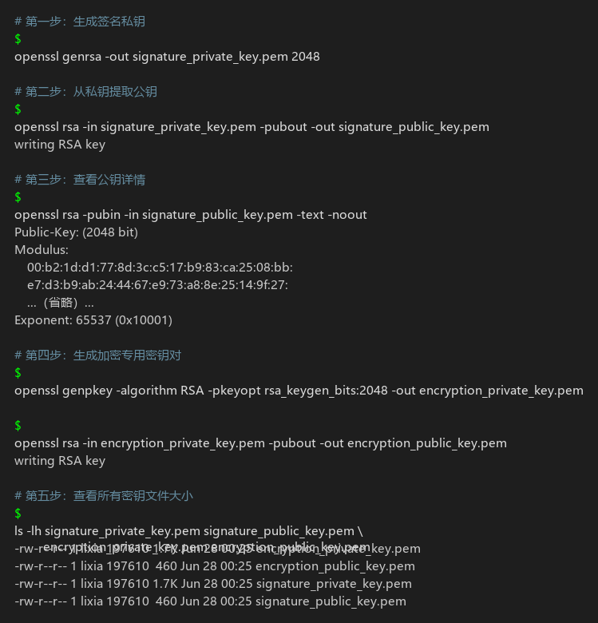
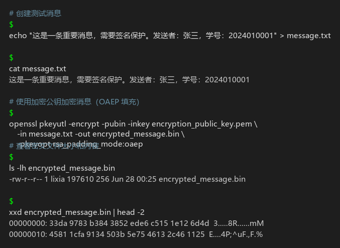
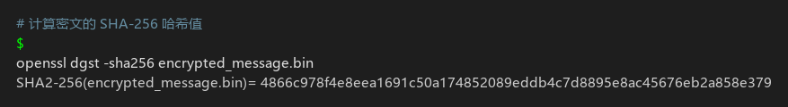
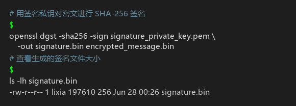
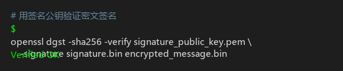
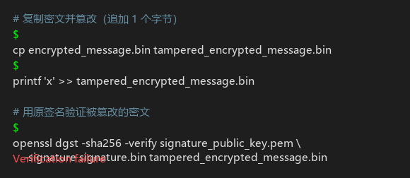
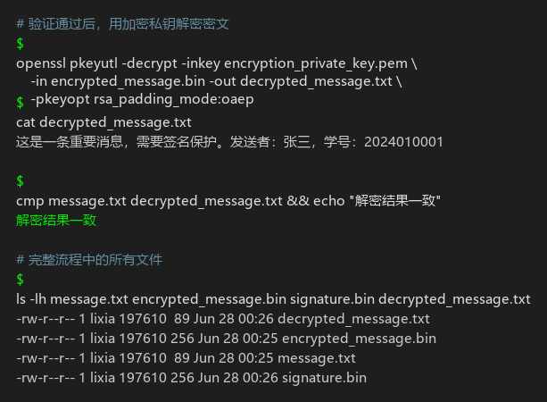

# Lab11：数字签名 —— 验证消息的真实性与完整性

## 实验简介

### 从哈希函数到数字签名

在前面的实验中，你已经学习了：

- **对称加密**（Lab1-Lab4）：使用相同的密钥进行加密和解密，适合大量数据的快速加密
- **非对称加密**（Lab5-Lab8）：使用公钥加密、私钥解密，解决了密钥分发问题
- **哈希函数**（Lab9）：将任意长度的数据映射为固定长度的摘要，具有单向性和抗碰撞性
- **公钥密码学应用**（Lab10）：RSA、ElGamal 等公钥加密系统的原理和实现

这些都是密码学的基础工具。但它们单独使用时，都有各自的局限：

- **对称加密**能保证机密性，但无法证明发送者身份
- **非对称密码学**可以用私钥生成签名来证明身份，但直接对大文件使用非对称运算效率太低
- **哈希函数**能检测数据是否被篡改，但无法证明哈希值本身是谁计算的

**数字签名**就是将这些工具组合起来，解决一个核心问题：**如何在不安全的网络中，让接收者确信一条消息确实来自声称的发送者，且内容未被篡改？**

### 数字签名解决的问题

想象以下场景：

**场景一：软件发布**

你从网上下载了一个软件安装包。网站上提供了文件的 SHA-256 哈希值。你下载后计算哈希，发现和网站上的一致。但问题来了：**网站本身可能被黑客入侵，哈希值也被替换了**。你如何确认这个哈希值确实是软件开发者发布的，而不是攻击者伪造的？

**场景二：电子邮件**

你收到一封"来自老板"的邮件，要求立即转账。邮件地址看起来很像老板的邮箱。但你如何确认这封邮件真的是老板发的，而不是钓鱼邮件？

**场景三：代码提交**

开源项目中，有人提交了一个 Pull Request。代码看起来没问题，但你如何确认这个提交真的来自声称的开发者，而不是有人冒用了他的 GitHub 账号？

这些场景的共同点是：**你需要验证消息的来源和完整性**。数字签名提供了这种能力。

### 数字签名的三大保证

数字签名技术提供了三个关键保证：

1. **身份认证（Authentication）**
   - 证明消息确实来自持有私钥的发送者
   - 就像手写签名证明文件是你本人签署的
2. **完整性保护（Integrity）**
   - 确保消息在传输过程中未被篡改
   - 任何微小的修改都会导致签名验证失败
3. **不可否认性（Non-repudiation）**
   - 发送者无法否认自己发送过该消息
   - 因为他持有生成签名所需的私钥

### Lab11 的目标

本次实验将带你深入理解数字签名的工作原理，并通过实际操作掌握"先加密、再对密文签名、验证后解密"的完整流程。完成本实验后，你应该能够：

1. **理解数字签名的数学原理**：为什么"先哈希后签名"是必要的？哈希函数在签名中扮演什么角色？
2. **掌握加密后签名的完整流程**：从密钥生成、消息加密、密文哈希、密文签名到签名验证和解密的每一步操作
3. **理解签名的安全性**：为什么签名能防止篡改？为什么签名能证明身份？什么情况下签名会失效？
4. **理解 RSA 加密与数字签名的异同**：通过同一个消息文件串联加密、签名、验证和解密，区分"保密性"与"身份认证/完整性保护"
5. **理解签名在实际系统中的应用**：软件签名、代码签名、数字证书等场景

> **说明**：本实验使用 OpenSSL 工具，推荐在 Linux 或 macOS 环境下完成。Windows 用户可以使用 WSL 或 Git Bash。

---

## 数字签名的核心原理

在动手之前，先把数字签名的关键概念理解透彻。

### 数字签名 vs 手写签名

手写签名的特点：
- **固定不变**：同一个人的签名基本一致
- **难以伪造**：每个人的笔迹特征独特
- **绑定文件**：签名直接写在文件上，和文件内容物理绑定

但手写签名有个致命问题：**可以复制**。如果你在一份合同上签了名，别人可以扫描这个签名，粘贴到另一份你从未见过的合同上。

数字签名解决了这个问题：
- **签名和消息绑定**：签名是针对特定消息内容计算出来的，无法"复制粘贴"到其他消息上
- **不可伪造**：只有持有私钥的人才能生成有效签名
- **可验证**：任何人都可以用公钥验证签名的有效性

### 数字签名的基本流程

数字签名最基本的对象是"一段数据"。这段数据可以是明文消息，也可以是密文、软件安装包、代码提交或证书内容。本实验为了同时理解加密和签名，会先把明文加密成密文，再对密文进行哈希和签名。

#### 签名生成（发送方）

```
待签名数据（本实验中是密文）
    ↓
计算哈希值（SHA-256）
    ↓
用签名私钥对哈希值签名
    ↓
得到数字签名
    ↓
发送：待签名数据 + 签名
```

#### 签名验证（接收方）

```
收到：待签名数据 + 签名
    ↓
路径1：计算接收到的数据的哈希值 → 哈希值A
路径2：用签名公钥验证签名 → 哈希值B
    ↓
比较哈希值A 和 哈希值B
    ↓
相同？ → 验证通过 ✓
不同？ → 验证失败 ✗（数据被篡改或签名伪造）
```

本实验中的完整顺序是：

```
明文 message.txt
    ↓
用加密公钥加密 → encrypted_message.bin
    ↓
计算密文哈希
    ↓
用签名私钥对密文哈希签名 → signature.bin
    ↓
接收方先验证密文签名
    ↓
验证通过后，用加密私钥解密密文
```

### 为什么要先计算哈希值？

你可能会问：既然 RSA 签名本质上也是用私钥做数学运算，为什么不直接对整个消息或密文进行 RSA 运算作为签名？

原因有三个：

**1. 效率问题**

RSA 等非对称加密算法的运算速度远低于对称加密。对一个 1GB 的文件进行 RSA 运算是不现实的。而哈希函数的计算速度很快，无论文件多大，都能快速生成固定长度的哈希值（例如 SHA-256 输出 256 位）。然后只需要对这 256 位进行 RSA 签名即可。

| 操作对象 | 大小 | RSA 签名耗时 |
| :------- | :--- | :---------- |
| 直接对 1GB 文件签名 | 1GB | 不可行 |
| 先计算 SHA-256，对哈希值签名 | 256 位（32 字节） | 毫秒级 |

**2. 输入长度问题**

RSA 一次只能处理不超过模数长度的数据块，签名标准也不是为直接处理任意长度文件设计的。先计算哈希值，可以把任意大小的文件压缩成固定长度摘要，再对摘要进行签名。

**3. 标准化问题**

哈希值是固定长度的，这使得签名算法的接口统一、简洁。无论消息是 1KB 还是 1GB，签名的输入都是固定的哈希值。

### RSA 签名的数学原理

回顾 RSA 加密的基本原理：

- **密钥生成**：选择两个大素数 $p$ 和 $q$，计算 $N = p \times q$，选择公钥指数 $e$ 和私钥指数 $d$，满足 $e \times d \equiv 1 \pmod{\varphi(N)}$
- **加密**：密文 $c = m^e \bmod N$
- **解密**：明文 $m = c^d \bmod N$

RSA 签名利用了 RSA 的**可逆性**：

- **签名**：签名 $\sigma = H(m)^d \bmod N$（用私钥 $d$）
- **验证**：计算 $\sigma^e \bmod N$，应该等于 $H(m)$（用公钥 $e$）

关键点：
1. **只有持有私钥 $d$ 的人才能计算 $\sigma = H(m)^d \bmod N$**
2. **任何人都可以用公钥 $e$ 验证：$\sigma^e \bmod N = H(m)$**
3. **如果消息被篡改**，$H(m)$ 改变，$\sigma^e \bmod N$ 就不会等于新的 $H(m')$，验证失败

### 为什么签名能防止篡改？

假设攻击者想要篡改消息：

**场景：修改消息内容**
1. Alice 发送消息 $m_1$："转账 100 元" + 签名 $\sigma_1 = H(m_1)^d \bmod N$
2. 攻击者截获后，想改成 $m_2$："转账 10000 元"
3. 攻击者把消息改为 $m_2$，但签名 $\sigma_1$ 还是原来的
4. Bob 收到后验证：$\sigma_1^e \bmod N = H(m_1)$，但现在消息是 $m_2$，$H(m_2) \neq H(m_1)$
5. 验证失败！Bob 发现消息被篡改

**场景：伪造签名**
1. 攻击者想为消息 $m_2$ 生成签名 $\sigma_2 = H(m_2)^d \bmod N$
2. 但攻击者没有私钥 $d$，无法计算 $H(m_2)^d \bmod N$
3. 攻击者试图暴力破解私钥 $d$？对于 2048 位 RSA，这需要数十亿年
4. 攻击者无法伪造签名

本实验中，签名对象不是明文消息，而是 `encrypted_message.bin`。把上面例子里的"消息"替换成"密文"，验证逻辑完全相同：密文一旦被篡改，签名验证就会失败。

### 哈希函数在签名中的关键作用

哈希函数必须满足三个性质，才能保证签名的安全：

**1. 抗原像性（Preimage Resistance）**

给定哈希值 $h$，找到满足 $H(m) = h$ 的消息 $m$ 在计算上不可行。
- **对签名的意义**：攻击者即使知道签名 $\sigma = H(m)^d \bmod N$，也无法反推出原始消息 $m$

**2. 抗第二原像性（Second Preimage Resistance）**

给定消息 $m_1$，找到另一个消息 $m_2 \ne m_1$ 使得 $H(m_1) = H(m_2)$ 在计算上不可行。
- **对签名的意义**：攻击者无法找到另一个消息 $m_2$，使得它的哈希值和原消息 $m_1$ 相同，从而重用签名

**3. 抗碰撞性（Collision Resistance）**

找到任意两个不同的消息 $m_1 \ne m_2$ 使得 $H(m_1) = H(m_2)$ 在计算上不可行。
- **对签名的意义**：攻击者无法事先准备两个内容不同但哈希值相同的消息，然后用其中一个签名，替换为另一个

### 为什么 SHA-1 不再安全？

SHA-1 曾经被广泛用于文件校验和数字签名，但它已经不再适合安全场景。2017 年，Google 和 CWI Amsterdam 公开了 SHA-1 碰撞攻击：攻击者可以构造两个内容不同、但 SHA-1 哈希值相同的文件。这对数字签名非常危险。

假设攻击者准备了两个文件：
1. 文件 A：看起来正常、愿意让别人签名的内容
2. 文件 B：攻击者真正想替换进去的恶意内容

如果两个文件的 SHA-1 哈希值相同，那么对文件 A 的签名也可能被拿去验证文件 B。也就是说，签名者以为自己签的是 A，验证者却可能看到 B 也能通过验证。

因此，现代数字签名不应使用 SHA-1。本实验使用 SHA-256。

### 常见的数字签名算法

| 算法 | 基础 | 签名长度 | 特点 |
| :--- | :--- | :------ | :--- |
| **RSA 签名** | RSA 公钥系统 | 与密钥长度相同（2048 位密钥 → 256 字节签名） | 最广泛使用，签名和验证速度适中 |
| **ECDSA** | 椭圆曲线密码学 | 较短（256 位曲线 → 64 字节签名） | 签名更短，验证较快，广泛用于区块链 |
| **EdDSA** | Edwards 曲线 | 64 字节（Ed25519） | 签名速度快，安全性高，抗侧信道攻击 |
| **DSA** | 离散对数 | 40-64 字节 | 已过时，不推荐使用 |

本实验主要使用 **RSA 签名**，因为它最容易理解，也最广泛使用。

---

## 实验环境准备

### 检查 OpenSSL 版本

OpenSSL 是一个强大的密码学工具库，提供了完整的数字签名功能。检查你的系统是否已安装 OpenSSL：

```bash
openssl version
```

期望输出类似：

```
OpenSSL 3.5.6 7 Apr 2026 (Library: OpenSSL 3.5.6 7 Apr 2026)
```

### 创建实验目录

```bash
mkdir -p ~/cryptography-lab11 && cd ~/cryptography-lab11
```

---

## 任务一：生成签名密钥对和加密密钥对

本实验需要两对 RSA 密钥：

| 密钥对 | 私钥用途 | 公钥用途 |
| :----- | :------- | :------- |
| 签名密钥对 | 生成数字签名 | 验证数字签名 |
| 加密密钥对 | 解密密文 | 加密明文 |

实际系统中通常会区分签名密钥和加密密钥。本实验也采用这种方式，避免把同一对密钥混用于不同安全目标。

### 第一步：生成签名私钥

执行命令：

```bash
openssl genrsa -out signature_private_key.pem 2048
```

### 第二步：查看私钥内容

```bash
openssl rsa -in signature_private_key.pem -text -noout
```

期望输出（部分）：

```
Private-Key: (2048 bit, 2 primes)
modulus:
    00:b2:1d:d1:77:8d:3c:c5:17:b9:83:ca:25:08:bb:
    e7:d3:b9:ab:24:44:67:e9:73:a8:8e:25:14:9f:27:
    ...
publicExponent: 65537 (0x10001)
privateExponent:
    ...
prime1:
    ...
prime2:
    ...
```

### 第三步：从签名私钥中提取签名公钥

```bash
openssl rsa -in signature_private_key.pem -pubout -out signature_public_key.pem
```

### 第四步：查看公钥内容

```bash
openssl rsa -pubin -in signature_public_key.pem -text -noout
```

期望输出：

```
Public-Key: (2048 bit)
Modulus:
    00:b2:1d:d1:77:8d:3c:c5:17:b9:83:ca:25:08:bb:
    e7:d3:b9:ab:24:44:67:e9:73:a8:8e:25:14:9f:27:
    ...（省略中间部分）...
    91:d3:0f:f8:83:8b:91:6d:34:ab:16:f1:ea:6e:30:
    18:57
Exponent: 65537 (0x10001)
```

### 第五步：比较签名密钥文件大小

```bash
ls -lh signature_private_key.pem signature_public_key.pem
```

### 第六步：生成加密专用 RSA 密钥对

```bash
openssl genpkey -algorithm RSA -pkeyopt rsa_keygen_bits:2048 -out encryption_private_key.pem
openssl rsa -in encryption_private_key.pem -pubout -out encryption_public_key.pem
ls -lh encryption_private_key.pem encryption_public_key.pem
```

### 任务一小结



---

## 任务二：创建消息并使用 RSA 加密文件

现在我们先模拟发送方保护消息内容：创建明文文件，然后用接收方的加密公钥把它加密成密文。

### 第一步：创建测试消息

```bash
echo "这是一条重要消息，需要签名保护。发送者：张三，学号：2024010001" > message.txt
cat message.txt
```

### 第二步：使用加密公钥加密消息

```bash
openssl pkeyutl -encrypt -pubin -inkey encryption_public_key.pem -in message.txt -out encrypted_message.bin -pkeyopt rsa_padding_mode:oaep
```

### 第三步：查看密文文件

```bash
ls -lh encrypted_message.bin
xxd encrypted_message.bin | head -2
```

### 任务二小结



---

## 任务三：对密文计算哈希并生成数字签名

发送方现在已经有了密文 `encrypted_message.bin`。接下来不要签名明文，而是对密文计算哈希并生成签名。

### 第一步：计算密文的哈希值

```bash
openssl dgst -sha256 encrypted_message.bin
```

### 第二步：使用签名私钥对密文签名

```bash
openssl dgst -sha256 -sign signature_private_key.pem -out signature.bin encrypted_message.bin
```

### 第三步：查看签名文件

```bash
ls -lh signature.bin
```

### 任务三小结





---

## 任务四：验证密文签名并解密

接收方收到的是 `encrypted_message.bin` 和 `signature.bin`。正确处理顺序是：**先验证签名，再解密密文**。

### 第一步：验证密文签名

```bash
openssl dgst -sha256 -verify signature_public_key.pem -signature signature.bin encrypted_message.bin
```



### 第二步：测试密文被篡改后的验证结果

```bash
cp encrypted_message.bin tampered_encrypted_message.bin
printf 'x' >> tampered_encrypted_message.bin
openssl dgst -sha256 -verify signature_public_key.pem -signature signature.bin tampered_encrypted_message.bin
```



### 第三步：验证通过后解密密文

```bash
openssl pkeyutl -decrypt -inkey encryption_private_key.pem -in encrypted_message.bin -out decrypted_message.txt -pkeyopt rsa_padding_mode:oaep
cat decrypted_message.txt
cmp message.txt decrypted_message.txt && echo "解密结果一致"
ls -lh message.txt encrypted_message.bin signature.bin decrypted_message.txt
```

### 第四步：观察完整流程中的文件

| 文件 | 含义 | 作用 |
| :--- | :--- | :--- |
| `message.txt` | 原始明文 | 发送前的消息 |
| `encrypted_message.bin` | 密文 | 保护消息内容 |
| `signature.bin` | 密文签名 | 证明密文来源并检测篡改 |
| `decrypted_message.txt` | 解密后的明文 | 接收方恢复出的消息 |

### 任务四小结



---

## 实验结果填写

> 根据你的实验结果填写下表。

### A. 密钥信息

| 项目 | 你的结果 |
| :--- | :------- |
| 签名 RSA 密钥长度（位） | 2048 |
| 签名私钥 `signature_private_key.pem` 文件大小（字节） | 1732 |
| 签名公钥 `signature_public_key.pem` 文件大小（字节） | 460 |
| 签名公钥指数 e 的值 | 65537 (0x10001) |
| 签名公钥模数 N 的前 16 位十六进制 | B21DD1778D3CC517 |
| 加密私钥 `encryption_private_key.pem` 文件大小（字节） | 1732 |
| 加密公钥 `encryption_public_key.pem` 文件大小（字节） | 460 |

---

### B. 加密与密文哈希

| 项目 | 你的结果 |
| :--- | :------- |
| 原始消息内容（你写入的文字） | 这是一条重要消息，需要签名保护。发送者：张三，学号：2024010001 |
| 密文文件 `encrypted_message.bin` 大小（字节） | 256 |
| 密文 SHA-256 哈希值（完整的 64 位十六进制） | 4866c978f4e8eea1691c50a174852089eddb4c7d8895e8ac45676eb2a858e379 |
| 密文 SHA-256 哈希值长度（十六进制字符数） | 64 |

---

### C. 密文签名与验证

| 项目 | 你的结果 |
| :--- | :------- |
| 签名文件 `signature.bin` 大小（字节） | 256 |
| 原始密文的签名验证结果 | Verified OK |
| 篡改密文后的签名验证结果 | Verification failure |

---

### D. 解密与流程理解

| 项目 | 你的结果 |
| :--- | :------- |
| 解密后的文件是否与原文件一致 | 是（解密结果一致） |
| 加密操作使用的密钥文件 | `encryption_public_key.pem`（加密公钥） |
| 解密操作使用的密钥文件 | `encryption_private_key.pem`（加密私钥） |
| 签名操作使用的密钥文件 | `signature_private_key.pem`（签名私钥） |
| 验证签名操作使用的密钥文件 | `signature_public_key.pem`（签名公钥） |
| 接收方应先验证签名还是先解密 | 先验证签名 |

---

## 思考题

### 1. 数字签名的三大保证

**数字签名提供了哪三个关键保证？请分别解释它们的含义，并结合本次实验说明这三个保证是如何实现的。**

> 答：
>
> 数字签名提供以下三个关键保证：
>
> **（1）身份认证（Authentication）**：证明消息确实来自持有私钥的发送者。
>
> 本实验中，只有持有 `signature_private_key.pem` 的发送者才能生成有效的 `signature.bin`。接收方使用对应的 `signature_public_key.pem` 验证签名成功（Verified OK），说明该密文确实是拥有对应私钥的一方签发的。就像手写签名证明了文件签署人的身份一样。
>
> **（2）完整性保护（Integrity）**：确保消息在传输过程中未被篡改。
>
> 本实验中，我们对密文追加了一个字节模拟篡改，再用原签名去验证，结果为 `Verification failure`。这说明签名绑定的是密文的内容——只要密文发生哪怕一个字节的改变，其 SHA-256 哈希值就会完全改变，导致签名验证失败。因此，签名验证通过就保证了密文在传输过程中没有被篡改。
>
> **（3）不可否认性（Non-repudiation）**：发送者无法否认自己发送过该消息。
>
> 因为签名是用发送者的私钥生成的，只有他/她持有这个私钥。一旦签名被验证成功，发送者就无法否认"我没有签过这条消息"。即使发送者声称"这不是我发的"，只要签名验证通过且私钥未泄露，就可以确定消息确实来自该发送者。

---

### 2. 为什么要"先哈希后签名"？

**在本实验中，为什么要先计算密文的哈希值，而不是直接对整个密文进行 RSA 签名？请至少列举三个原因。**

> 答：
>
> **原因一：效率问题**
>
> RSA 等非对称加密算法（包括签名操作）的运算速度远低于哈希函数。本实验中密文仅 256 字节，但如果要对一个 1 GB 的文件进行 RSA 运算，时间成本是不可接受的。而 SHA-256 无论文件多大，都能在毫秒级内计算出 32 字节的哈希值，然后只需对这个 256 位的哈希值做一次 RSA 签名即可。这是最根本的原因。
>
> **原因二：输入长度限制**
>
> RSA 一次只能处理不超过模数长度的数据块（2048 位 RSA 密钥只能处理 ≤ 256 字节的输入）。如果消息超过这个长度，就需要分块处理或填充，这使得"直接对整个消息签名"变得复杂且不标准。先计算哈希值可以把任意大小的输入统一压缩为固定长度的摘要（SHA-256 固定输出 32 字节），使得签名接口简单统一。
>
> **原因三：标准化与兼容性**
>
> 所有主流数字签名标准（PKCS#1 v1.5、PSS、ECDSA 等）都是基于哈希值设计的，而不是基于原始数据。"先哈希后签名"已经成为行业标准做法。这样做的好处是：无论底层使用什么哈希算法（SHA-256、SHA-384 等），签名的处理逻辑都保持一致，只需更换哈希参数即可。

---

### 3. 签名长度与密钥长度的关系

**观察你生成的签名文件 `signature.bin` 的大小。为什么 2048 位的 RSA 密钥生成的签名长度是 256 字节？如果使用 4096 位的 RSA 密钥，签名长度会是多少？**

> 答：
>
> 本实验中 `signature.bin` 的大小为 **256 字节**。
>
> **原因分析**：
>
> RSA 签名的本质是对哈希值的数学运算 $\sigma = H(m)^d \bmod N$。由于运算是取模 $N$ 的结果，所以签名值 $\sigma$ 的范围是 $0 \le \sigma < N$。而 $N$ 是两个大素数的乘积，其位数等于密钥长度。因此：
>
> - 2048 位 RSA 密钥 → 模数 $N$ 占 2048 位 = 256 字节 → 签名长度 = 256 字节
> - 4096 位 RSA 密钥 → 模数 $N$ 占 4096 位 = 512 字节 → 签名长度 = 512 字节
> - 1024 位 RSA 密钥 → 模数 $N$ 占 1024 位 = 128 字节 → 签名长度 = 128 字节
>
> 简言之，**RSA 签名的长度始终等于密钥位数的八分之一（即字节数），因为签名值是模 $N$ 的余数，不可能超过 $N-1$**。
>
> 这也是为什么椭圆曲线签名（如 Ed25519）更受欢迎的原因之一——256 位椭圆曲线产生的签名仅 64 字节，比同等安全性的 RSA 签名短得多。

---

### 4. 哈希函数的安全性要求

**哈希函数必须满足哪三个性质才能保证数字签名的安全？请分别解释这三个性质，并说明如果哈希函数不满足某个性质，会导致什么安全问题。提示：抗原像性、抗第二原像性、抗碰撞性**

> 答：
>
> **（1）抗原像性（Preimage Resistance）**
>
> 定义：给定哈希值 $h$，找到满足 $H(m) = h$ 的任意消息 $m$ 在计算上不可行。
>
> 对签名的意义：如果抗原像性被攻破，攻击者在截获签名 $\sigma = H(m)^d \bmod N$ 后，可以从 $\sigma$ 反推出原始消息 $m$（因为 $\sigma^e \bmod N = H(m)$ 得到哈希值，再利用抗原像性的缺失找到 $m$），破坏了签名的机密性。虽然通常签名不需要保护消息的机密性，但在某些场景下这可能造成信息泄露。
>
> **（2）抗第二原像性（Second Preimage Resistance）**
>
> 定义：给定消息 $m_1$，找到另一个不同的消息 $m_2 \neq m_1$ 使得 $H(m_1) = H(m_2)$ 在计算上不可行。
>
> 对签名的意义：如果此性质被攻破，攻击者在看到合法的消息 $m_1$ 及其签名后，可以找到一个内容不同的 $m_2$ 使其具有相同的哈希值，从而**复用 $m_1$ 的签名来冒充 $m_2$ 也是由发送者签发的**。例如，发送者签署了一份金额为 100 元的转账指令，攻击者找到了另一份金额为 10000 元的指令具有相同哈希值，就能用原始签名欺骗接收者。
>
> **（3）抗碰撞性（Collision Resistance）**
>
> 定义：找到任意两个不同的消息 $m_1 \neq m_2$ 使得 $H(m_1) = H(m_2)$ 在计算上不可行。
>
> 对签名的意义：如果此性质被攻破（如 SHA-1 被攻破的情况），攻击者可以**事先准备两份内容不同但哈希值相同的文件**，让签名者为其中一份"良性"文件签名，然后将签名应用到另一份"恶意"文件上。这与第二原像攻击的区别在于：碰撞攻击允许攻击者**同时控制两个文件的内容**，危害更大。这也是 SHA-1 不再推荐用于数字签名的主要原因。

---

### 5. SHA-1 的安全问题

**为什么 SHA-1 哈希算法不再被推荐用于数字签名？2017 年 Google 发现的 SHA-1 碰撞攻击对数字签名有什么影响？请举例说明攻击者如何利用这个漏洞。**

> 答：
>
> **SHA-1 不再安全的原因**：
>
> SHA-1 输出的哈希值为 160 位。随着计算能力的提升，理论上寻找碰撞的难度已经降到可行范围。2017 年 2 月，Google 与 CWI Amsterdam 联合公布了首个 SHA-1 碰撞实例（命名为 SHAttered 攻击），证明了两份内容不同的 PDF 文件具有相同的 SHA-1 哈希值。
>
> **对数字签名的影响**：
>
> SHA-1 的碰撞攻击直接破坏了哈希函数的抗碰撞性（Collision Resistance），从而危及依赖此性质的数字签名安全。具体影响如下：
>
> **攻击示例**：
>
> 假设攻击者 Alice 准备了两份 PDF 合同文件：
> 1. **文件 A**：内容为"同意支付 100 元给乙方"，看起来是一份正常的合同
> 2. **文件 B**：内容为"同意支付 10,000 元给乙方"，是 Alice 真正想要的合同
>
> 两份文件的 SHA-1 哈希值相同（通过 SHAttered 技术实现）。Alice 将文件 A 给受害者 Bob 签名。Bob 用自己的私钥对文件 A 进行签名。之后 Alice 取出 Bob 的签名，将其附加到文件 B 上——由于两份文件哈希值相同，Bob 对文件 A 的签名同样可以通过文件 B 的签名验证。Bob 就这样"签发"了他从未见过的文件 B。
>
> 这种攻击之所以危险，是因为攻击者可以在签名发生之前精心构造碰撞对，使得整个攻击过程对签名者完全透明。这就是为什么现代数字签名必须使用 SHA-256 或更强的哈希算法。

---

### 6. 公钥与私钥的角色

**本实验使用了签名密钥对和加密密钥对。请分别说明：**
**- 签名私钥、签名公钥分别用于什么操作？**
**- 加密私钥、加密公钥分别用于什么操作？**
**- 如果攻击者获得了公钥，他能做什么？不能做什么？**

> 答：
>
> **签名密钥对的用途**：
>
> - **签名私钥** (`signature_private_key.pem`)：用于**生成数字签名**（签名操作）。本实验中使用它对密文的 SHA-256 哈希值执行 RSA 签名，生成 `signature.bin`。私钥必须严格保密。
> - **签名公钥** (`signature_public_key.pem`)：用于**验证数字签名**（验证操作）。本实验中使用它来验证 `signature.bin` 是否是针对 `encrypted_message.bin` 的有效签名。公钥可以公开分发。
>
> **加密密钥对的用途**：
>
> - **加密公钥** (`encryption_public_key.pem`)：用于**加密消息**（加密操作）。任何人都可以使用它将明文加密为密文，确保只有持有对应私钥的人才能解密。
> - **加密私钥** (`encryption_private_key.pem`)：用于**解密密文**（解密操作）。只有持有此私钥的人才能还原出原始明文。私钥必须严格保密。
>
> **攻击者获得公键后的能力与局限**：
>
> **能做到的**：
> - 使用加密公钥加密任意消息（但不能解密）
> - 使用签名公钥验证签名（但不能伪造签名）
> - 从公钥获取模数 $N$ 和指数 $e$（但这些不足以推导出私钥）
>
> **做不到的**：
> - 无法解密用加密公钥加密的数据（没有加密私钥）
> - 无法伪造有效签名（没有签名私钥）
> - 无法从公钥反推出私钥（RSA 的安全性依赖于大整数分解问题的困难性）

---

### 7. 签名与加密的区别

**结合本实验"加密 -> 哈希 -> 签名 -> 验证 -> 解密"的流程，说明数字签名和消息加密有什么本质区别。它们分别解决什么问题？为什么不能简单地用加密代替签名？**

> 答：
>
> **本质区别对比**：
>
> | 维度 | 数字签名 | 消息加密 |
> | :--- | :--- | :--- |
> | **目的** | 证明身份 + 保证完整性 | 保护内容机密性 |
> | **操作方式** | 私钥签名，公钥验证 | 公钥加密，私钥解密 |
> | **解决的核心问题** | "这条消息是谁发的？有没有被改？" | "除了接收者，谁也看不懂内容" |
> | **密钥方向** | 签名用私钥（自己持有） | 加密用公钥（对方公开） |
>
> **在本实验中的体现**：
>
> - **加密**解决了"消息内容不被窃听者读取"的问题：明文经过 `encryption_public_key.pem` 加密后变成乱码般的 `encrypted_message.bin`
> - **签名**解决了"消息来源真实且完整"的问题：密文经过 `signature_private_key.pem` 签名后，任何人可用 `signature_public_key.pem` 验证其真实性
>
> **为什么不能用加密代替签名？**
>
> 如果我们只用加密而不签名：
> 1. **无法证明身份**：接收方只能确认消息是用某把公钥加密的，但这把公钥可能是攻击者公布的。加密只保证机密性，不保证来源可信。
> 2. **无法防止内部篡改**：如果攻击者截获了密文并将其替换为自己的加密消息，接收方解密后不会发现异常——因为没有机制检测篡改。
> 3. **无法实现不可否认性**：双方都知道加密密钥时（对称加密场景），无法区分消息是哪一方发出的。
>
> 因此，加密和签名解决的是**两个正交的安全需求**：加密保护机密性（Confidentiality），签名提供认证性和完整性（Authentication & Integrity）。两者结合才能构建完整的端到端安全通信。

---

### 8. 签名的不可否认性

**什么是"不可否认性"（Non-repudiation）？为什么数字签名能提供不可否认性，而消息认证码（MAC）不能？提示：MAC 使用对称密钥，签名使用非对称密钥**

> 答：
>
> **不可否认性的定义**：
>
> 不可否认性是指消息的发送方在事后**无法否认自己曾经发送过该消息**这一性质。当第三方（如仲裁机构）能够独立确认消息确实来自某一方时，就实现了不可否认性。
>
> **数字签名为什么能提供不可否认性？**
>
> 因为数字签名使用**非对称密钥体系**：
> - 签名是由**只有发送者持有的私钥**生成的
> - 验证只需要**公开的公钥**
> - 任何人（包括第三方仲裁者）都可以独立验证签名的有效性
> - 由于私钥唯一地属于发送者，验证通过就意味着"只有发送者才能产生这个签名"
>
> 即使发送者事后声称"我没签过这个"，只要签名验证通过且私钥未泄露，仲裁者就能判定签名有效，发送者无法抵赖。
>
> **为什么 MAC 不能提供不可否认性？**
>
> MAC（Message Authentication Code，消息认证码）使用**对称密钥**：
> - 生成 MAC 和验证 MAC 使用的是**同一个密钥**
> - 发送方和接收方共享同一把密钥
> - 既然接收方也有这把密钥，那么**接收方完全可以自己构造出一个合法的 MAC**
>
> 这意味着：如果发生争议，发送方可以声称"这个 MAC 是接收方自己伪造的"——由于双方都有能力生成合法的 MAC，第三方仲裁者**无法判断 MAC 到底是谁生成的**。因此，MAC 只能提供消息认证（确认消息来自知道密钥的一方），但不具备不可否认性。
>
> **总结一句话**：非对称体制使签名者和验证者的角色不对称（私钥签名 vs 公钥验证），从而支持不可否认；对称体制中双方能力相同，无法区分谁是真正的签名者。

---

### 9. 实际应用场景

**请列举三个数字签名在现实世界中的应用场景（例如软件发布、电子邮件、代码签名等），并说明在这些场景中数字签名解决了什么问题。**

> 答：
>
> **应用场景一：软件发布 / 代码签名**
>
> 当你下载 Windows 更新、macOS 应用程序或驱动程序时，这些文件都带有开发者的数字签名。操作系统在安装前会验证签名：
> - 解决的问题：**防止恶意软件伪装**。攻击者可能入侵下载服务器替换安装包，但由于他没有微软/苹果的私钥，无法对恶意文件生成有效签名，操作系统会拒绝安装未签名或签名无效的文件。
> - 具体例子：Windows 的 Authenticode 代码签名、Apple 的 Gatekeeper、Linux 包管理器（apt/yum）中的 GPG 签名。
>
> **应用场景二：电子邮件安全（S/MIME）**
>
> S/MIME 协议允许用户对电子邮件进行数字签名：
> - 解决的问题：**防止钓鱼邮件和身份冒充**。当老板发邮件让你转账时，S/MIME 签名让你确认这封邮件确实来自老板的邮箱地址（绑定了他的数字证书），而非攻击者伪造的相似地址。同时也保证邮件内容在中转服务器上没有被篡改。
>
> **应用场景三：区块链与加密货币交易**
>
> 在比特币、以太坊等区块链系统中，每笔交易都需要发送者用私钥进行 ECDSA/EdDSA 签名：
> - 解决的问题：**交易的真实性与不可伪造性**。矿工/验证节点用发送者的公钥验证交易签名，确认交易确实由币的主人授权。同时确保交易金额和收款地址在网络传输中不被篡改。如果签名验证不通过，网络会拒绝这笔交易。
>
> **补充：TLS/HTTPS 证书**
>
> 访问网站时，浏览器验证服务器的 SSL/TLS 证书——本质上就是验证 CA（证书颁发机构）对该网站公钥的数字签名。这解决了"我正在和真正的银行网站通信吗"的问题。

---

### 10. 时间戳与签名

**假设你今天对一份文件进行了签名。一年后，你声称这份文件是昨天才签名的。接收者如何验证签名的时间？数字签名本身能否证明签名的时间？如何解决这个问题？提示：考虑可信时间戳服务（TSA）**

> 答：
>
> **数字签名本身无法证明签名时间**。
>
> 数字签名只能证明两点：（1）文件内容的完整性；（2）签名者身份的真实性。但它**完全不包含时间维度信息**——签名中没有嵌入可靠的时间戳。签名者的系统时钟可以被随意设置，因此签名文件中的元数据时间不可信。
>
> **问题场景**：
>
> - 你今天签了一个合同，一年后想赖账说"这份合同是我昨天才签的"
> - 或者反过来，攻击者用一个旧的私钥（已过期/已撤销）在今天伪造一个"过去时间点"的签名
>
> **解决方案：可信时间戳服务（TSA, Time Stamping Authority）**
>
> RFC 3161 定义的 TSA 工作流程如下：
>
> 1. 你对文件签名后，将文件哈希值发送给 TSA 服务器
> 2. TSA 用**自己的私钥**对你的哈希值加上**当前权威时间**一起签名，返回一个时间戳令牌（Time Stamp Token, TST）
> 3. TST 中包含了精确到秒甚至毫秒的可信时间，以及 TSA 的数字签名
>
> 这样一来，即使一年后你否认签名时间：
> - 第三方可以验证 TSA 的签名（TSA 是受信任的中立机构）
> - TST 中嵌入了权威时间，证明"在 T 时间点，该文件的哈希值就已经存在"
> - 结合你的签名，可以形成完整的证据链：你在 T 时间之前就已签名
>
> **实际应用**：代码签名证书通常包含时间戳功能，即使签名用的代码签名证书过期了，只要时间戳令牌仍然有效，签名就依然可信。PDF 签名、电子合同等场景也广泛应用 TSA 服务。

---

### 11. 密钥长度的选择

**为什么本实验使用 2048 位的 RSA 密钥？1024 位是否足够安全？4096 位是否有必要？请查阅资料，说明不同密钥长度的安全性和性能权衡。**

> 答：
>
> **各密钥长度的安全性评估（截至 2026 年）**：
>
> | 密钥长度 | 安全强度（等效对称密钥） | 安全状态 | 破解所需资源估算 |
> | :--- | :--- | :--- | :--- |
> | **1024 位** | ~80 位 | **不安全** | 可在数月内被专业组织分解（2010年已实现768位RSA分解）；已被各大CA废弃 |
> | **2048 位** | ~112 位 | **目前安全（推荐）** | 预计2030年前仍安全，需约 $2^{112}$ 次运算量 |
> | **3072 位** | ~128 位 | **长期安全** | 等效于AES-128的安全性，适用于高价值资产 |
> | **4096 位** | ~150 位 | **极长期安全** | 性能代价较高，适用于极高安全需求的场景 |
>
> **为什么选择 2048 位？**
>
> - **安全性与实用性的最佳平衡点**：2048 位 RSA 目前被认为是安全的，预计在未来几年内不会被破解
> - **性能可接受**：签名和验证操作的耗时在毫秒级，对大多数应用无感知延迟
> - **广泛兼容**：几乎所有现代系统和库都原生支持 2048 位 RSA
> - **NIST SP 800-57 推荐**：美国国家标准技术研究院建议 2048 位作为当前标准选择
>
> **1024 位为什么不安全？**
>
> 1024 位 RSA 已被明确认为不安全：
> - 2009 年研究人员成功分解了 768 位 RSA 模数
> - 各大浏览器和操作系统已停止信任 1024 位的根证书
> - 有组织的攻击者（国家级行动者）可能在合理时间内分解 1024 位模数
>
> **4096 位是否有必要？**
>
> 4096 位提供了更高的安全裕度，但有显著代价：
> - **性能下降**：签名/验证速度约为 2048 位的 4-8 倍（RSA 运算复杂度为 O(n³)）
> - **存储开销增大**：公钥、证书、签名文件大小翻倍
> - **兼容性问题**：某些嵌入式设备或老旧系统可能不支持 4096 位
>
> **结论**：对于一般应用（Web 证书、代码签名、文档签名等），**2048 位是目前的标准推荐值**。对于需要保护几十年以上的高敏感数据（如政府/军事/金融核心系统），可以考虑 3072 或 4096 位，或者迁移至椭圆曲线方案（如 ECDSA P-256 或 Ed25519），后者在同等安全性下性能更好、签名更短。

---

### 12. 签名链

**假设 Alice 对一份文件签名，然后 Bob 对"Alice 的签名"进行签名，形成"签名的签名"。这种做法有意义吗？在什么场景下可能需要多重签名？**

> 答：
>
> **"签名的签名"（签名链）是有意义的**，它在多种实际场景中有重要应用：
>
> **场景一：证书链（数字证书体系中最常见的签名链）**
>
> 这是签名链最典型的应用：
> 1. 终端实体证书（如 example.com 的 TLS 证书）— 由中间 CA 签名
> 2. 中间 CA 的证书 — 由根 CA 签名
> 3. 根 CA 的证书 — 自签名（自身签发）
>
> 浏览器预置了根 CA 的公钥。验证过程是：
> - 用根 CA 公钥验证中间 CA 证书的签名 ✓
> - 用中间 CA 公钥验证终端实体证书的签名 ✓
> - 最终确认终端实体公钥可信
>
> 这就是 PKI（公钥基础设施）建立信任链的核心机制。
>
> **场景二：多重签名（Multi-signature）**
>
> 多个独立方对同一份文件分别签名：
> - **企业财务审批**：一笔大额付款需要 CFO + CEO 共同签名才生效
> - **智能合约**：区块链上的多签钱包（如 2-of-3 方案），需要至少 2 个私钥持有人签名才能转移资金
> - **软件发布**：开发者签名 + CI/CD 构建系统签名，双重保障
>
> 注意多重签名与签名链的区别：多重签名是多人对同一份数据签名（并行），签名链是依次对前一个签名再次签名（串行）。
>
> **场景三：时间戳签名链（RFC 3161）**
>
> 如思考题 10 所述，用户签名 → TSA 时间戳签名 → 可能还有归档机构的定期续签时间戳，形成一个不断延伸的签名链，用于长期存证。
>
> **场景四：公证/背书（Endorsement）**
>
> Alice 签名了一份合同，然后公证机构（Notary Public）对"Alice 的签名 + 合同哈希"进行签名，形成公证背书。此后若 Alice 否认签名，公证机构可以作为独立的第三方证人。
>
> **总结**：签名链的本质是通过引入额外的信任锚点，将一个签名方的信任传递到另一方，或增加额外的安全保障层。这在 PKI 证书体系、法律公证、多方审批等场景中至关重要。

---

## 实验扩展阅读

### 1. RSA-PSS vs PKCS#1 v1.5

OpenSSL 默认使用 PKCS#1 v1.5 填充方案。更安全的方案是 RSA-PSS（概率签名方案）。

**区别**：
- PKCS#1 v1.5 是确定性的（同一消息每次签名结果相同）
- RSA-PSS 是概率性的（每次签名结果不同，因为包含随机盐值）
- RSA-PSS 有更强的安全性证明

### 2. 盲签名（Blind Signature）

盲签名允许签名者在不知道消息内容的情况下对消息签名。

应用场景：数字货币（防止追踪）、电子投票（保护隐私）、匿名认证。

### 3. 聚合签名（Aggregate Signature）

多个签名可以聚合成一个签名，减少存储和传输开销。应用于区块链和证书链。

### 4. 门限签名（Threshold Signature）

门限签名要求 n 个参与者中的 t 个人共同参与才能生成有效签名。应用于多重签名钱包和企业财务审批。

---

## 提交要求

在自己的文件夹下新建 `Lab11/` 目录，提交以下文件：

```
学号姓名/
└── Lab11/
    ├── Lab11.md                # 本文件（填写完整，含截图与答案）
    ├── keygen.png              # 密钥生成截图
    ├── encrypt.png             # RSA 加密截图
    ├── hash.png                # 密文哈希计算截图
    ├── sign.png                # 密文签名生成截图
    ├── verify_ok.png           # 密文签名验证成功截图
    ├── verify_fail.png         # 篡改密文后验证失败截图
    └── decrypt.png             # 解密截图
```

---

## 截止时间

2026-07-06，届时关于 Lab11 的 PR 请求将不会被合并。

---

**实验愉快！🔐**
