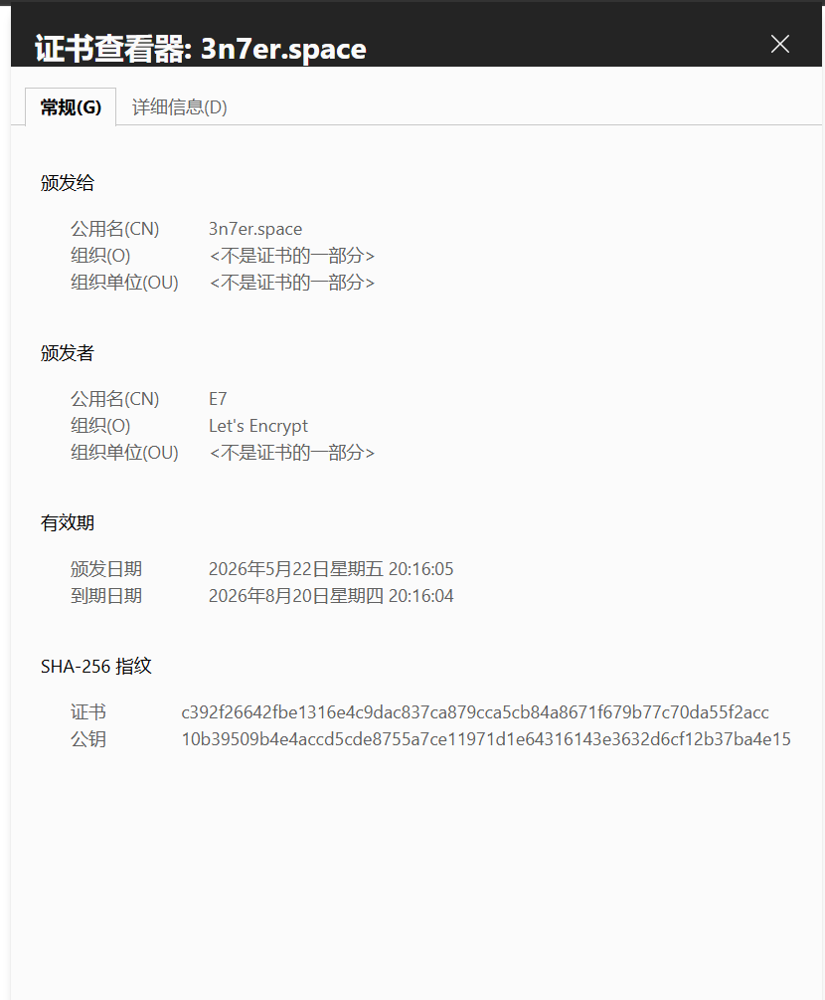
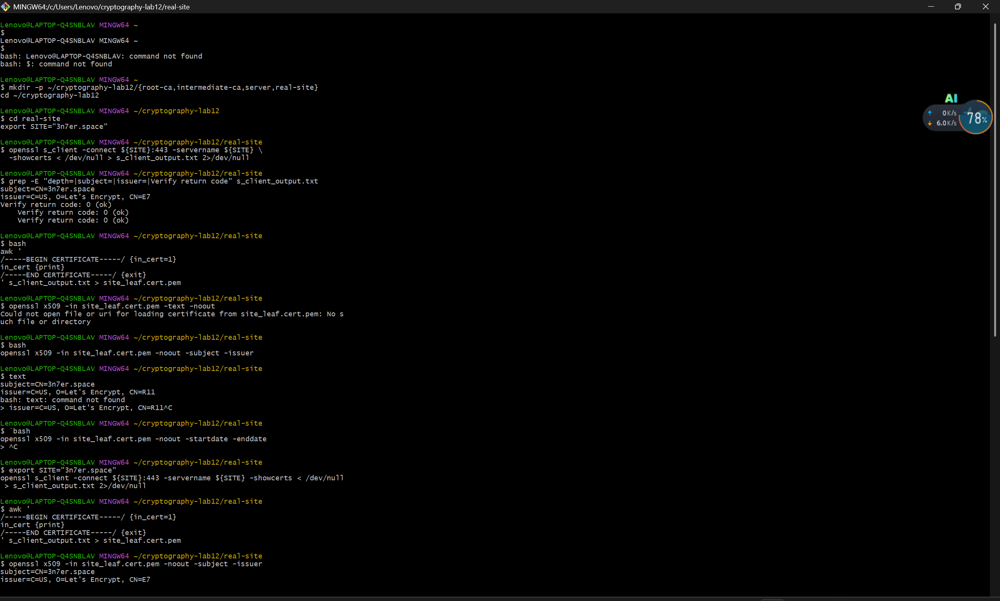
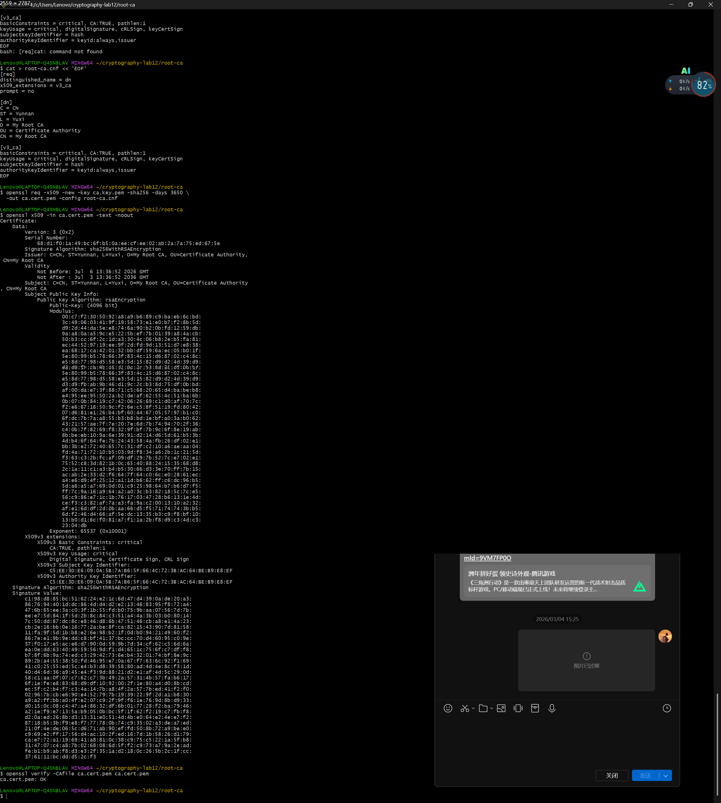
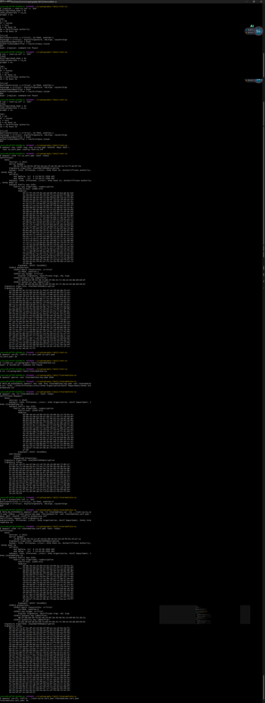
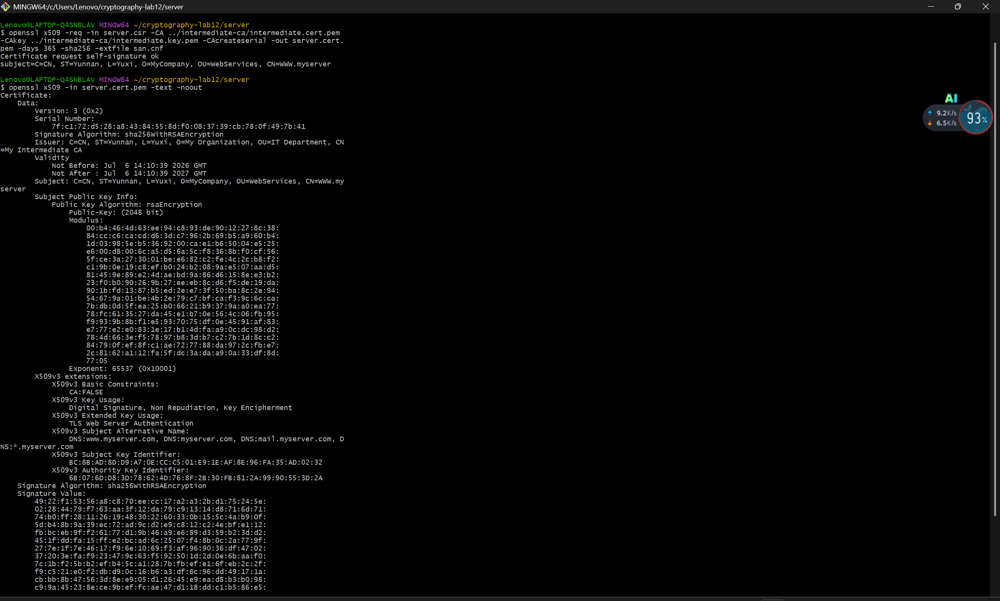
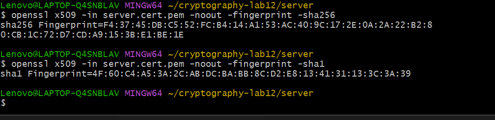

# Lab12：数字证书 —— 构建信任链的基石

## 实验简介

### 从数字签名到数字证书

在 Lab11 中，你已经学习了数字签名的原理和应用：使用私钥对消息签名，用公钥验证签名，数字签名提供了身份认证、完整性保护和不可否认性。

但数字签名有一个**核心问题**还没有解决：**如何确认公钥本身是可信的？**

**场景一：下载软件**

你从网站下载了一个软件安装包，网站提供了安装包、数字签名文件和公钥文件，并说"用公钥验证签名，确保软件未被篡改"。

但如果攻击者**同时替换了软件、签名和公钥**，你的验证仍然会通过——而你下载的是恶意软件。

**场景二：HTTPS 连接**

当你访问 `https://www.example.com` 时，服务器会发送它的公钥。如果攻击者能替换这个公钥，他就能冒充网站，窃取你的密码、信用卡信息等敏感数据。

### 数字证书的解决方案

数字证书通过引入**可信第三方**——证书颁发机构（Certificate Authority, CA）——来解决公钥分发问题：

```text
1. CA 是一个被广泛信任的权威机构（如 DigiCert、Let's Encrypt）
2. CA 用自己的私钥对"网站的公钥 + 网站的身份信息"进行签名
3. 签名后的数据包就是"数字证书"
4. 操作系统和浏览器预装了 CA 的公钥（根证书）
5. 当你收到网站证书时，用 CA 的公钥验证签名
6. 如果验证通过，就可以信任证书中的网站公钥
```

一句话概括：
- **数字签名**解决"消息完整性和来源认证"
- **数字证书**解决"公钥本身的可信性"

### 证书的本质

**数字证书 = 身份信息 + 公钥 + CA 的数字签名**

```text
┌──────────────────────────────────┐
│         数字证书的内容            │
├──────────────────────────────────┤
│ 版本号：V3                        │
│ 序列号：唯一标识                   │
│ 签名算法：SHA-256-RSA             │
│ 颁发者：CA 名称                   │
│ 有效期：2024-01-01 到 2025-01-01  │
│ 主题：网站/个人/组织的身份信息       │
│ 公钥：持有者的公钥                 │
│ 扩展字段：用途、域名等              │
├──────────────────────────────────┤
│      CA 的数字签名（对上述内容）    │
└──────────────────────────────────┘
```

### 信任链（Chain of Trust）

现实中，证书不是单层的，而是形成一条**信任链**：

```text
根 CA 证书（Root CA）          ← 自签名，预装在操作系统中
    ↓ 用根 CA 私钥签名
中间 CA 证书（Intermediate CA） ← 由根 CA 签名，实际签发网站证书
    ↓ 用中间 CA 私钥签名
终端实体证书（End-entity）      ← 这就是网站的证书
```

**为什么需要中间 CA？**

- **安全性**：根 CA 的私钥保存在离线的高安全环境中，不直接签发网站证书
- **可撤销性**：中间 CA 的私钥泄露时，只需吊销该中间 CA，不影响根 CA
- **分工**：不同中间 CA 可负责不同业务领域

### 本次实验目标

完成本实验后，你应该能够：

1. 理解 X.509 证书的结构和字段含义
2. 观察真实 HTTPS 网站的证书链，并追溯到本机信任库中的根证书
3. 构建私有证书链（根 CA → 中间 CA → 服务器证书）
4. 理解证书验证过程中的每个步骤
5. 掌握证书指纹的计算与用途
6. 理解 PKI 体系中的 CRL 和 OCSP 机制

> **环境说明**：本实验使用 OpenSSL，推荐在 Linux 或 macOS 环境下完成。Windows 用户可使用 WSL 或 Git Bash。

---

## 核心概念

### X.509 证书标准

X.509 是最广泛使用的数字证书标准，当前使用 **v3** 版本，主要字段如下：

#### 版本（Version）

- v1：最初版本，只含基本字段
- v2：增加颁发者和主题唯一标识符
- v3：增加扩展字段，现代证书均为 v3

#### 序列号（Serial Number）

由 CA 分配，用于唯一标识证书、引用吊销记录和防止重放攻击。示例：`01:23:45:67:89:ab:cd:ef`

#### 签名算法（Signature Algorithm）

CA 用于签名证书的算法，常见组合：

- `sha256WithRSAEncryption`：SHA-256 + RSA
- `ecdsa-with-SHA256`：SHA-256 + ECDSA

#### 颁发者（Issuer）与主题（Subject）

均采用**可分辨名称（Distinguished Name, DN）**格式：

| 字段 | 全称 | 含义 | 示例 |
| :--- | :--- | :--- | :--- |
| C | Country | 国家 | CN（中国）、US（美国） |
| ST | State/Province | 省/州 | Yunnan |
| L | Locality | 城市 | Yuxi |
| O | Organization | 组织 | YXNU |
| OU | Organizational Unit | 部门 | IT Department |
| CN | Common Name | 通用名称（域名或姓名） | www.example.com |

#### 有效期（Validity）

- **Not Before**：证书生效时间
- **Not After**：证书过期时间

有效期的意义：限制密钥使用时间、强制定期更新、便于撤销。

#### 主题公钥信息（Subject Public Key Info）

证书核心内容，包含公钥算法（RSA、ECDSA、Ed25519）和实际公钥数值。

#### 扩展字段（Extensions）

X.509 v3 引入的可选字段：

| 扩展名 | 用途 |
| :----- | :--- |
| Subject Alternative Name (SAN) | 额外的域名（多域名证书） |
| Key Usage | 密钥用途（签名、加密、证书签名等） |
| Extended Key Usage | 扩展用途（TLS 服务器、代码签名等） |
| Basic Constraints | 是否是 CA 证书，及路径长度限制 |
| Authority Key Identifier | 签发者密钥的标识符 |
| Subject Key Identifier | 持有者密钥的标识符 |
| CRL Distribution Points | 证书吊销列表的下载地址 |
| Authority Information Access | OCSP 地址、CA 证书下载地址 |

#### CA 的数字签名（Signature）

CA 对所有字段的数字签名。

**签名过程**：将证书所有字段编码为字节序列 → 计算哈希（SHA-256）→ 用 CA 私钥签名 → 附加到证书末尾

**验证过程**：提取签名 → 用 CA 公钥"解密"得到哈希 H1 → 重新计算字段哈希 H2 → H1 = H2 则验证通过

### 证书链的层次结构

```text
┌────────────────────────────┐
│   根 CA 证书 (Root CA)      │  ← 自签名，预装在操作系统中，有效期 20-30 年
└────────────┬───────────────┘
             │ 用根 CA 私钥签名
             ↓
┌────────────────────────────┐
│ 中间 CA 证书 (Intermediate) │  ← 由根 CA 签名，有效期 5-10 年
└────────────┬───────────────┘
             │ 用中间 CA 私钥签名
             ↓
┌────────────────────────────┐
│ 终端实体证书 (End-entity)   │  ← 由中间 CA 签名，有效期 1-2 年（Let's Encrypt 90 天）
│ CN=www.example.com          │  ← Basic Constraints: CA=False，不能再签发其他证书
└────────────────────────────┘
```

### 证书验证的完整过程

当浏览器访问 `https://www.example.com` 时：

1. **检查有效期**：当前时间是否在 Not Before 和 Not After 之间
2. **检查域名匹配**：证书的 CN 或 SAN 字段是否匹配访问的域名（通配符 `*.example.com` 可匹配二级域名）
3. **验证证书链**：用中间 CA 公钥验证网站证书签名 → 用根 CA 公钥验证中间 CA 证书签名 → 根 CA 证书预装在系统中，自动信任
4. **检查吊销状态**：通过 CRL（证书吊销列表）或 OCSP（在线证书状态协议）确认证书未被吊销
5. **检查证书用途**：Key Usage 和 Extended Key Usage 是否与使用场景匹配

### 证书指纹（Fingerprint）

**计算方式**：`Fingerprint = Hash(整个证书的二进制数据)`

| 算法 | 指纹长度 | 十六进制字符数 |
| :--- | :------ | :----------- |
| SHA-1 | 160 位 | 40 字符 |
| SHA-256 | 256 位 | 64 字符（推荐） |

**主要用途**：
- **证书钉扎（Certificate Pinning）**：App 预存服务器证书指纹，连接时验证，防止中间人攻击
- **证书比对**：快速判断两张证书是否相同
- **带外验证**：通过其他渠道（如电话）传递指纹，接收方对比

---

## 实验环境准备

**命令：检查 OpenSSL 版本**

```bash
openssl version
```

需要 1.1.1 或更高版本，低版本可能不支持部分参数。

**命令：创建实验目录**

```bash
mkdir -p ~/cryptography-lab12/{root-ca,intermediate-ca,server,real-site}
cd ~/cryptography-lab12
```

| 目录 | 用途 |
| :--- | :--- |
| `root-ca/` | 根 CA 的密钥和证书 |
| `intermediate-ca/` | 中间 CA 的密钥和证书 |
| `server/` | 服务器（终端实体）的密钥和证书 |
| `real-site/` | 获取的真实网站证书 |

### 中途出错如何重来

实验过程中如果某一步出了问题（比如配置写错、参数填错、证书签发顺序乱了），**最干净的做法是清空目录从头开始**，而不是在错误的基础上继续修补——证书链环环相扣，前一步的错误会传递到后面所有步骤。

**清除第二部分（私有证书链）**：只删除自己生成的证书和密钥，不影响第一部分已经观察到的真实网站证书：

```bash
rm -rf ~/cryptography-lab12/root-ca/*
rm -rf ~/cryptography-lab12/intermediate-ca/*
rm -rf ~/cryptography-lab12/server/*
```

然后重新回到任务二的步骤 1 开始执行。

**清除全部实验内容**（含第一部分的真实网站证书，全部重来）：

```bash
rm -rf ~/cryptography-lab12
mkdir -p ~/cryptography-lab12/{root-ca,intermediate-ca,server,real-site}
cd ~/cryptography-lab12
```

**只重做某一层**：如果只是某一个任务出了问题，可以只清该任务对应的目录：

| 出问题的任务 | 需要清除的目录 | 需要重做的任务 |
| :--- | :--- | :--- |
| 任务二（根 CA） | `root-ca/`、`intermediate-ca/`、`server/` | 任务二、三、四、五 |
| 任务三（中间 CA） | `intermediate-ca/`、`server/` | 任务三、四、五 |
| 任务四（服务器证书） | `server/` | 任务四、五 |
| 任务五（指纹） | 无需清除 | 直接重新执行指纹命令 |

> 根 CA 是整个链条的起点，根 CA 出错必须连带清除所有下游目录重做，因为中间 CA 和服务器证书都依赖根 CA 的私钥签名，根 CA 换了它们就全部失效了。

---

## 实验概览

本次实验分为两部分：

- **第一部分（任务一）**：观察真实公网网站的证书链，确认其能追溯到本机信任库的根证书
- **第二部分（任务二～五）**：从零构建私有证书链（根 CA → 中间 CA → 服务器证书），并计算证书指纹

---

## 第一部分：观察真实网站证书链

> **重点**：先观察真实 PKI 如何工作，再动手制作私有证书。

本部分默认观察 `3n7er.space`，也可以换成任意 HTTPS 网站（如 `github.com`、`baidu.com`）：

```bash
export SITE="3n7er.space"
```

## 任务一：观察真实网站证书链并追溯到本机根证书

### 步骤 1：在浏览器中查看证书

**Chrome / Edge**：地址栏左侧锁图标 🔒 → 连接是安全的 → 证书

**Firefox**：锁图标 🔒 → 右箭头 → 更多信息 → 查看证书

**Safari（macOS）**：锁图标 🔒 → 显示证书

在证书查看器中，重点关注以下信息：

- **颁发给（Subject）**、**颁发者（Issuer）**、**有效期**
- **详细信息** → 序列号、签名算法、公钥算法与位数
- **扩展字段** → Subject Alternative Name、Extended Key Usage、CRL Distribution Points
- **证书路径** → 完整的证书链层级（通常 2-3 层）

### 步骤 2：使用 OpenSSL 获取证书

首先进入工作目录：

```bash
cd ~/cryptography-lab12/real-site
```

---

**命令 2-1：连接目标站点，保存完整 TLS 握手输出**

```bash
openssl s_client -connect ${SITE}:443 -servername ${SITE} \
  -showcerts < /dev/null > s_client_output.txt 2>/dev/null
```

这条命令用 OpenSSL 模拟一个 HTTPS 客户端，连上目标网站，把服务器在握手阶段发过来的所有证书保存下来。参数逐一解释：

- `s_client`：OpenSSL 内置的 TLS 客户端工具，专门用来调试和检查 TLS 连接
- `-connect ${SITE}:443`：指定要连接的主机和端口，443 是 HTTPS 的标准端口
- `-servername ${SITE}`：发送 SNI（Server Name Indication）扩展。一台服务器可能托管多个域名，SNI 告诉服务器"我要访问的是这个域名"，服务器才返回对应的证书；不加这个参数，服务器可能返回默认证书，不一定是你想看的那个
- `-showcerts`：默认情况下 `s_client` 只显示服务器证书，加了这个参数才会把完整证书链（服务器证书 + 所有中间 CA 证书）都输出出来
- `< /dev/null`：`s_client` 建立连接后会等待你输入数据，`/dev/null` 是一个空设备，把它作为输入来源相当于立刻发送 EOF，连接会马上关闭，不用手动按 Ctrl+C
- `> s_client_output.txt`：把标准输出（证书内容、握手摘要）保存到文件，方便后续处理
- `2>/dev/null`：把标准错误（连接过程中的调试信息）丢弃，让输出更干净

---

**命令 2-2：快速浏览证书链摘要**

```bash
grep -E "depth=|subject=|issuer=|Verify return code" s_client_output.txt
```

`s_client_output.txt` 里的内容很长，这条命令只过滤出我们关心的几行：

- `depth=`：证书链中每一层证书的深度编号，`depth=0` 是服务器证书（最底层），数字越大越靠近根
- `subject=`：该层证书的主题，即"这张证书是颁发给谁的"
- `issuer=`：该层证书的颁发者，即"这张证书是谁签的"
- `Verify return code`：整个证书链的验证结果，`0 (ok)` 表示验证通过

> 注意：`depth=`、`subject=`、`issuer=` 这几行实际输出在 stderr，已被上面的 `2>/dev/null` 过滤掉，所以这里 grep 可能看不到它们。下面步骤 3 会用 `2>&1` 重新抓取，不影响后续操作。

---

**命令 2-3：从输出中提取叶子证书**

```bash
awk '
/-----BEGIN CERTIFICATE-----/ {in_cert=1}
in_cert {print}
/-----END CERTIFICATE-----/ {exit}
' s_client_output.txt > site_leaf.cert.pem
```

`-showcerts` 的输出里包含多张证书（服务器证书、中间 CA 证书），首尾相接排在一起，每张都用 `-----BEGIN CERTIFICATE-----` 和 `-----END CERTIFICATE-----` 包裹。

这段 awk 脚本的逻辑：

- 遇到 `-----BEGIN CERTIFICATE-----`，把 `in_cert` 标志设为 1，开始打印
- 只要 `in_cert` 为 1，就打印当前行（`in_cert {print}` 是简写，等价于 `if (in_cert) print`）
- 遇到 `-----END CERTIFICATE-----`，打印完这一行就立刻 `exit` 退出

效果：只提取第一张证书（`depth=0`，即服务器的叶子证书），保存为 `site_leaf.cert.pem`。后续所有分析都基于这个文件。

### 步骤 3：查看证书详细信息

---

**命令 3-1：查看证书完整内容**

```bash
openssl x509 -in site_leaf.cert.pem -text -noout
```

- `x509`：OpenSSL 的 X.509 证书管理子命令，用于解析、展示、转换证书
- `-in site_leaf.cert.pem`：指定要读取的证书文件，即上一步提取的叶子证书
- `-text`：把证书解码成人类可读的文本格式，展示所有字段（版本、序列号、有效期、公钥、扩展等）
- `-noout`：不输出证书本身的 Base64 编码原文，只输出 `-text` 解析后的内容，避免输出里混杂大段乱码

这条命令的输出内容很多，是后面所有"分项提取"命令的信息来源。先完整看一遍，对证书结构有个整体印象，再用下面的命令精确提取填表需要的字段。

---

**命令 3-2：提取证书主题与颁发者**

```bash
openssl x509 -in site_leaf.cert.pem -noout -subject -issuer
```

- `-subject`：只输出证书的 Subject 字段（即"这张证书颁发给谁"）
- `-issuer`：只输出证书的 Issuer 字段（即"这张证书是谁签发的"）

两个参数可以同时加，OpenSSL 会依次输出。输出示例：

```text
subject=CN=3n7er.space
issuer=C=US, O=Let's Encrypt, CN=R11
```

用这两行直接填表格中的"证书主题"和"证书颁发者"。

---

**命令 3-3：提取证书有效期**

```bash
openssl x509 -in site_leaf.cert.pem -noout -startdate -enddate
```

- `-startdate`：输出 Not Before（证书生效时间）
- `-enddate`：输出 Not After（证书过期时间）

输出示例：

```text
notBefore=Apr 10 03:12:45 2025 GMT
notAfter=Jul  9 03:12:44 2025 GMT
```

填表时写成区间格式，例如：`2025-04-10 03:12:45 GMT - 2025-07-09 03:12:44 GMT`。

---

**命令 3-4：提取公钥算法**

```bash
openssl x509 -in site_leaf.cert.pem -text -noout | grep "Public Key Algorithm" | head -1
```

- `| grep "Public Key Algorithm"`：从 `-text` 的完整输出里过滤出含有公钥算法的行
- `| head -1`：`Signature Algorithm` 字段在证书里出现两次（证书头部一次、签名块一次），`head -1` 只取第一行，避免重复

输出示例：

```text
        Public Key Algorithm: id-ecPublicKey
```

或者：

```text
        Public Key Algorithm: rsaEncryption
```

如果是 RSA，还需要找到密钥位数（如 2048 bit），可以在 `openssl x509 -text` 的完整输出里搜索 `Public-Key`。

---

**命令 3-5：提取签名算法**

```bash
openssl x509 -in site_leaf.cert.pem -text -noout | grep "Signature Algorithm" | head -1
```

和上面的思路相同，`Signature Algorithm` 也会出现两次，`head -1` 只取第一处。

输出示例：

```text
    Signature Algorithm: ecdsa-with-SHA384
```

---

**命令 3-6：查看完整证书链层级**

```bash
openssl s_client -connect ${SITE}:443 -servername ${SITE} -showcerts < /dev/null 2>&1 \
  | awk '/depth=|subject=|issuer=/{print}'
```

注意这里用的是 `2>&1` 而不是 `2>/dev/null`。原因：`depth=`、`subject=`、`issuer=` 这些行是 OpenSSL 输出到 **stderr** 的，如果用 `2>/dev/null` 就会把它们全部丢弃，awk 就什么都看不到。`2>&1` 把 stderr 合并进 stdout，awk 才能正常过滤。

输出示例（从下往上读就是从叶子到根）：

```text
depth=2 issuer= C=US, O=Internet Security Research Group, CN=ISRG Root X1
depth=2 subject= C=US, O=Internet Security Research Group, CN=ISRG Root X1
depth=1 issuer= C=US, O=Internet Security Research Group, CN=ISRG Root X1
depth=1 subject= C=US, O=Let's Encrypt, CN=R11
depth=0 issuer= C=US, O=Let's Encrypt, CN=R11
depth=0 subject= CN=3n7er.space
```

`depth=0` 是服务器证书，`depth=1` 是中间 CA，`depth=2` 是根 CA（Issuer = Subject，自签名）。

---

**命令 3-7：计算证书链层级数**

```bash
openssl s_client -connect ${SITE}:443 -servername ${SITE} -showcerts < /dev/null 2>&1 \
  | awk '/depth=/{match($0,/depth=([0-9]+)/,m); print m[1]}' \
  | sort -nr | head -n1 | awk '{print "证书链层级数 = " $1+1}'
```

这条命令是上一条的延伸，不需要手数，直接算出层级数。逐段解释：

- `awk '/depth=/{match($0,/depth=([0-9]+)/,m); print m[1]}'`：每遇到含 `depth=` 的行，用正则提取出数字部分（如 `0`、`1`、`2`）并打印
- `| sort -nr`：把提取到的数字从大到小排序
- `| head -n1`：取最大的那个数字（即最深的层级编号，例如 `2`）
- `| awk '{print "证书链层级数 = " $1+1}'`：层级编号从 0 开始，所以 +1 才是实际层级数（`depth=2` → 3 层）

---

**命令 3-8：判断是否为公开 CA / 第三方 CA 签发**

```bash
openssl x509 -in site_leaf.cert.pem -noout -issuer
```

这和命令 3-2 里的 `-issuer` 相同，单独拿出来是因为这里要做一个判断：

输出示例：

```text
issuer=C=US, O=Let's Encrypt, CN=R11
```

判断方法：看 `O=` 或 `CN=` 是否是知名公共 CA 机构名称——

| Issuer 中看到的 | 结论 |
| :--- | :--- |
| `Let's Encrypt`、`DigiCert`、`GlobalSign`、`Sectigo` 等 | **是**，填"是（机构名）" |
| 自己填写的名字、企业内网名称 | **否** |

### 步骤 4：验证证书链

**命令 4-1：使用本机信任库验证完整证书链**

```bash
openssl s_client -connect ${SITE}:443 -servername ${SITE} \
  -verify_return_error < /dev/null 2>/dev/null | grep "Verify return code"
```

- `-verify_return_error`：如果证书链验证失败，立即以非零状态码退出并报错（默认情况下即使验证失败 `s_client` 也会继续连接）。加上这个参数，验证失败就不会产生后续输出，结果更干净
- `| grep "Verify return code"`：从输出里只提取验证结果那一行

这里 `depth=`、`subject=` 这些调试行我们已经在步骤 3 看过了，不需要再看，所以 `2>/dev/null` 是合适的。

期望输出：

```text
Verify return code: 0 (ok)
```

这说明网站的证书链能从服务器证书一路追溯到本机 OpenSSL 信任库中的根 CA。浏览器之所以信任这个网站，正是因为这条链条的终点是操作系统预装的根证书。

> 如果结果不是 `0 (ok)` 但浏览器访问正常，通常是 OpenSSL 没有正确找到本机 CA 信任库，记录实际输出即可，后续实验不受影响。

### 任务一结果表

请根据上述命令的输出填写以下表格：

| 项目 | 你的结果 |
| :--- | :------- |
| 访问的网站 | `${SITE}` |
| 证书主题（Subject） | |
| 证书颁发者（Issuer） | |
| 证书有效期（起始-结束） | |
| 公钥算法 | |
| 签名算法 | |
| 证书链层级数 | |
| 根 CA 名称 | |
| OpenSSL 验证结果（Verify return code） | |
| 是否为公开 CA / 第三方 CA 签发 | |

### 截图要求

请截图以下内容并保存到同一目录下：

| 截图内容 | 文件名 |
| :--- | :--- |
| 浏览器证书详情页（含颁发者、主题、有效期、证书路径） | `browser_cert.png` |
| OpenSSL 链路摘要（depth / subject / issuer）+ 验证结果 | `openssl_cert.png` |

截图：





---

## 第二部分：构建私有证书链

### 总体流程

这一部分要从零搭建一条完整的三层私有证书链。整个过程分三个任务，最终产出六个文件：

```text
任务二                    任务三                      任务四
────────────────────      ─────────────────────────   ─────────────────────────────
生成根 CA 私钥             生成中间 CA 私钥              生成服务器私钥
       ↓                          ↓                           ↓
创建根 CA 自签名证书        生成 CSR（向根 CA 申请）        生成 CSR（向中间 CA 申请）
  ca.key.pem                      ↓                           ↓
  ca.cert.pem            根 CA 私钥签名 → 中间 CA 证书    中间 CA 私钥签名 → 服务器证书
                           intermediate.key.pem            server.key.pem
                           intermediate.cert.pem           server.cert.pem
```

三个任务做完后，信任关系如下：

```text
ca.cert.pem（根 CA，自签名，信任起点）
    └── intermediate.cert.pem（中间 CA，由根 CA 签名）
            └── server.cert.pem（服务器证书，由中间 CA 签名）
```

### 三层证书的核心差异

在开始动手之前，先看一张对比表。做完三个任务后再回来核对这张表，确认自己理解了每个参数为什么这样设：

| 对比项 | 根 CA 证书 | 中间 CA 证书 | 服务器证书 |
| :--- | :--- | :--- | :--- |
| **如何产生** | `openssl req -x509`（直接自签名） | `openssl req -new` 生成 CSR，再由根 CA 用 `openssl x509 -req` 签发 | 同上，但由中间 CA 签发 |
| **谁来签名** | 自己签自己 | 根 CA 私钥签名 | 中间 CA 私钥签名 |
| **Issuer = Subject？** | 是（自签名的标志） | 否（Issuer 是根 CA） | 否（Issuer 是中间 CA） |
| **密钥长度** | 4096 位 | 2048 位 | 2048 位 |
| **有效期** | 3650 天（10 年） | 1825 天（5 年） | 365 天（1 年） |
| **basicConstraints** | `CA:TRUE, pathlen:1` | `CA:TRUE, pathlen:0` | `CA:FALSE` |
| **能否签发其他证书** | 能（最多一层子 CA） | 能（只能签终端证书） | 不能 |
| **extendedKeyUsage** | 无 | 无 | `serverAuth` |
| **SAN 字段** | 无 | 无 | 有（列出域名） |
| **配置文件写法** | `root-ca.cnf`（含 `[dn]` 和 `[v3_ca]`） | `extensions.cnf`（只有扩展字段） | `san.cnf`（只有扩展字段，含域名列表） |

**密钥长度为什么逐层缩短？**
根 CA 证书有效期 10 年，私钥一旦泄露整条链全部失效，值得用 4096 位；中间 CA 和服务器证书有效期短，到期可以重签，且签名操作更频繁（性能有影响），2048 位是合理的折中。

**有效期为什么逐层缩短？**
根 CA 证书一旦过期，所有依赖它的设备都需要更新信任库，成本极高，所以给 10 年。中间 CA 只需要更新 CA 本身的证书，影响面小，5 年。服务器证书最容易出问题（私钥泄露、域名变更），1 年强制更新是对安全的主动保障。

**basicConstraints 为什么逐层收紧？**
- 根 CA 的 `pathlen:1` 允许它签一层子 CA（即中间 CA）
- 中间 CA 的 `pathlen:0` 只允许它签终端证书，不能再派生子 CA
- 服务器的 `CA:FALSE` 明确声明这不是 CA，完全禁止签发任何证书

这个设计防止了链条无限延伸：即使中间 CA 的私钥被盗，攻击者也无法用它再建一层假 CA。

---

> **说明**：这个私有 PKI 只在你明确使用 `ca.cert.pem` 作为信任根时才可信，适合教学、企业内网、开发测试等场景，默认不会被浏览器信任。

---

## 任务二：创建私有自签名根 CA 证书

### 步骤 1：生成根 CA 私钥

```bash
cd ~/cryptography-lab12/root-ca
```

**命令 1-1：生成 RSA 私钥**

```bash
openssl genrsa -out ca.key.pem 4096
```

- `genrsa`：生成 RSA 私钥的子命令
- `-out ca.key.pem`：把生成的私钥保存到 `ca.key.pem`。文件名里的 `.pem` 是 Privacy Enhanced Mail 格式，本质是 Base64 编码的文本，用 `-----BEGIN ... KEY-----` 包裹，是 OpenSSL 最常用的存储格式
- `4096`：密钥长度为 4096 位。根 CA 私钥是整个 PKI 体系的基础，一旦泄露整条链都不可信，且根 CA 证书有效期长达 10-30 年，因此使用比一般服务器更长的密钥来提供更高的安全边际

**命令 1-2：确认私钥文件权限**

```bash
ls -lh ca.key.pem
```

期望输出：

```text
-rw------- 1 root root 3.2K Jun 22 14:00 ca.key.pem
```

权限应为 `600`（只有所有者可读写，其他人无任何权限）。OpenSSL 生成私钥时会自动设置这个权限。如果权限不对，用 `chmod 600 ca.key.pem` 修正。

### 步骤 2：生成自签名根 CA 证书

**命令 2-1：创建证书配置文件**

```bash
cat > root-ca.cnf << 'EOF'
[req]
distinguished_name = dn
x509_extensions = v3_ca
prompt = no

[dn]
C = CN
ST = Yunnan
L = Yuxi
O = My Root CA
OU = Certificate Authority
CN = My Root CA

[v3_ca]
basicConstraints = critical, CA:TRUE, pathlen:1
keyUsage = critical, digitalSignature, cRLSign, keyCertSign
subjectKeyIdentifier = hash
authorityKeyIdentifier = keyid:always,issuer
EOF
```

- `cat > root-ca.cnf << 'EOF' ... EOF`：这是 shell 的 here-doc 语法，把两个 EOF 之间的内容直接写入 `root-ca.cnf` 文件，等价于手动创建文件并粘贴内容
- `[req]` 段：告诉 `openssl req` 命令如何读取配置
  - `distinguished_name = dn`：证书主题字段定义在 `[dn]` 段
  - `x509_extensions = v3_ca`：生成 x509 证书时使用 `[v3_ca]` 段的扩展字段
  - `prompt = no`：不交互式提示输入，直接从配置文件读取主题字段
- `[dn]` 段：定义证书主题（Subject），即"这张证书颁发给谁"
- `[v3_ca]` 段：定义 X.509 v3 扩展字段
  - `basicConstraints = critical, CA:TRUE, pathlen:1`：`critical` 表示这个扩展是强制性的，验证方必须识别它；`CA:TRUE` 表明这是一张 CA 证书，可以签发其他证书；`pathlen:1` 限制证书链深度，本实验中最多再签发 1 层 CA（即只允许一层中间 CA）
  - `keyUsage = critical, digitalSignature, cRLSign, keyCertSign`：指定密钥用途，`keyCertSign` 是签发证书的权限，`cRLSign` 是签发吊销列表的权限
  - `subjectKeyIdentifier = hash`：给证书的公钥计算一个哈希标识符，便于在证书链中引用
  - `authorityKeyIdentifier = keyid:always,issuer`：标记这张证书的签发者密钥标识符，帮助验证方找到上一级证书

> 你可以把 `[dn]` 段里的字段改成你自己的信息，例如把 `CN = My Root CA` 改成 `CN = 张三的根CA`。

---

**命令 2-2：生成自签名根 CA 证书**

```bash
openssl req -x509 -new -key ca.key.pem -sha256 -days 3650 \
  -out ca.cert.pem -config root-ca.cnf
```

- `req`：证书请求相关的子命令
- `-x509`：直接生成一张自签名的 X.509 证书，而不是生成 CSR（证书签名请求）。根 CA 没有上级 CA 为它签名，只能自签名
- `-new`：创建新证书（相对于处理已有证书）
- `-key ca.key.pem`：使用刚才生成的私钥来签名
- `-sha256`：指定签名时使用的哈希算法为 SHA-256
- `-days 3650`：证书有效期 3650 天，约 10 年。根 CA 证书有效期长，是因为根证书一旦过期需要所有客户端更新信任库，成本很高
- `-out ca.cert.pem`：把生成的证书保存到 `ca.cert.pem`
- `-config root-ca.cnf`：使用上一步创建的配置文件，读取主题字段和扩展字段

### 步骤 3：查看并验证根 CA 证书

**命令 3-1：查看证书详情**

```bash
openssl x509 -in ca.cert.pem -text -noout
```

参数含义与任务一步骤 3 相同。重点观察输出中的以下字段：

- `Issuer` 和 `Subject` 是否完全相同 → 自签名证书的标志
- `Basic Constraints: CA:TRUE, pathlen:1` → 这是 CA 证书，且最多允许一层中间 CA
- `Key Usage: Certificate Sign, CRL Sign` → 拥有签发证书和吊销列表的权限
- `RSA Public-Key: (4096 bit)` → 确认密钥长度

---

**命令 3-2：用根 CA 证书验证自身**

```bash
openssl verify -CAfile ca.cert.pem ca.cert.pem
```

- `verify`：证书验证子命令
- `-CAfile ca.cert.pem`：指定信任的 CA 证书（这里用根 CA 自身）
- 最后的 `ca.cert.pem`：要验证的目标证书（同一个文件）

根 CA 是自签名的，用自己的公钥验证自己的签名，所以 `-CAfile` 和目标文件是同一个。这条命令验证的是证书格式和签名本身是否正确，而不是"是否被外部信任"。

期望输出：`ca.cert.pem: OK`

### 任务二小结

完成后应有：
- `root-ca/ca.key.pem`：根 CA 私钥（4096 位，保密）
- `root-ca/ca.cert.pem`：根 CA 自签名证书（可公开，是整个私有 PKI 的信任起点）

### 截图要求

| 截图内容 | 文件名 |
| :--- | :--- |
| 生成密钥、创建证书、openssl verify 验证成功的完整过程 | `root_ca.png` |

截图：



---

## 任务三：创建私有中间 CA 并由根 CA 签发

### 步骤 1：生成中间 CA 私钥

```bash
cd ~/cryptography-lab12/intermediate-ca
```

**命令 1-1：生成 RSA 私钥**

```bash
openssl genrsa -out intermediate.key.pem 2048
```

与根 CA 的私钥生成命令相同，但密钥长度改为 2048 位。中间 CA 的证书有效期只有 5 年（1825 天），远短于根 CA，且需要联网使用，更容易更换，2048 位的安全边际已经足够。

### 步骤 2：创建证书签名请求（CSR）

**命令 2-1：生成 CSR**

```bash
MSYS_NO_PATHCONV=1 openssl req -new -key intermediate.key.pem -out intermediate.csr -subj "/C=CN/ST=Yunnan/L=Yuxi/O=My Organization/OU=IT Department/CN=My Intermediate CA"
```

- `req -new`：生成一个新的 CSR（证书签名请求），而不是证书本身
- `-key intermediate.key.pem`：使用中间 CA 的私钥。CSR 里会包含对应的公钥，并用私钥对整个 CSR 签名，向 CA 证明"我确实持有这个私钥"
- `-out intermediate.csr`：把 CSR 保存到文件。`.csr` 是约定俗成的扩展名，本质也是 PEM 格式
- `-subj "..."`：直接在命令行指定证书主题，避免交互式提示。格式是 `/字段=值/字段=值`，注意 CN 填的是中间 CA 的名称，而不是域名

CSR 本身不是证书，它只是一份"申请单"：里面包含了申请者的身份信息和公钥，但还没有 CA 的签名，还不能用于任何认证。

---

**命令 2-2：查看 CSR 内容**

```bash
openssl req -in intermediate.csr -text -noout
```

- `req -in`：读取并解析一个 CSR 文件（而不是证书文件，证书用 `x509 -in`）
- `-text -noout`：与查看证书相同，输出可读文本，不输出 Base64 原文

观察输出可以确认：CSR 里有 Subject（申请者身份）和公钥，但没有 Issuer 和有效期——这些字段是 CA 签发时才会填入的。

### 步骤 3：用根 CA 签发中间 CA 证书

**命令 3-1：创建扩展配置文件**

```bash
cat > extensions.cnf << 'EOF'
basicConstraints = critical, CA:TRUE, pathlen:0
keyUsage = critical, digitalSignature, cRLSign, keyCertSign
EOF
```

- `pathlen:0`：这里改成了 0，比根 CA 的 `pathlen:1` 少一层。含义是：中间 CA 可以签发证书，但只能签发**终端实体证书**，不能再签发下一层 CA 证书。这在结构上保证了证书链的深度不会无限延伸

---

**命令 3-2：根 CA 为中间 CA 的 CSR 签名**

```bash
MSYS_NO_PATHCONV=1 openssl x509 -req -in intermediate.csr -CA ../root-ca/ca.cert.pem -CAkey ../root-ca/ca.key.pem -CAcreateserial -out intermediate.cert.pem -days 1825 -sha256 -extfile extensions.cnf
```

- `x509 -req`：读取一个 CSR 并为其签名，生成正式的 X.509 证书
- `-in intermediate.csr`：要被签名的 CSR 文件
- `-CA ../root-ca/ca.cert.pem`：签发者（根 CA）的证书，用于提供 Issuer 字段
- `-CAkey ../root-ca/ca.key.pem`：签发者（根 CA）的私钥，实际执行签名操作
- `-CAcreateserial`：自动创建一个序列号文件（`ca.cert.srl`）并自增。序列号是每张证书的唯一编号，同一个 CA 签发的所有证书序列号不能重复
- `-out intermediate.cert.pem`：把签发好的证书保存到文件
- `-days 1825`：有效期 1825 天（约 5 年），比根 CA 短
- `-sha256`：签名使用 SHA-256 哈希算法
- `-extfile extensions.cnf`：把上一步配置文件里的扩展字段（`basicConstraints`、`keyUsage`）写入证书

期望输出：

```text
Signature ok
subject=C=CN, ST=Yunnan, ..., CN=My Intermediate CA
Getting CA Private Key
```

### 步骤 4：查看并验证中间 CA 证书

**命令 4-1：查看证书详情**

```bash
openssl x509 -in intermediate.cert.pem -text -noout
```

重点观察：
- `Issuer` 为根 CA 的 Subject，`Subject` 为中间 CA 自身 → Issuer ≠ Subject，说明是由根 CA 签名的
- `Basic Constraints: CA:TRUE, pathlen:0` → 是 CA 证书，但只能签发终端实体证书

---

**命令 4-2：验证中间 CA 证书**

```bash
openssl verify -CAfile ../root-ca/ca.cert.pem intermediate.cert.pem
```

- `-CAfile ../root-ca/ca.cert.pem`：指定信任锚为根 CA 证书。OpenSSL 会用根 CA 的公钥去验证中间 CA 证书上的签名
- `intermediate.cert.pem`：要验证的目标证书

期望输出：`intermediate.cert.pem: OK`

### 任务三小结

完成后应有：
- `intermediate-ca/intermediate.key.pem`：中间 CA 私钥
- `intermediate-ca/intermediate.csr`：中间 CA 的 CSR
- `intermediate-ca/intermediate.cert.pem`：中间 CA 证书

### 截图要求

| 截图内容 | 文件名 |
| :--- | :--- |
| 创建 CSR、签发证书、验证成功的完整过程 | `intermediate_ca.png` |

截图：



---

## 根 CA 与中间 CA 证书对比

做完任务二和任务三，手里有了两张 CA 证书，现在来仔细对比它们。先用命令把关键字段分别打出来：

```bash
echo "===== 根 CA =====" && \
  openssl x509 -in ~/cryptography-lab12/root-ca/ca.cert.pem -noout \
    -subject -issuer -dates \
    -text 2>/dev/null | grep -E "Subject:|Issuer:|Not Before|Not After|Public-Key|Basic Constraints|pathlen|Key Usage|CA:"

echo "===== 中间 CA =====" && \
  openssl x509 -in ~/cryptography-lab12/intermediate-ca/intermediate.cert.pem -noout \
    -subject -issuer -dates \
    -text 2>/dev/null | grep -E "Subject:|Issuer:|Not Before|Not After|Public-Key|Basic Constraints|pathlen|Key Usage|CA:"
```

对比输出，你会看到以下几处明显差异：

### 差异一：Issuer 与 Subject

**根 CA**：
```text
subject=C=CN, ST=Yunnan, L=Yuxi, O=My Root CA, CN=My Root CA
issuer=C=CN, ST=Yunnan, L=Yuxi, O=My Root CA, CN=My Root CA
```

**中间 CA**：
```text
subject=C=CN, ST=Yunnan, L=Yuxi, O=My Organization, CN=My Intermediate CA
issuer=C=CN, ST=Yunnan, L=Yuxi, O=My Root CA, CN=My Root CA
```

根 CA 的 Issuer = Subject，这是自签名证书的定义——它自己给自己做担保。没有人能验证这个担保是否可信，只能靠"人工决策"：操作系统和浏览器厂商审核后把根 CA 列入信任列表，预装进去。

中间 CA 的 Issuer 是根 CA，意味着根 CA 为这张证书做了担保。任何信任根 CA 的客户端，通过验证签名就能自动信任中间 CA，无需人工干预。

### 差异二：产生方式

**根 CA** 用 `openssl req -x509` 直接生成证书，一步到位，不需要 CSR，因为没有上级 CA 来审核。

**中间 CA** 的过程分两步：先用 `openssl req -new` 生成 CSR（只包含身份信息和公钥，没有 CA 签名），再由根 CA 用 `openssl x509 -req` 审核并签名，生成正式证书。这个"申请→审核→签发"的流程模拟了真实 PKI 中机构向 CA 申请证书的过程。

### 差异三：密钥长度

| | 根 CA | 中间 CA |
| :--- | :--- | :--- |
| 密钥长度 | 4096 位 | 2048 位 |
| 原因 | 有效期 10 年，泄露代价极高 | 有效期 5 年，可以更换，性能影响更大 |

根 CA 私钥通常存放在**离线**的硬件安全模块（HSM）中，不参与日常签名操作，性能不是问题，所以可以用更长的密钥。中间 CA 每天都要签发证书，签名操作频率高，密钥太长会带来明显的性能开销，2048 位在安全与性能之间取得平衡。

### 差异四：有效期

| | 根 CA | 中间 CA |
| :--- | :--- | :--- |
| 有效期 | 3650 天（约 10 年） | 1825 天（约 5 年） |
| 过期影响 | 所有依赖它的设备都失效，需更新系统信任库 | 只需重签中间 CA 证书，不影响根 CA |

有效期的设计遵循一个原则：**影响面越大，有效期越长，更换成本越高，所以越要保证安全**。根 CA 一旦出问题，波及的是整个 PKI 体系；中间 CA 出问题，只影响它所签发的那批证书。

### 差异五：basicConstraints 与 pathlen

**根 CA**：`CA:TRUE, pathlen:1`

**中间 CA**：`CA:TRUE, pathlen:0`

两张证书都是 CA（`CA:TRUE`），都可以签发其他证书，但 `pathlen` 不同：

- `pathlen:1`：还可以在下面签发 **1 层** CA 证书，即允许中间 CA 的存在
- `pathlen:0`：下面不能再有 CA，只能签发终端实体证书（服务器证书、客户端证书等）

这个设计防止了一种攻击：如果中间 CA 的私钥泄露，攻击者想用它再创建一个假的"中级 CA"，然后用那个假 CA 签发任何域名的证书——`pathlen:0` 直接封死了这条路。验证方在检查证书时会核查 `pathlen`，发现违规的证书会拒绝信任。

### 差异六：制作流程小结

```text
根 CA（任务二）                        中间 CA（任务三）
─────────────────────────────────────  ───────────────────────────────────────────
① openssl genrsa 4096                  ① openssl genrsa 2048
② openssl req -x509（直接自签名）        ② openssl req -new（生成 CSR，申请签名）
                                        ③ openssl x509 -req（根 CA 审核并签名）
无需 CSR，直接输出证书                   必须经过 CSR → 签发两步
```

---

## 任务四：签发私有服务器证书

### 步骤 1：生成服务器私钥

```bash
cd ~/cryptography-lab12/server
```

**命令 1-1：生成 RSA 私钥**

```bash
openssl genrsa -out server.key.pem 2048
```

与中间 CA 相同，服务器使用 2048 位密钥。服务器证书有效期只有 1 年，到期后需要重新签发，安全风险窗口短，2048 位足够。

### 步骤 2：创建服务器 CSR

**命令 2-1：生成 CSR**

```bash
openssl req -new -key server.key.pem -out server.csr \
  -subj "/C=CN/ST=Yunnan/L=Yuxi/O=My Company/OU=Web Services/CN=www.myserver.com"
```

参数与任务三步骤 2 相同，区别在于 Subject：

- `CN=www.myserver.com`：服务器证书的 CN 填域名，而不是名字。这是因为 TLS 验证时浏览器要对比 CN（或 SAN）与访问的域名是否匹配

### 步骤 3：创建 SAN 配置文件

**命令 3-1：写入 SAN 配置**

```bash
cat > san.cnf << 'EOF'
basicConstraints = CA:FALSE
keyUsage = nonRepudiation, digitalSignature, keyEncipherment
extendedKeyUsage = serverAuth
subjectAltName = @alt_names

[alt_names]
DNS.1 = www.myserver.com
DNS.2 = myserver.com
DNS.3 = mail.myserver.com
DNS.4 = *.myserver.com
EOF
```

逐行解释：

- `basicConstraints = CA:FALSE`：这是终端实体证书，不是 CA，不能用来签发其他证书
- `keyUsage = nonRepudiation, digitalSignature, keyEncipherment`：密钥用途。`keyEncipherment` 是 RSA 密钥交换必须的，`digitalSignature` 用于 TLS 1.3 的签名，`nonRepudiation` 提供不可否认性
- `extendedKeyUsage = serverAuth`：扩展密钥用途，声明这张证书用于 TLS 服务器认证。浏览器会检查这个字段，没有 `serverAuth` 的证书不会被接受为 HTTPS 服务器证书
- `subjectAltName = @alt_names`：声明 SAN 字段的具体内容在下方的 `[alt_names]` 段中定义
- `DNS.1 ~ DNS.4`：列出这张证书可以覆盖的所有域名。`*.myserver.com` 是通配符，可以匹配任意一级子域名（如 `api.myserver.com`），但不能匹配多级（如 `a.b.myserver.com`）

> 现代浏览器只看 SAN，不看 CN 里的域名。如果证书没有 SAN 字段，浏览器会报"证书对此域名无效"的错误。

### 步骤 4：中间 CA 签发服务器证书

**命令 4-1：签发证书**

```bash
MSYS_NO_PATHCONV=1 openssl x509 -req -in server.csr -CA ../intermediate-ca/intermediate.cert.pem -CAkey ../intermediate-ca/intermediate.key.pem -CAcreateserial -out server.cert.pem -days 365 -sha256 -extfile san.cnf
```

与任务三签发中间 CA 证书的命令结构相同，区别在于：

- `-CA` 和 `-CAkey` 换成了中间 CA 的证书和私钥（不再使用根 CA）
- `-days 365`：服务器证书有效期只有 1 年，符合现代 CA 的最佳实践
- `-extfile san.cnf`：把上一步写好的 SAN 配置（含 `basicConstraints`、`keyUsage`、`extendedKeyUsage`、`subjectAltName`）全部写入证书

### 步骤 5：查看、拼接并验证

**命令 5-1：查看服务器证书详情**

```bash
openssl x509 -in server.cert.pem -text -noout
```

重点确认：`Basic Constraints: CA:FALSE`、`Extended Key Usage: TLS Web Server Authentication`、`Subject Alternative Name` 中包含你配置的所有域名。

---

**命令 5-2：拼接完整证书链文件**

```bash
cat server.cert.pem ../intermediate-ca/intermediate.cert.pem > server-chain.cert.pem
```

把服务器证书和中间 CA 证书拼接成一个文件。这是实际部署 HTTPS 服务器时的标准做法：服务器在 TLS 握手时需要把完整的证书链（从自身到中间 CA）发给客户端，客户端才能逐级验证到根 CA。注意顺序是**叶子证书在前，中间 CA 在后**。

---

**命令 5-3：验证完整三级证书链**

```bash
openssl verify -CAfile ../root-ca/ca.cert.pem \
  -untrusted ../intermediate-ca/intermediate.cert.pem \
  server.cert.pem
```

- `-CAfile ../root-ca/ca.cert.pem`：指定信任锚为根 CA 证书，OpenSSL 无条件信任这个文件里的 CA
- `-untrusted ../intermediate-ca/intermediate.cert.pem`：提供中间 CA 证书作为"辅助证书"。`-untrusted` 的意思是"这张证书不是信任锚，但可以用来构建证书链"——OpenSSL 会用它去补全从服务器证书到根 CA 之间的链路，然后用根 CA 验证整条链
- `server.cert.pem`：要验证的目标证书

期望输出：`server.cert.pem: OK`

### 任务四小结

至此，你已经构建了完整的三级私有证书链：

```text
根 CA 证书（ca.cert.pem）
    ↓ 签名
中间 CA 证书（intermediate.cert.pem）
    ↓ 签名
服务器证书（server.cert.pem）
```

这条链在密码学结构上与真实网站证书链完全相同，区别仅在于信任根：真实证书链的根是系统预装的公网根 CA，本实验的根是你自己创建的 `ca.cert.pem`。

### 截图要求

| 截图内容 | 文件名 |
| :--- | :--- |
| 创建 CSR、签发证书、验证完整证书链的过程 | `server_cert.png` |

截图：



---

## 服务器证书与 CA 证书对比

三个任务全部完成，现在把三张证书放在一起对比。用同一条命令对比三者的关键字段：

```bash
for cert in \
  ~/cryptography-lab12/root-ca/ca.cert.pem \
  ~/cryptography-lab12/intermediate-ca/intermediate.cert.pem \
  ~/cryptography-lab12/server/server.cert.pem; do
  echo "===== $cert ====="
  openssl x509 -in "$cert" -noout -subject -issuer -dates
  openssl x509 -in "$cert" -text -noout 2>/dev/null \
    | grep -E "Public-Key|Basic Constraints|pathlen|CA:|Key Usage|Extended Key Usage|Subject Alternative"
  echo ""
done
```

### 差异一：basicConstraints 的演变

| 证书 | basicConstraints | 含义 |
| :--- | :--- | :--- |
| 根 CA | `CA:TRUE, pathlen:1` | 是 CA，可以再签一层子 CA |
| 中间 CA | `CA:TRUE, pathlen:0` | 是 CA，但只能签终端证书 |
| 服务器证书 | `CA:FALSE` | 不是 CA，不能签任何证书 |

这三个值沿着链条一路收紧，体现的是**最小权限原则**：每一层只被授予完成自身任务所需的最小权限。服务器只需要"证明自己是 www.myserver.com"，不需要签发任何证书，所以 `CA:FALSE`。

### 差异二：专属字段只在服务器证书出现

**extendedKeyUsage（扩展密钥用途）**

CA 证书没有这个字段，或者说不需要。CA 的职责是签发证书，而不是提供服务。

服务器证书必须有 `serverAuth`，否则浏览器会拒绝：它向客户端声明"这张证书的合法用途是 TLS 服务器认证"。如果一张证书的 `extendedKeyUsage` 里写的是 `emailProtection`，你把它装到 HTTPS 服务器上，浏览器会报错。

**Subject Alternative Name（SAN）**

CA 证书没有 SAN 字段，CA 的身份靠 Subject 里的 O（组织）和 CN（通用名称）来表达。

服务器证书必须有 SAN，而且 SAN 里要列出所有它能覆盖的域名。SAN 是现代 HTTPS 的强制要求——现代浏览器只看 SAN，CN 里的域名会被忽略。

### 差异三：生成方式的完整对比

```text
根 CA（任务二）           中间 CA（任务三）          服务器证书（任务四）
─────────────────────    ────────────────────────   ────────────────────────────────
genrsa 4096              genrsa 2048                genrsa 2048
req -x509（自签名）       req -new → CSR             req -new → CSR
无需 CSR                 x509 -req（根 CA 签名）     x509 -req（中间 CA 签名）
root-ca.cnf              extensions.cnf             san.cnf
（含 [dn] 和扩展）        （只有扩展字段）             （扩展 + [alt_names] 域名列表）
```

每一层的配置文件越来越专用：根 CA 需要完整配置（身份信息 + 扩展），中间 CA 和服务器可以用 `-subj` 在命令行直接给身份信息，只需要一个扩展字段文件。

### 差异四：三张证书的 Issuer 关系

```text
根 CA：    Issuer = Subject = "My Root CA"       （自签名）
中间 CA：  Issuer = "My Root CA"                 （由根 CA 签名）
           Subject = "My Intermediate CA"
服务器：   Issuer = "My Intermediate CA"         （由中间 CA 签名）
           Subject = "www.myserver.com"
```

顺着 Issuer 字段一路往上追，就是证书链的验证路径。OpenSSL 做 `verify` 验证时，内部做的正是这件事：从服务器证书的 Issuer 找到中间 CA，从中间 CA 的 Issuer 找到根 CA，最终在 `-CAfile` 指定的信任锚里找到根 CA 的公钥，用它验证整条链的签名。

---

## 任务五：计算证书指纹

### 为什么需要这一步？

完成前四个任务后，你已经能构建和验证证书链了。但证书链验证有一个局限：它只能证明"这张证书是由某个受信任的 CA 签发的"，却无法防范一种特殊的攻击——**CA 被入侵后为攻击者签发了合法证书**。

历史上这类事件真实发生过。2011 年荷兰 CA 机构 DigiNotar 被攻击，攻击者为 `*.google.com` 签发了合法证书，伊朗用户的 Gmail 流量因此遭到中间人监听，整个事件导致 DigiNotar 破产并被从所有主流浏览器信任列表中移除。

证书指纹解决的就是这个问题。指纹是对整张证书（包括 CA 签名在内）做哈希，只要证书本身没变，指纹就不变。应用可以在首次建立连接时把服务器证书的指纹记录下来（**证书钉扎，Certificate Pinning**），后续每次连接都比对指纹——即使攻击者拿到了另一张合法 CA 签名的伪造证书，指纹也对不上，连接会被拒绝。

本任务就是练习计算指纹的操作，让你理解指纹的来源和两种算法的差异。

---

```bash
cd ~/cryptography-lab12
```

**命令 1：计算 SHA-256 指纹**

```bash
openssl x509 -in server/server.cert.pem -noout -fingerprint -sha256
```

- `-fingerprint`：对整个证书的二进制数据（DER 编码）计算哈希，输出结果就是证书指纹
- `-sha256`：指定使用 SHA-256 哈希算法。指纹不是证书内容里的某个字段，而是临时计算出来的，用于快速唯一标识一张证书

期望输出：

```text
SHA256 Fingerprint=A7:F4:C9:2E:8B:12:34:56:78:90:AB:CD:EF:...
```

---

**命令 2：计算 SHA-1 指纹**

```bash
openssl x509 -in server/server.cert.pem -noout -fingerprint -sha1
```

与上面相同，只是把 `-sha256` 换成 `-sha1`，哈希算法不同，指纹长度也不同（SHA-1 输出 40 个十六进制字符，SHA-256 输出 64 个）。

SHA-1 已被证明存在碰撞风险，现在主要用于向后兼容或快速对比场景。新系统应优先使用 SHA-256 指纹。

期望输出：

```text
SHA1 Fingerprint=3D:A1:B2:C3:D4:E5:F6:07:08:09:0A:0B:0C:...
```

### 截图要求

| 截图内容 | 文件名 |
| :--- | :--- |
| 服务器证书的 SHA-256 和 SHA-1 指纹输出 | `fingerprint.png` |

截图：



---

## 实验结果

### A. 真实网站证书（任务一）

已在任务一结果表中填写，此处无需重复。

### B. 私有根 CA 证书（任务二）

| 项目 | 你的结果 |
| :--- | :------- |
| 证书主题（Subject） | |
| 证书颁发者（Issuer） | |
| 主题和颁发者是否相同 | |
| 证书有效期（天数） | |
| 公钥长度（位） | |
| Basic Constraints 中 CA 字段的值 | |

### C. 私有中间 CA 证书（任务三）

| 项目 | 你的结果 |
| :--- | :------- |
| 证书主题（Subject） | |
| 证书颁发者（Issuer） | |
| pathlen 值 | |
| 证书有效期（天数） | |

### D. 私有服务器证书（任务四）

| 项目 | 你的结果 |
| :--- | :------- |
| 证书主题（Subject） | |
| 证书颁发者（Issuer） | |
| CA 字段的值 | |
| Extended Key Usage | |
| SAN 中包含的域名数量 | |
| 是否支持通配符域名 | |

### E. 证书指纹（任务五）

| 项目 | 你的结果 |
| :--- | :------- |
| SHA-256 指纹（完整） | |
| SHA-1 指纹（完整） | |

### F. 真实 PKI 与私有 PKI 对比

| 对比项 | 真实公网 PKI（`${SITE}`） | 本实验私有 PKI |
| :--- | :--- | :--- |
| 最终信任根 | | |
| 浏览器默认是否信任 | | |
| 证书签发者是否为第三方 CA | | |
| 适合的使用场景 | | |

---

## 思考题

### 1. 数字证书的本质

数字证书的本质是什么？它解决了什么问题？为什么单独的数字签名不够，还需要数字证书？

> 答：

---

### 2. 自签名证书 vs CA 签名证书

什么是自签名证书？为什么浏览器会警告自签名证书不安全？在什么场景下可以使用自签名证书？

> 答：

---

### 3. 证书链的必要性

为什么需要证书链（根 CA → 中间 CA → 终端实体证书）？为什么不让根 CA 直接签发所有终端实体证书？

> 答：

---

### 4. 根 CA 证书的信任

根 CA 证书是自签名的，为什么我们会信任它？操作系统和浏览器如何决定信任哪些根 CA？

> 答：

---

### 5. pathlen 的作用

中间 CA 证书中的 `pathlen:0` 是什么意思？如果 `pathlen:1`，会有什么区别？

> 答：

---

### 6. 证书过期

如果一个网站的证书过期了，会发生什么？为什么证书需要有效期限制？为什么 Let's Encrypt 的证书只有 90 天有效期？

> 答：

---

### 7. 证书吊销

什么情况下需要吊销证书？CRL 和 OCSP 有什么区别？

> 答：

---

### 8. Subject Alternative Name

为什么现代证书通常包含 SAN 扩展？SAN 和 CN 有什么区别？

> 答：

---

### 9. 证书指纹的用途

证书指纹是如何计算的？什么是证书钉扎（Certificate Pinning）？

> 答：

---

### 10. 通配符证书

通配符证书（如 `*.example.com`）可以匹配哪些域名？它有什么局限性？

> 答：

---

### 11. 证书透明度

什么是证书透明度（Certificate Transparency, CT）？它解决了什么问题？

> 提示：查阅资料了解 CT 日志的作用。

> 答：

---

### 12. Let's Encrypt 的工作原理

结合 `3n7er.space` 的证书链，说明 Let's Encrypt 是如何免费签发证书的？ACME 协议如何验证域名控制权？为什么 Let's Encrypt 证书有效期较短并依赖自动续期？

> 提示：了解 HTTP-01、DNS-01 等验证方式。

> 答：

---

### 13. 真实 PKI 与私有 PKI

为什么浏览器默认信任 `3n7er.space` 的 Let's Encrypt 证书，却不信任本实验签发的服务器证书？两者在证书格式、证书链结构和信任根上有哪些相同点和不同点？

> 答：

---

## 常见问题

### Q1：`unable to get local issuer certificate`

**原因**：验证时没有提供完整的证书链。

**解决**：确保同时指定 `-CAfile`（根 CA）和 `-untrusted`（中间 CA）：

```bash
openssl verify -CAfile root-ca/ca.cert.pem \
  -untrusted intermediate-ca/intermediate.cert.pem \
  server/server.cert.pem
```

### Q2：浏览器不信任私有证书

**原因**：根 CA 证书未安装到系统信任存储中（这是正常的，本实验是私有 PKI）。

**解决（如有需要）**：

- **macOS**：双击 `ca.cert.pem` → 钥匙串访问 → 右键证书 → 显示简介 → 信任 → 始终信任
- **Ubuntu/Debian**：
  ```bash
  sudo cp ca.cert.pem /usr/local/share/ca-certificates/my-root-ca.crt
  sudo update-ca-certificates
  ```
- **Windows**：`Win+R` → `certmgr.msc` → 受信任的根证书颁发机构 → 导入

### Q3：CN 和 SAN 不匹配

**原因**：现代浏览器优先检查 SAN，忽略 CN。

**解决**：确保 `san.cnf` 中包含所有需要的域名，并在签发时通过 `-extfile` 生效。

---

## 提交要求

在自己的文件夹下新建 `Lab12/` 目录，提交以下文件：

```text
学号姓名/
└── Lab12/
    ├── Lab12.md                    ← 本文件（填写完整）
    ├── browser_cert.png            ← 浏览器证书截图
    ├── openssl_cert.png            ← OpenSSL 证书截图
    ├── root_ca.png                 ← 根 CA 截图
    ├── intermediate_ca.png         ← 中间 CA 截图
    ├── server_cert.png             ← 服务器证书截图
    └── fingerprint.png             ← 证书指纹截图
```

**重要提醒**：
- 只提交 `Lab12.md` 和 6 张 PNG 截图，**不要**提交密钥、CSR、证书、配置文件等生成文件
- 确保截图清晰可读，文字可辨
- 确保所有结果表格和思考题均已填写

**截止时间**：2026-07-06，届时关于 Lab12 的 PR 请求将不再被合并。

---

## 实验总结

完成本实验后，你应该已经：

**理论层面**：
- 深入理解 X.509 数字证书的结构和字段含义
- 理解信任链和 PKI 体系的工作原理
- 理解证书验证的完整过程
- 理解真实公网 PKI 与私有 PKI 的信任差异

**实践层面**：
- 掌握使用 OpenSSL 查看和验证真实 Let's Encrypt 证书链的方法
- 掌握构建私有根 CA、中间 CA、服务器证书的完整流程
- 掌握证书验证和指纹计算

**应用层面**：
- 理解证书在 HTTPS、代码签名等场景中的应用
- 理解为什么真实网站证书能被浏览器默认信任，而私有证书需要手动安装信任根


---

**实验愉快！🔐**
