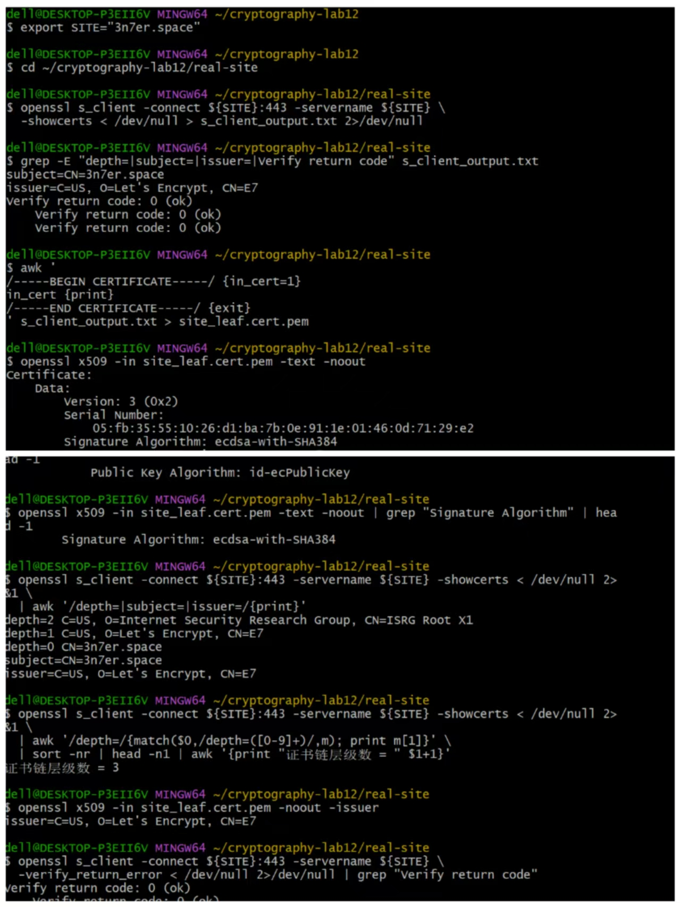
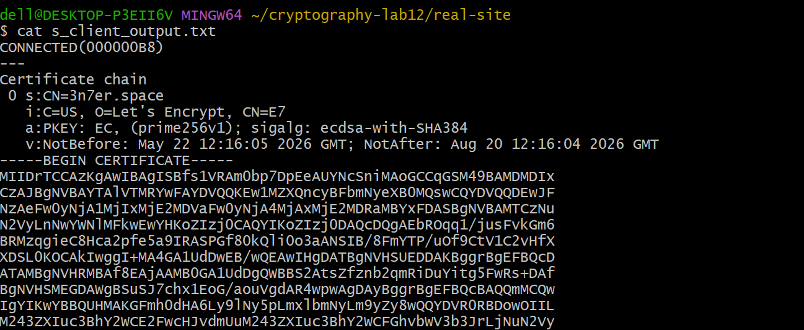
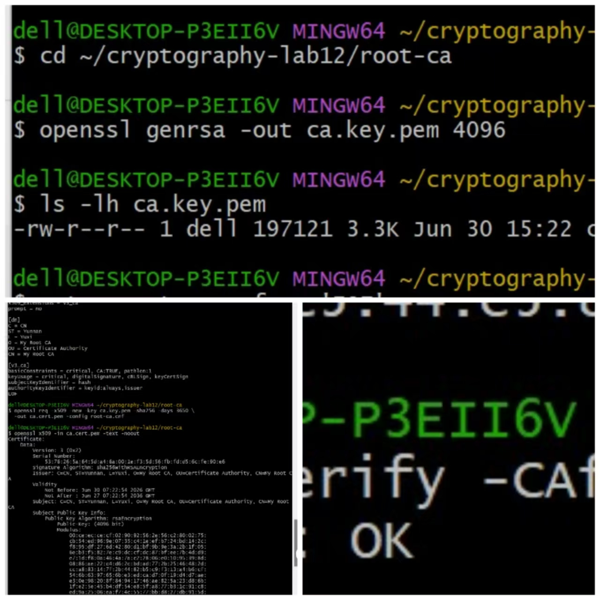
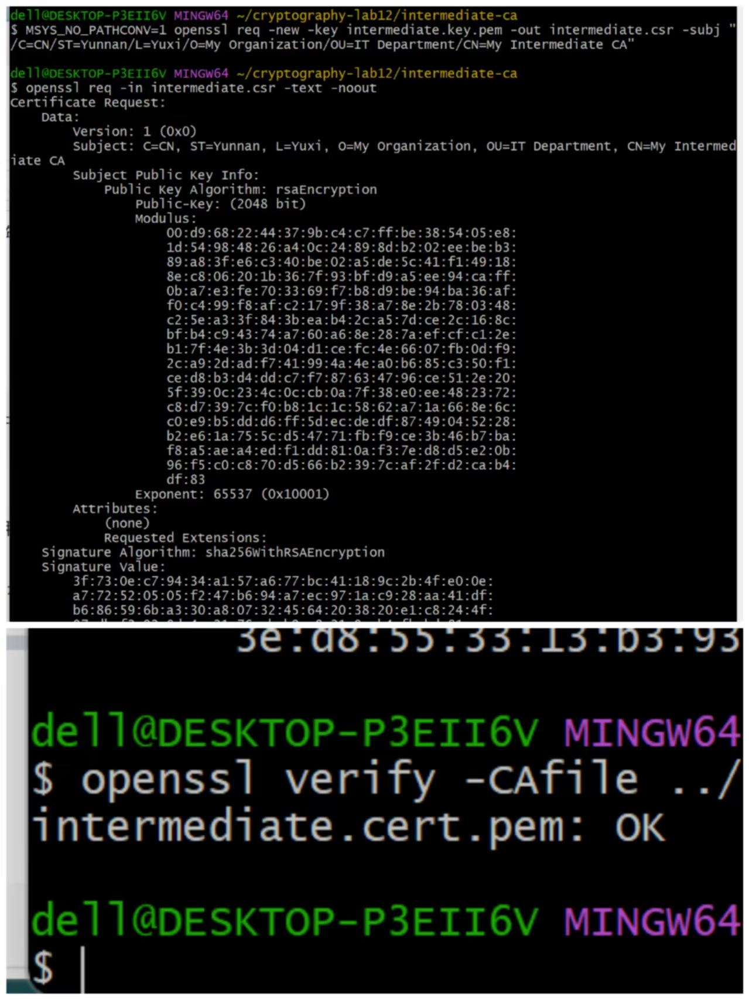
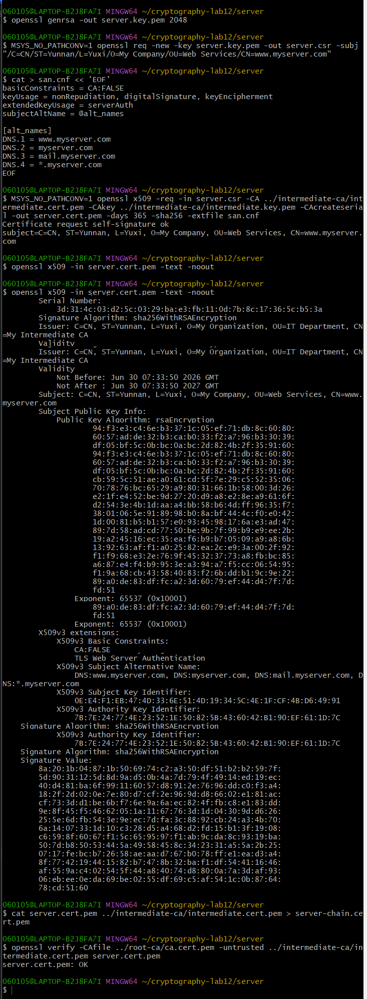
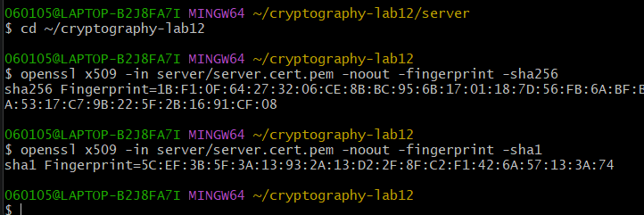

# Lab12：数字证书 —— 构建信任链的基石

## 实验简介

### 从数字签名到数字证书

在 Lab11 中，你已经学习了数字签名的原理和应用：使用私钥对消息签名，用公钥验证签名，数字签名提供了身份认证、完整性保护和不可否认性。

但数字签名有一个**核心问题**还没有解决：**如何确认公钥本身是可信的？**

**场景一：下载软件**

你从网站下载了一个软件安装包，网站提供了安装包、数字签名文件和公钥文件，并说"用公钥验证签名，确保软件未被篡改"。

但如果攻击者**同时替换了软件、签名和公钥**，你的验证仍然会通过——而你下载的是恶意软件。

**场景二：HTTPS 连接**

当你访问 `https://www.example.com` 时，服务器会发送它的公钥。如果攻击者能替换这个公钥，他就能冒充网站，窃取你的密码、信用卡信息等敏感数据。

### 数字证书的解决方案

数字证书通过引入**可信第三方**——证书颁发机构（Certificate Authority, CA）——来解决公钥分发问题：

```text
1. CA 是一个被广泛信任的权威机构（如 DigiCert、Let's Encrypt）
2. CA 用自己的私钥对"网站的公钥 + 网站的身份信息"进行签名
3. 签名后的数据包就是"数字证书"
4. 操作系统和浏览器预装了 CA 的公钥（根证书）
5. 当你收到网站证书时，用 CA 的公钥验证签名
6. 如果验证通过，就可以信任证书中的网站公钥
```

一句话概括：
- **数字签名**解决"消息完整性和来源认证"
- **数字证书**解决"公钥本身的可信性"

### 证书的本质

**数字证书 = 身份信息 + 公钥 + CA 的数字签名**

```text
┌──────────────────────────────────┐
│         数字证书的内容            │
├──────────────────────────────────┤
│ 版本号：V3                        │
│ 序列号：唯一标识                   │
│ 签名算法：SHA-256-RSA             │
│ 颁发者：CA 名称                   │
│ 有效期：2024-01-01 到 2025-01-01  │
│ 主题：网站/个人/组织的身份信息       │
│ 公钥：持有者的公钥                 │
│ 扩展字段：用途、域名等              │
├──────────────────────────────────┤
│      CA 的数字签名（对上述内容）    │
└──────────────────────────────────┘
```

### 信任链（Chain of Trust）

现实中，证书不是单层的，而是形成一条**信任链**：

```text
根 CA 证书（Root CA）          ← 自签名，预装在操作系统中
    ↓ 用根 CA 私钥签名
中间 CA 证书（Intermediate CA） ← 由根 CA 签名，实际签发网站证书
    ↓ 用中间 CA 私钥签名
终端实体证书（End-entity）      ← 这就是网站的证书
```

**为什么需要中间 CA？**

- **安全性**：根 CA 的私钥保存在离线的高安全环境中，不直接签发网站证书
- **可撤销性**：中间 CA 的私钥泄露时，只需吊销该中间 CA，不影响根 CA
- **分工**：不同中间 CA 可负责不同业务领域

### 本次实验目标

完成本实验后，你应该能够：

1. 理解 X.509 证书的结构和字段含义
2. 观察真实 HTTPS 网站的证书链，并追溯到本机信任库中的根证书
3. 构建私有证书链（根 CA → 中间 CA → 服务器证书）
4. 理解证书验证过程中的每个步骤
5. 掌握证书指纹的计算与用途
6. 理解 PKI 体系中的 CRL 和 OCSP 机制

> **环境说明**：本实验使用 OpenSSL，推荐在 Linux 或 macOS 环境下完成。Windows 用户可使用 WSL 或 Git Bash。

---

## 核心概念

### X.509 证书标准

X.509 是最广泛使用的数字证书标准，当前使用 **v3** 版本，主要字段如下：

#### 版本（Version）

- v1：最初版本，只含基本字段
- v2：增加颁发者和主题唯一标识符
- v3：增加扩展字段，现代证书均为 v3

#### 序列号（Serial Number）

由 CA 分配，用于唯一标识证书、引用吊销记录和防止重放攻击。示例：`01:23:45:67:89:ab:cd:ef`

#### 签名算法（Signature Algorithm）

CA 用于签名证书的算法，常见组合：

- `sha256WithRSAEncryption`：SHA-256 + RSA
- `ecdsa-with-SHA256`：SHA-256 + ECDSA

#### 颁发者（Issuer）与主题（Subject）

均采用**可分辨名称（Distinguished Name, DN）**格式：

| 字段 | 全称 | 含义 | 示例 |
| :--- | :--- | :--- | :--- |
| C | Country | 国家 | CN（中国）、US（美国） |
| ST | State/Province | 省/州 | Yunnan |
| L | Locality | 城市 | Yuxi |
| O | Organization | 组织 | YXNU |
| OU | Organizational Unit | 部门 | IT Department |
| CN | Common Name | 通用名称（域名或姓名） | www.example.com |

#### 有效期（Validity）

- **Not Before**：证书生效时间
- **Not After**：证书过期时间

有效期的意义：限制密钥使用时间、强制定期更新、便于撤销。

#### 主题公钥信息（Subject Public Key Info）

证书核心内容，包含公钥算法（RSA、ECDSA、Ed25519）和实际公钥数值。

#### 扩展字段（Extensions）

X.509 v3 引入的可选字段：

| 扩展名 | 用途 |
| :----- | :--- |
| Subject Alternative Name (SAN) | 额外的域名（多域名证书） |
| Key Usage | 密钥用途（签名、加密、证书签名等） |
| Extended Key Usage | 扩展用途（TLS 服务器、代码签名等） |
| Basic Constraints | 是否是 CA 证书，及路径长度限制 |
| Authority Key Identifier | 签发者密钥的标识符 |
| Subject Key Identifier | 持有者密钥的标识符 |
| CRL Distribution Points | 证书吊销列表的下载地址 |
| Authority Information Access | OCSP 地址、CA 证书下载地址 |

#### CA 的数字签名（Signature）

CA 对所有字段的数字签名。

**签名过程**：将证书所有字段编码为字节序列 → 计算哈希（SHA-256）→ 用 CA 私钥签名 → 附加到证书末尾

**验证过程**：提取签名 → 用 CA 公钥"解密"得到哈希 H1 → 重新计算字段哈希 H2 → H1 = H2 则验证通过

### 证书链的层次结构

```text
┌────────────────────────────┐
│   根 CA 证书 (Root CA)      │  ← 自签名，预装在操作系统中，有效期 20-30 年
└────────────┬───────────────┘
             │ 用根 CA 私钥签名
             ↓
┌────────────────────────────┐
│ 中间 CA 证书 (Intermediate) │  ← 由根 CA 签名，有效期 5-10 年
└────────────┬───────────────┘
             │ 用中间 CA 私钥签名
             ↓
┌────────────────────────────┐
│ 终端实体证书 (End-entity)   │  ← 由中间 CA 签名，有效期 1-2 年（Let's Encrypt 90 天）
│ CN=www.example.com          │  ← Basic Constraints: CA=False，不能再签发其他证书
└────────────────────────────┘
```

### 证书验证的完整过程

当浏览器访问 `https://www.example.com` 时：

1. **检查有效期**：当前时间是否在 Not Before 和 Not After 之间
2. **检查域名匹配**：证书的 CN 或 SAN 字段是否匹配访问的域名（通配符 `*.example.com` 可匹配二级域名）
3. **验证证书链**：用中间 CA 公钥验证网站证书签名 → 用根 CA 公钥验证中间 CA 证书签名 → 根 CA 证书预装在系统中，自动信任
4. **检查吊销状态**：通过 CRL（证书吊销列表）或 OCSP（在线证书状态协议）确认证书未被吊销
5. **检查证书用途**：Key Usage 和 Extended Key Usage 是否与使用场景匹配

### 证书指纹（Fingerprint）

**计算方式**：`Fingerprint = Hash(整个证书的二进制数据)`

| 算法 | 指纹长度 | 十六进制字符数 |
| :--- | :------ | :----------- |
| SHA-1 | 160 位 | 40 字符 |
| SHA-256 | 256 位 | 64 字符（推荐） |

**主要用途**：
- **证书钉扎（Certificate Pinning）**：App 预存服务器证书指纹，连接时验证，防止中间人攻击
- **证书比对**：快速判断两张证书是否相同
- **带外验证**：通过其他渠道（如电话）传递指纹，接收方对比

---

## 实验环境准备

**命令：检查 OpenSSL 版本**

```bash
openssl version
```

需要 1.1.1 或更高版本，低版本可能不支持部分参数。

**命令：创建实验目录**

```bash
mkdir -p ~/cryptography-lab12/{root-ca,intermediate-ca,server,real-site}
cd ~/cryptography-lab12
```

| 目录 | 用途 |
| :--- | :--- |
| `root-ca/` | 根 CA 的密钥和证书 |
| `intermediate-ca/` | 中间 CA 的密钥和证书 |
| `server/` | 服务器（终端实体）的密钥和证书 |
| `real-site/` | 获取的真实网站证书 |

### 中途出错如何重来

实验过程中如果某一步出了问题（比如配置写错、参数填错、证书签发顺序乱了），**最干净的做法是清空目录从头开始**，而不是在错误的基础上继续修补——证书链环环相扣，前一步的错误会传递到后面所有步骤。

**清除第二部分（私有证书链）**：只删除自己生成的证书和密钥，不影响第一部分已经观察到的真实网站证书：

```bash
rm -rf ~/cryptography-lab12/root-ca/*
rm -rf ~/cryptography-lab12/intermediate-ca/*
rm -rf ~/cryptography-lab12/server/*
```

然后重新回到任务二的步骤 1 开始执行。

**清除全部实验内容**（含第一部分的真实网站证书，全部重来）：

```bash
rm -rf ~/cryptography-lab12
mkdir -p ~/cryptography-lab12/{root-ca,intermediate-ca,server,real-site}
cd ~/cryptography-lab12
```

**只重做某一层**：如果只是某一个任务出了问题，可以只清该任务对应的目录：

| 出问题的任务 | 需要清除的目录 | 需要重做的任务 |
| :--- | :--- | :--- |
| 任务二（根 CA） | `root-ca/`、`intermediate-ca/`、`server/` | 任务二、三、四、五 |
| 任务三（中间 CA） | `intermediate-ca/`、`server/` | 任务三、四、五 |
| 任务四（服务器证书） | `server/` | 任务四、五 |
| 任务五（指纹） | 无需清除 | 直接重新执行指纹命令 |

> 根 CA 是整个链条的起点，根 CA 出错必须连带清除所有下游目录重做，因为中间 CA 和服务器证书都依赖根 CA 的私钥签名，根 CA 换了它们就全部失效了。

---

## 实验概览

本次实验分为两部分：

- **第一部分（任务一）**：观察真实公网网站的证书链，确认其能追溯到本机信任库的根证书
- **第二部分（任务二～五）**：从零构建私有证书链（根 CA → 中间 CA → 服务器证书），并计算证书指纹

---

## 第一部分：观察真实网站证书链

> **重点**：先观察真实 PKI 如何工作，再动手制作私有证书。

本部分默认观察 `3n7er.space`，也可以换成任意 HTTPS 网站（如 `github.com`、`baidu.com`）：

```bash
export SITE="3n7er.space"
```

## 任务一：观察真实网站证书链并追溯到本机根证书

### 步骤 1：在浏览器中查看证书

**Chrome / Edge**：地址栏左侧锁图标 🔒 → 连接是安全的 → 证书

**Firefox**：锁图标 🔒 → 右箭头 → 更多信息 → 查看证书

**Safari（macOS）**：锁图标 🔒 → 显示证书

在证书查看器中，重点关注以下信息：

- **颁发给（Subject）**、**颁发者（Issuer）**、**有效期**
- **详细信息** → 序列号、签名算法、公钥算法与位数
- **扩展字段** → Subject Alternative Name、Extended Key Usage、CRL Distribution Points
- **证书路径** → 完整的证书链层级（通常 2-3 层）

### 步骤 2：使用 OpenSSL 获取证书

首先进入工作目录：

```bash
cd ~/cryptography-lab12/real-site
```

---

**命令 2-1：连接目标站点，保存完整 TLS 握手输出**

```bash
openssl s_client -connect ${SITE}:443 -servername ${SITE} \
  -showcerts < /dev/null > s_client_output.txt 2>/dev/null
```

这条命令用 OpenSSL 模拟一个 HTTPS 客户端，连上目标网站，把服务器在握手阶段发过来的所有证书保存下来。参数逐一解释：

- `s_client`：OpenSSL 内置的 TLS 客户端工具，专门用来调试和检查 TLS 连接
- `-connect ${SITE}:443`：指定要连接的主机和端口，443 是 HTTPS 的标准端口
- `-servername ${SITE}`：发送 SNI（Server Name Indication）扩展。一台服务器可能托管多个域名，SNI 告诉服务器"我要访问的是这个域名"，服务器才返回对应的证书；不加这个参数，服务器可能返回默认证书，不一定是你想看的那个
- `-showcerts`：默认情况下 `s_client` 只显示服务器证书，加了这个参数才会把完整证书链（服务器证书 + 所有中间 CA 证书）都输出出来
- `< /dev/null`：`s_client` 建立连接后会等待你输入数据，`/dev/null` 是一个空设备，把它作为输入来源相当于立刻发送 EOF，连接会马上关闭，不用手动按 Ctrl+C
- `> s_client_output.txt`：把标准输出（证书内容、握手摘要）保存到文件，方便后续处理
- `2>/dev/null`：把标准错误（连接过程中的调试信息）丢弃，让输出更干净

---

**命令 2-2：快速浏览证书链摘要**

```bash
grep -E "depth=|subject=|issuer=|Verify return code" s_client_output.txt
```

`s_client_output.txt` 里的内容很长，这条命令只过滤出我们关心的几行：

- `depth=`：证书链中每一层证书的深度编号，`depth=0` 是服务器证书（最底层），数字越大越靠近根
- `subject=`：该层证书的主题，即"这张证书是颁发给谁的"
- `issuer=`：该层证书的颁发者，即"这张证书是谁签的"
- `Verify return code`：整个证书链的验证结果，`0 (ok)` 表示验证通过

> 注意：`depth=`、`subject=`、`issuer=` 这几行实际输出在 stderr，已被上面的 `2>/dev/null` 过滤掉，所以这里 grep 可能看不到它们。下面步骤 3 会用 `2>&1` 重新抓取，不影响后续操作。

---

**命令 2-3：从输出中提取叶子证书**

```bash
awk '
/-----BEGIN CERTIFICATE-----/ {in_cert=1}
in_cert {print}
/-----END CERTIFICATE-----/ {exit}
' s_client_output.txt > site_leaf.cert.pem
```

`-showcerts` 的输出里包含多张证书（服务器证书、中间 CA 证书），首尾相接排在一起，每张都用 `-----BEGIN CERTIFICATE-----` 和 `-----END CERTIFICATE-----` 包裹。

这段 awk 脚本的逻辑：

- 遇到 `-----BEGIN CERTIFICATE-----`，把 `in_cert` 标志设为 1，开始打印
- 只要 `in_cert` 为 1，就打印当前行（`in_cert {print}` 是简写，等价于 `if (in_cert) print`）
- 遇到 `-----END CERTIFICATE-----`，打印完这一行就立刻 `exit` 退出

效果：只提取第一张证书（`depth=0`，即服务器的叶子证书），保存为 `site_leaf.cert.pem`。后续所有分析都基于这个文件。

### 步骤 3：查看证书详细信息

---

**命令 3-1：查看证书完整内容**

```bash
openssl x509 -in site_leaf.cert.pem -text -noout
```

- `x509`：OpenSSL 的 X.509 证书管理子命令，用于解析、展示、转换证书
- `-in site_leaf.cert.pem`：指定要读取的证书文件，即上一步提取的叶子证书
- `-text`：把证书解码成人类可读的文本格式，展示所有字段（版本、序列号、有效期、公钥、扩展等）
- `-noout`：不输出证书本身的 Base64 编码原文，只输出 `-text` 解析后的内容，避免输出里混杂大段乱码

这条命令的输出内容很多，是后面所有"分项提取"命令的信息来源。先完整看一遍，对证书结构有个整体印象，再用下面的命令精确提取填表需要的字段。

---

**命令 3-2：提取证书主题与颁发者**

```bash
openssl x509 -in site_leaf.cert.pem -noout -subject -issuer
```

- `-subject`：只输出证书的 Subject 字段（即"这张证书颁发给谁"）
- `-issuer`：只输出证书的 Issuer 字段（即"这张证书是谁签发的"）

两个参数可以同时加，OpenSSL 会依次输出。输出示例：

```text
subject=CN=3n7er.space
issuer=C=US, O=Let's Encrypt, CN=R11
```

用这两行直接填表格中的"证书主题"和"证书颁发者"。

---

**命令 3-3：提取证书有效期**

```bash
openssl x509 -in site_leaf.cert.pem -noout -startdate -enddate
```

- `-startdate`：输出 Not Before（证书生效时间）
- `-enddate`：输出 Not After（证书过期时间）

输出示例：

```text
notBefore=Apr 10 03:12:45 2025 GMT
notAfter=Jul  9 03:12:44 2025 GMT
```

填表时写成区间格式，例如：`2025-04-10 03:12:45 GMT - 2025-07-09 03:12:44 GMT`。

---

**命令 3-4：提取公钥算法**

```bash
openssl x509 -in site_leaf.cert.pem -text -noout | grep "Public Key Algorithm" | head -1
```

- `| grep "Public Key Algorithm"`：从 `-text` 的完整输出里过滤出含有公钥算法的行
- `| head -1`：`Signature Algorithm` 字段在证书里出现两次（证书头部一次、签名块一次），`head -1` 只取第一行，避免重复

输出示例：

```text
        Public Key Algorithm: id-ecPublicKey
```

或者：

```text
        Public Key Algorithm: rsaEncryption
```

如果是 RSA，还需要找到密钥位数（如 2048 bit），可以在 `openssl x509 -text` 的完整输出里搜索 `Public-Key`。

---

**命令 3-5：提取签名算法**

```bash
openssl x509 -in site_leaf.cert.pem -text -noout | grep "Signature Algorithm" | head -1
```

和上面的思路相同，`Signature Algorithm` 也会出现两次，`head -1` 只取第一处。

输出示例：

```text
    Signature Algorithm: ecdsa-with-SHA384
```

---

**命令 3-6：查看完整证书链层级**

```bash
openssl s_client -connect ${SITE}:443 -servername ${SITE} -showcerts < /dev/null 2>&1 \
  | awk '/depth=|subject=|issuer=/{print}'
```

注意这里用的是 `2>&1` 而不是 `2>/dev/null`。原因：`depth=`、`subject=`、`issuer=` 这些行是 OpenSSL 输出到 **stderr** 的，如果用 `2>/dev/null` 就会把它们全部丢弃，awk 就什么都看不到。`2>&1` 把 stderr 合并进 stdout，awk 才能正常过滤。

输出示例（从下往上读就是从叶子到根）：

```text
depth=2 issuer= C=US, O=Internet Security Research Group, CN=ISRG Root X1
depth=2 subject= C=US, O=Internet Security Research Group, CN=ISRG Root X1
depth=1 issuer= C=US, O=Internet Security Research Group, CN=ISRG Root X1
depth=1 subject= C=US, O=Let's Encrypt, CN=R11
depth=0 issuer= C=US, O=Let's Encrypt, CN=R11
depth=0 subject= CN=3n7er.space
```

`depth=0` 是服务器证书，`depth=1` 是中间 CA，`depth=2` 是根 CA（Issuer = Subject，自签名）。

---

**命令 3-7：计算证书链层级数**

```bash
openssl s_client -connect ${SITE}:443 -servername ${SITE} -showcerts < /dev/null 2>&1 \
  | awk '/depth=/{match($0,/depth=([0-9]+)/,m); print m[1]}' \
  | sort -nr | head -n1 | awk '{print "证书链层级数 = " $1+1}'
```

这条命令是上一条的延伸，不需要手数，直接算出层级数。逐段解释：

- `awk '/depth=/{match($0,/depth=([0-9]+)/,m); print m[1]}'`：每遇到含 `depth=` 的行，用正则提取出数字部分（如 `0`、`1`、`2`）并打印
- `| sort -nr`：把提取到的数字从大到小排序
- `| head -n1`：取最大的那个数字（即最深的层级编号，例如 `2`）
- `| awk '{print "证书链层级数 = " $1+1}'`：层级编号从 0 开始，所以 +1 才是实际层级数（`depth=2` → 3 层）

---

**命令 3-8：判断是否为公开 CA / 第三方 CA 签发**

```bash
openssl x509 -in site_leaf.cert.pem -noout -issuer
```

这和命令 3-2 里的 `-issuer` 相同，单独拿出来是因为这里要做一个判断：

输出示例：

```text
issuer=C=US, O=Let's Encrypt, CN=R11
```

判断方法：看 `O=` 或 `CN=` 是否是知名公共 CA 机构名称——

| Issuer 中看到的 | 结论 |
| :--- | :--- |
| `Let's Encrypt`、`DigiCert`、`GlobalSign`、`Sectigo` 等 | **是**，填"是（机构名）" |
| 自己填写的名字、企业内网名称 | **否** |

### 步骤 4：验证证书链

**命令 4-1：使用本机信任库验证完整证书链**

```bash
openssl s_client -connect ${SITE}:443 -servername ${SITE} \
  -verify_return_error < /dev/null 2>/dev/null | grep "Verify return code"
```

- `-verify_return_error`：如果证书链验证失败，立即以非零状态码退出并报错（默认情况下即使验证失败 `s_client` 也会继续连接）。加上这个参数，验证失败就不会产生后续输出，结果更干净
- `| grep "Verify return code"`：从输出里只提取验证结果那一行

这里 `depth=`、`subject=` 这些调试行我们已经在步骤 3 看过了，不需要再看，所以 `2>/dev/null` 是合适的。

期望输出：

```text
Verify return code: 0 (ok)
```

这说明网站的证书链能从服务器证书一路追溯到本机 OpenSSL 信任库中的根 CA。浏览器之所以信任这个网站，正是因为这条链条的终点是操作系统预装的根证书。

> 如果结果不是 `0 (ok)` 但浏览器访问正常，通常是 OpenSSL 没有正确找到本机 CA 信任库，记录实际输出即可，后续实验不受影响。

### 任务一结果表

请根据上述命令的输出填写以下表格：

| 项目 | 你的结果 |
| :--- | :------- |
| 访问的网站 | `${SITE}` |
| 证书主题（Subject） | |
| 证书颁发者（Issuer） | |
| 证书有效期（起始-结束） | |
| 公钥算法 | |
| 签名算法 | |
| 证书链层级数 | |
| 根 CA 名称 | |
| OpenSSL 验证结果（Verify return code） | |
| 是否为公开 CA / 第三方 CA 签发 | |

### 截图要求

请截图以下内容并保存到同一目录下：

| 截图内容 | 文件名 |
| :--- | :--- |
| 浏览器证书详情页（含颁发者、主题、有效期、证书路径） | `browser_cert.png` |
| OpenSSL 链路摘要（depth / subject / issuer）+ 验证结果 | `openssl_cert.png` |

截图：





---

## 第二部分：构建私有证书链

### 总体流程

这一部分要从零搭建一条完整的三层私有证书链。整个过程分三个任务，最终产出六个文件：

```text
任务二                    任务三                      任务四
────────────────────      ─────────────────────────   ─────────────────────────────
生成根 CA 私钥             生成中间 CA 私钥              生成服务器私钥
       ↓                          ↓                           ↓
创建根 CA 自签名证书        生成 CSR（向根 CA 申请）        生成 CSR（向中间 CA 申请）
  ca.key.pem                      ↓                           ↓
  ca.cert.pem            根 CA 私钥签名 → 中间 CA 证书    中间 CA 私钥签名 → 服务器证书
                           intermediate.key.pem            server.key.pem
                           intermediate.cert.pem           server.cert.pem
```

三个任务做完后，信任关系如下：

```text
ca.cert.pem（根 CA，自签名，信任起点）
    └── intermediate.cert.pem（中间 CA，由根 CA 签名）
            └── server.cert.pem（服务器证书，由中间 CA 签名）
```

### 三层证书的核心差异

在开始动手之前，先看一张对比表。做完三个任务后再回来核对这张表，确认自己理解了每个参数为什么这样设：

| 对比项 | 根 CA 证书 | 中间 CA 证书 | 服务器证书 |
| :--- | :--- | :--- | :--- |
| **如何产生** | `openssl req -x509`（直接自签名） | `openssl req -new` 生成 CSR，再由根 CA 用 `openssl x509 -req` 签发 | 同上，但由中间 CA 签发 |
| **谁来签名** | 自己签自己 | 根 CA 私钥签名 | 中间 CA 私钥签名 |
| **Issuer = Subject？** | 是（自签名的标志） | 否（Issuer 是根 CA） | 否（Issuer 是中间 CA） |
| **密钥长度** | 4096 位 | 2048 位 | 2048 位 |
| **有效期** | 3650 天（10 年） | 1825 天（5 年） | 365 天（1 年） |
| **basicConstraints** | `CA:TRUE, pathlen:1` | `CA:TRUE, pathlen:0` | `CA:FALSE` |
| **能否签发其他证书** | 能（最多一层子 CA） | 能（只能签终端证书） | 不能 |
| **extendedKeyUsage** | 无 | 无 | `serverAuth` |
| **SAN 字段** | 无 | 无 | 有（列出域名） |
| **配置文件写法** | `root-ca.cnf`（含 `[dn]` 和 `[v3_ca]`） | `extensions.cnf`（只有扩展字段） | `san.cnf`（只有扩展字段，含域名列表） |

**密钥长度为什么逐层缩短？**
根 CA 证书有效期 10 年，私钥一旦泄露整条链全部失效，值得用 4096 位；中间 CA 和服务器证书有效期短，到期可以重签，且签名操作更频繁（性能有影响），2048 位是合理的折中。

**有效期为什么逐层缩短？**
根 CA 证书一旦过期，所有依赖它的设备都需要更新信任库，成本极高，所以给 10 年。中间 CA 只需要更新 CA 本身的证书，影响面小，5 年。服务器证书最容易出问题（私钥泄露、域名变更），1 年强制更新是对安全的主动保障。

**basicConstraints 为什么逐层收紧？**
- 根 CA 的 `pathlen:1` 允许它签一层子 CA（即中间 CA）
- 中间 CA 的 `pathlen:0` 只允许它签终端证书，不能再派生子 CA
- 服务器的 `CA:FALSE` 明确声明这不是 CA，完全禁止签发任何证书

这个设计防止了链条无限延伸：即使中间 CA 的私钥被盗，攻击者也无法用它再建一层假 CA。

---

> **说明**：这个私有 PKI 只在你明确使用 `ca.cert.pem` 作为信任根时才可信，适合教学、企业内网、开发测试等场景，默认不会被浏览器信任。

---

## 任务二：创建私有自签名根 CA 证书

### 步骤 1：生成根 CA 私钥

```bash
cd ~/cryptography-lab12/root-ca
```

**命令 1-1：生成 RSA 私钥**

```bash
openssl genrsa -out ca.key.pem 4096
```

- `genrsa`：生成 RSA 私钥的子命令
- `-out ca.key.pem`：把生成的私钥保存到 `ca.key.pem`。文件名里的 `.pem` 是 Privacy Enhanced Mail 格式，本质是 Base64 编码的文本，用 `-----BEGIN ... KEY-----` 包裹，是 OpenSSL 最常用的存储格式
- `4096`：密钥长度为 4096 位。根 CA 私钥是整个 PKI 体系的基础，一旦泄露整条链都不可信，且根 CA 证书有效期长达 10-30 年，因此使用比一般服务器更长的密钥来提供更高的安全边际

**命令 1-2：确认私钥文件权限**

```bash
ls -lh ca.key.pem
```

期望输出：

```text
-rw------- 1 root root 3.2K Jun 22 14:00 ca.key.pem
```

权限应为 `600`（只有所有者可读写，其他人无任何权限）。OpenSSL 生成私钥时会自动设置这个权限。如果权限不对，用 `chmod 600 ca.key.pem` 修正。

### 步骤 2：生成自签名根 CA 证书

**命令 2-1：创建证书配置文件**

```bash
cat > root-ca.cnf << 'EOF'
[req]
distinguished_name = dn
x509_extensions = v3_ca
prompt = no

[dn]
C = CN
ST = Yunnan
L = Yuxi
O = My Root CA
OU = Certificate Authority
CN = My Root CA

[v3_ca]
basicConstraints = critical, CA:TRUE, pathlen:1
keyUsage = critical, digitalSignature, cRLSign, keyCertSign
subjectKeyIdentifier = hash
authorityKeyIdentifier = keyid:always,issuer
EOF
```

- `cat > root-ca.cnf << 'EOF' ... EOF`：这是 shell 的 here-doc 语法，把两个 EOF 之间的内容直接写入 `root-ca.cnf` 文件，等价于手动创建文件并粘贴内容
- `[req]` 段：告诉 `openssl req` 命令如何读取配置
  - `distinguished_name = dn`：证书主题字段定义在 `[dn]` 段
  - `x509_extensions = v3_ca`：生成 x509 证书时使用 `[v3_ca]` 段的扩展字段
  - `prompt = no`：不交互式提示输入，直接从配置文件读取主题字段
- `[dn]` 段：定义证书主题（Subject），即"这张证书颁发给谁"
- `[v3_ca]` 段：定义 X.509 v3 扩展字段
  - `basicConstraints = critical, CA:TRUE, pathlen:1`：`critical` 表示这个扩展是强制性的，验证方必须识别它；`CA:TRUE` 表明这是一张 CA 证书，可以签发其他证书；`pathlen:1` 限制证书链深度，本实验中最多再签发 1 层 CA（即只允许一层中间 CA）
  - `keyUsage = critical, digitalSignature, cRLSign, keyCertSign`：指定密钥用途，`keyCertSign` 是签发证书的权限，`cRLSign` 是签发吊销列表的权限
  - `subjectKeyIdentifier = hash`：给证书的公钥计算一个哈希标识符，便于在证书链中引用
  - `authorityKeyIdentifier = keyid:always,issuer`：标记这张证书的签发者密钥标识符，帮助验证方找到上一级证书

> 你可以把 `[dn]` 段里的字段改成你自己的信息，例如把 `CN = My Root CA` 改成 `CN = 张三的根CA`。

---

**命令 2-2：生成自签名根 CA 证书**

```bash
openssl req -x509 -new -key ca.key.pem -sha256 -days 3650 \
  -out ca.cert.pem -config root-ca.cnf
```

- `req`：证书请求相关的子命令
- `-x509`：直接生成一张自签名的 X.509 证书，而不是生成 CSR（证书签名请求）。根 CA 没有上级 CA 为它签名，只能自签名
- `-new`：创建新证书（相对于处理已有证书）
- `-key ca.key.pem`：使用刚才生成的私钥来签名
- `-sha256`：指定签名时使用的哈希算法为 SHA-256
- `-days 3650`：证书有效期 3650 天，约 10 年。根 CA 证书有效期长，是因为根证书一旦过期需要所有客户端更新信任库，成本很高
- `-out ca.cert.pem`：把生成的证书保存到 `ca.cert.pem`
- `-config root-ca.cnf`：使用上一步创建的配置文件，读取主题字段和扩展字段

### 步骤 3：查看并验证根 CA 证书

**命令 3-1：查看证书详情**

```bash
openssl x509 -in ca.cert.pem -text -noout
```

参数含义与任务一步骤 3 相同。重点观察输出中的以下字段：

- `Issuer` 和 `Subject` 是否完全相同 → 自签名证书的标志
- `Basic Constraints: CA:TRUE, pathlen:1` → 这是 CA 证书，且最多允许一层中间 CA
- `Key Usage: Certificate Sign, CRL Sign` → 拥有签发证书和吊销列表的权限
- `RSA Public-Key: (4096 bit)` → 确认密钥长度

---

**命令 3-2：用根 CA 证书验证自身**

```bash
openssl verify -CAfile ca.cert.pem ca.cert.pem
```

- `verify`：证书验证子命令
- `-CAfile ca.cert.pem`：指定信任的 CA 证书（这里用根 CA 自身）
- 最后的 `ca.cert.pem`：要验证的目标证书（同一个文件）

根 CA 是自签名的，用自己的公钥验证自己的签名，所以 `-CAfile` 和目标文件是同一个。这条命令验证的是证书格式和签名本身是否正确，而不是"是否被外部信任"。

期望输出：`ca.cert.pem: OK`

### 任务二小结

完成后应有：
- `root-ca/ca.key.pem`：根 CA 私钥（4096 位，保密）
- `root-ca/ca.cert.pem`：根 CA 自签名证书（可公开，是整个私有 PKI 的信任起点）

### 截图要求

| 截图内容 | 文件名 |
| :--- | :--- |
| 生成密钥、创建证书、openssl verify 验证成功的完整过程 | `root_ca.png` |

截图：



---

## 任务三：创建私有中间 CA 并由根 CA 签发

### 步骤 1：生成中间 CA 私钥

```bash
cd ~/cryptography-lab12/intermediate-ca
```

**命令 1-1：生成 RSA 私钥**

```bash
openssl genrsa -out intermediate.key.pem 2048
```

与根 CA 的私钥生成命令相同，但密钥长度改为 2048 位。中间 CA 的证书有效期只有 5 年（1825 天），远短于根 CA，且需要联网使用，更容易更换，2048 位的安全边际已经足够。

### 步骤 2：创建证书签名请求（CSR）

**命令 2-1：生成 CSR**

```bash
MSYS_NO_PATHCONV=1 openssl req -new -key intermediate.key.pem -out intermediate.csr -subj "/C=CN/ST=Yunnan/L=Yuxi/O=My Organization/OU=IT Department/CN=My Intermediate CA"
```

- `req -new`：生成一个新的 CSR（证书签名请求），而不是证书本身
- `-key intermediate.key.pem`：使用中间 CA 的私钥。CSR 里会包含对应的公钥，并用私钥对整个 CSR 签名，向 CA 证明"我确实持有这个私钥"
- `-out intermediate.csr`：把 CSR 保存到文件。`.csr` 是约定俗成的扩展名，本质也是 PEM 格式
- `-subj "..."`：直接在命令行指定证书主题，避免交互式提示。格式是 `/字段=值/字段=值`，注意 CN 填的是中间 CA 的名称，而不是域名

CSR 本身不是证书，它只是一份"申请单"：里面包含了申请者的身份信息和公钥，但还没有 CA 的签名，还不能用于任何认证。

---

**命令 2-2：查看 CSR 内容**

```bash
openssl req -in intermediate.csr -text -noout
```

- `req -in`：读取并解析一个 CSR 文件（而不是证书文件，证书用 `x509 -in`）
- `-text -noout`：与查看证书相同，输出可读文本，不输出 Base64 原文

观察输出可以确认：CSR 里有 Subject（申请者身份）和公钥，但没有 Issuer 和有效期——这些字段是 CA 签发时才会填入的。

### 步骤 3：用根 CA 签发中间 CA 证书

**命令 3-1：创建扩展配置文件**

```bash
cat > extensions.cnf << 'EOF'
basicConstraints = critical, CA:TRUE, pathlen:0
keyUsage = critical, digitalSignature, cRLSign, keyCertSign
EOF
```

- `pathlen:0`：这里改成了 0，比根 CA 的 `pathlen:1` 少一层。含义是：中间 CA 可以签发证书，但只能签发**终端实体证书**，不能再签发下一层 CA 证书。这在结构上保证了证书链的深度不会无限延伸

---

**命令 3-2：根 CA 为中间 CA 的 CSR 签名**

```bash
MSYS_NO_PATHCONV=1 openssl x509 -req -in intermediate.csr -CA ../root-ca/ca.cert.pem -CAkey ../root-ca/ca.key.pem -CAcreateserial -out intermediate.cert.pem -days 1825 -sha256 -extfile extensions.cnf
```

- `x509 -req`：读取一个 CSR 并为其签名，生成正式的 X.509 证书
- `-in intermediate.csr`：要被签名的 CSR 文件
- `-CA ../root-ca/ca.cert.pem`：签发者（根 CA）的证书，用于提供 Issuer 字段
- `-CAkey ../root-ca/ca.key.pem`：签发者（根 CA）的私钥，实际执行签名操作
- `-CAcreateserial`：自动创建一个序列号文件（`ca.cert.srl`）并自增。序列号是每张证书的唯一编号，同一个 CA 签发的所有证书序列号不能重复
- `-out intermediate.cert.pem`：把签发好的证书保存到文件
- `-days 1825`：有效期 1825 天（约 5 年），比根 CA 短
- `-sha256`：签名使用 SHA-256 哈希算法
- `-extfile extensions.cnf`：把上一步配置文件里的扩展字段（`basicConstraints`、`keyUsage`）写入证书

期望输出：

```text
Signature ok
subject=C=CN, ST=Yunnan, ..., CN=My Intermediate CA
Getting CA Private Key
```

### 步骤 4：查看并验证中间 CA 证书

**命令 4-1：查看证书详情**

```bash
openssl x509 -in intermediate.cert.pem -text -noout
```

重点观察：
- `Issuer` 为根 CA 的 Subject，`Subject` 为中间 CA 自身 → Issuer ≠ Subject，说明是由根 CA 签名的
- `Basic Constraints: CA:TRUE, pathlen:0` → 是 CA 证书，但只能签发终端实体证书

---

**命令 4-2：验证中间 CA 证书**

```bash
openssl verify -CAfile ../root-ca/ca.cert.pem intermediate.cert.pem
```

- `-CAfile ../root-ca/ca.cert.pem`：指定信任锚为根 CA 证书。OpenSSL 会用根 CA 的公钥去验证中间 CA 证书上的签名
- `intermediate.cert.pem`：要验证的目标证书

期望输出：`intermediate.cert.pem: OK`

### 任务三小结

完成后应有：
- `intermediate-ca/intermediate.key.pem`：中间 CA 私钥
- `intermediate-ca/intermediate.csr`：中间 CA 的 CSR
- `intermediate-ca/intermediate.cert.pem`：中间 CA 证书

### 截图要求

| 截图内容 | 文件名 |
| :--- | :--- |
| 创建 CSR、签发证书、验证成功的完整过程 | `intermediate_ca.png` |

截图：



---

## 根 CA 与中间 CA 证书对比

做完任务二和任务三，手里有了两张 CA 证书，现在来仔细对比它们。先用命令把关键字段分别打出来：

```bash
echo "===== 根 CA =====" && \
  openssl x509 -in ~/cryptography-lab12/root-ca/ca.cert.pem -noout \
    -subject -issuer -dates \
    -text 2>/dev/null | grep -E "Subject:|Issuer:|Not Before|Not After|Public-Key|Basic Constraints|pathlen|Key Usage|CA:"

echo "===== 中间 CA =====" && \
  openssl x509 -in ~/cryptography-lab12/intermediate-ca/intermediate.cert.pem -noout \
    -subject -issuer -dates \
    -text 2>/dev/null | grep -E "Subject:|Issuer:|Not Before|Not After|Public-Key|Basic Constraints|pathlen|Key Usage|CA:"
```

对比输出，你会看到以下几处明显差异：

### 差异一：Issuer 与 Subject

**根 CA**：
```text
subject=C=CN, ST=Yunnan, L=Yuxi, O=My Root CA, CN=My Root CA
issuer=C=CN, ST=Yunnan, L=Yuxi, O=My Root CA, CN=My Root CA
```

**中间 CA**：
```text
subject=C=CN, ST=Yunnan, L=Yuxi, O=My Organization, CN=My Intermediate CA
issuer=C=CN, ST=Yunnan, L=Yuxi, O=My Root CA, CN=My Root CA
```

根 CA 的 Issuer = Subject，这是自签名证书的定义——它自己给自己做担保。没有人能验证这个担保是否可信，只能靠"人工决策"：操作系统和浏览器厂商审核后把根 CA 列入信任列表，预装进去。

中间 CA 的 Issuer 是根 CA，意味着根 CA 为这张证书做了担保。任何信任根 CA 的客户端，通过验证签名就能自动信任中间 CA，无需人工干预。

### 差异二：产生方式

**根 CA** 用 `openssl req -x509` 直接生成证书，一步到位，不需要 CSR，因为没有上级 CA 来审核。

**中间 CA** 的过程分两步：先用 `openssl req -new` 生成 CSR（只包含身份信息和公钥，没有 CA 签名），再由根 CA 用 `openssl x509 -req` 审核并签名，生成正式证书。这个"申请→审核→签发"的流程模拟了真实 PKI 中机构向 CA 申请证书的过程。

### 差异三：密钥长度

| | 根 CA | 中间 CA |
| :--- | :--- | :--- |
| 密钥长度 | 4096 位 | 2048 位 |
| 原因 | 有效期 10 年，泄露代价极高 | 有效期 5 年，可以更换，性能影响更大 |

根 CA 私钥通常存放在**离线**的硬件安全模块（HSM）中，不参与日常签名操作，性能不是问题，所以可以用更长的密钥。中间 CA 每天都要签发证书，签名操作频率高，密钥太长会带来明显的性能开销，2048 位在安全与性能之间取得平衡。

### 差异四：有效期

| | 根 CA | 中间 CA |
| :--- | :--- | :--- |
| 有效期 | 3650 天（约 10 年） | 1825 天（约 5 年） |
| 过期影响 | 所有依赖它的设备都失效，需更新系统信任库 | 只需重签中间 CA 证书，不影响根 CA |

有效期的设计遵循一个原则：**影响面越大，有效期越长，更换成本越高，所以越要保证安全**。根 CA 一旦出问题，波及的是整个 PKI 体系；中间 CA 出问题，只影响它所签发的那批证书。

### 差异五：basicConstraints 与 pathlen

**根 CA**：`CA:TRUE, pathlen:1`

**中间 CA**：`CA:TRUE, pathlen:0`

两张证书都是 CA（`CA:TRUE`），都可以签发其他证书，但 `pathlen` 不同：

- `pathlen:1`：还可以在下面签发 **1 层** CA 证书，即允许中间 CA 的存在
- `pathlen:0`：下面不能再有 CA，只能签发终端实体证书（服务器证书、客户端证书等）

这个设计防止了一种攻击：如果中间 CA 的私钥泄露，攻击者想用它再创建一个假的"中级 CA"，然后用那个假 CA 签发任何域名的证书——`pathlen:0` 直接封死了这条路。验证方在检查证书时会核查 `pathlen`，发现违规的证书会拒绝信任。

### 差异六：制作流程小结

```text
根 CA（任务二）                        中间 CA（任务三）
─────────────────────────────────────  ───────────────────────────────────────────
① openssl genrsa 4096                  ① openssl genrsa 2048
② openssl req -x509（直接自签名）        ② openssl req -new（生成 CSR，申请签名）
                                        ③ openssl x509 -req（根 CA 审核并签名）
无需 CSR，直接输出证书                   必须经过 CSR → 签发两步
```

---

## 任务四：签发私有服务器证书

### 步骤 1：生成服务器私钥

```bash
cd ~/cryptography-lab12/server
```

**命令 1-1：生成 RSA 私钥**

```bash
openssl genrsa -out server.key.pem 2048
```

与中间 CA 相同，服务器使用 2048 位密钥。服务器证书有效期只有 1 年，到期后需要重新签发，安全风险窗口短，2048 位足够。

### 步骤 2：创建服务器 CSR

**命令 2-1：生成 CSR**

```bash
openssl req -new -key server.key.pem -out server.csr \
  -subj "/C=CN/ST=Yunnan/L=Yuxi/O=My Company/OU=Web Services/CN=www.myserver.com"
```

参数与任务三步骤 2 相同，区别在于 Subject：

- `CN=www.myserver.com`：服务器证书的 CN 填域名，而不是名字。这是因为 TLS 验证时浏览器要对比 CN（或 SAN）与访问的域名是否匹配

### 步骤 3：创建 SAN 配置文件

**命令 3-1：写入 SAN 配置**

```bash
cat > san.cnf << 'EOF'
basicConstraints = CA:FALSE
keyUsage = nonRepudiation, digitalSignature, keyEncipherment
extendedKeyUsage = serverAuth
subjectAltName = @alt_names

[alt_names]
DNS.1 = www.myserver.com
DNS.2 = myserver.com
DNS.3 = mail.myserver.com
DNS.4 = *.myserver.com
EOF
```

逐行解释：

- `basicConstraints = CA:FALSE`：这是终端实体证书，不是 CA，不能用来签发其他证书
- `keyUsage = nonRepudiation, digitalSignature, keyEncipherment`：密钥用途。`keyEncipherment` 是 RSA 密钥交换必须的，`digitalSignature` 用于 TLS 1.3 的签名，`nonRepudiation` 提供不可否认性
- `extendedKeyUsage = serverAuth`：扩展密钥用途，声明这张证书用于 TLS 服务器认证。浏览器会检查这个字段，没有 `serverAuth` 的证书不会被接受为 HTTPS 服务器证书
- `subjectAltName = @alt_names`：声明 SAN 字段的具体内容在下方的 `[alt_names]` 段中定义
- `DNS.1 ~ DNS.4`：列出这张证书可以覆盖的所有域名。`*.myserver.com` 是通配符，可以匹配任意一级子域名（如 `api.myserver.com`），但不能匹配多级（如 `a.b.myserver.com`）

> 现代浏览器只看 SAN，不看 CN 里的域名。如果证书没有 SAN 字段，浏览器会报"证书对此域名无效"的错误。

### 步骤 4：中间 CA 签发服务器证书

**命令 4-1：签发证书**

```bash
MSYS_NO_PATHCONV=1 openssl x509 -req -in server.csr -CA ../intermediate-ca/intermediate.cert.pem -CAkey ../intermediate-ca/intermediate.key.pem -CAcreateserial -out server.cert.pem -days 365 -sha256 -extfile san.cnf
```

与任务三签发中间 CA 证书的命令结构相同，区别在于：

- `-CA` 和 `-CAkey` 换成了中间 CA 的证书和私钥（不再使用根 CA）
- `-days 365`：服务器证书有效期只有 1 年，符合现代 CA 的最佳实践
- `-extfile san.cnf`：把上一步写好的 SAN 配置（含 `basicConstraints`、`keyUsage`、`extendedKeyUsage`、`subjectAltName`）全部写入证书

### 步骤 5：查看、拼接并验证

**命令 5-1：查看服务器证书详情**

```bash
openssl x509 -in server.cert.pem -text -noout
```

重点确认：`Basic Constraints: CA:FALSE`、`Extended Key Usage: TLS Web Server Authentication`、`Subject Alternative Name` 中包含你配置的所有域名。

---

**命令 5-2：拼接完整证书链文件**

```bash
cat server.cert.pem ../intermediate-ca/intermediate.cert.pem > server-chain.cert.pem
```

把服务器证书和中间 CA 证书拼接成一个文件。这是实际部署 HTTPS 服务器时的标准做法：服务器在 TLS 握手时需要把完整的证书链（从自身到中间 CA）发给客户端，客户端才能逐级验证到根 CA。注意顺序是**叶子证书在前，中间 CA 在后**。

---

**命令 5-3：验证完整三级证书链**

```bash
openssl verify -CAfile ../root-ca/ca.cert.pem \
  -untrusted ../intermediate-ca/intermediate.cert.pem \
  server.cert.pem
```

- `-CAfile ../root-ca/ca.cert.pem`：指定信任锚为根 CA 证书，OpenSSL 无条件信任这个文件里的 CA
- `-untrusted ../intermediate-ca/intermediate.cert.pem`：提供中间 CA 证书作为"辅助证书"。`-untrusted` 的意思是"这张证书不是信任锚，但可以用来构建证书链"——OpenSSL 会用它去补全从服务器证书到根 CA 之间的链路，然后用根 CA 验证整条链
- `server.cert.pem`：要验证的目标证书

期望输出：`server.cert.pem: OK`

### 任务四小结

至此，你已经构建了完整的三级私有证书链：

```text
根 CA 证书（ca.cert.pem）
    ↓ 签名
中间 CA 证书（intermediate.cert.pem）
    ↓ 签名
服务器证书（server.cert.pem）
```

这条链在密码学结构上与真实网站证书链完全相同，区别仅在于信任根：真实证书链的根是系统预装的公网根 CA，本实验的根是你自己创建的 `ca.cert.pem`。

### 截图要求

| 截图内容 | 文件名 |
| :--- | :--- |
| 创建 CSR、签发证书、验证完整证书链的过程 | `server_cert.png` |

截图：



---

## 服务器证书与 CA 证书对比

三个任务全部完成，现在把三张证书放在一起对比。用同一条命令对比三者的关键字段：

```bash
for cert in \
  ~/cryptography-lab12/root-ca/ca.cert.pem \
  ~/cryptography-lab12/intermediate-ca/intermediate.cert.pem \
  ~/cryptography-lab12/server/server.cert.pem; do
  echo "===== $cert ====="
  openssl x509 -in "$cert" -noout -subject -issuer -dates
  openssl x509 -in "$cert" -text -noout 2>/dev/null \
    | grep -E "Public-Key|Basic Constraints|pathlen|CA:|Key Usage|Extended Key Usage|Subject Alternative"
  echo ""
done
```

### 差异一：basicConstraints 的演变

| 证书 | basicConstraints | 含义 |
| :--- | :--- | :--- |
| 根 CA | `CA:TRUE, pathlen:1` | 是 CA，可以再签一层子 CA |
| 中间 CA | `CA:TRUE, pathlen:0` | 是 CA，但只能签终端证书 |
| 服务器证书 | `CA:FALSE` | 不是 CA，不能签任何证书 |

这三个值沿着链条一路收紧，体现的是**最小权限原则**：每一层只被授予完成自身任务所需的最小权限。服务器只需要"证明自己是 www.myserver.com"，不需要签发任何证书，所以 `CA:FALSE`。

### 差异二：专属字段只在服务器证书出现

**extendedKeyUsage（扩展密钥用途）**

CA 证书没有这个字段，或者说不需要。CA 的职责是签发证书，而不是提供服务。

服务器证书必须有 `serverAuth`，否则浏览器会拒绝：它向客户端声明"这张证书的合法用途是 TLS 服务器认证"。如果一张证书的 `extendedKeyUsage` 里写的是 `emailProtection`，你把它装到 HTTPS 服务器上，浏览器会报错。

**Subject Alternative Name（SAN）**

CA 证书没有 SAN 字段，CA 的身份靠 Subject 里的 O（组织）和 CN（通用名称）来表达。

服务器证书必须有 SAN，而且 SAN 里要列出所有它能覆盖的域名。SAN 是现代 HTTPS 的强制要求——现代浏览器只看 SAN，CN 里的域名会被忽略。

### 差异三：生成方式的完整对比

```text
根 CA（任务二）           中间 CA（任务三）          服务器证书（任务四）
─────────────────────    ────────────────────────   ────────────────────────────────
genrsa 4096              genrsa 2048                genrsa 2048
req -x509（自签名）       req -new → CSR             req -new → CSR
无需 CSR                 x509 -req（根 CA 签名）     x509 -req（中间 CA 签名）
root-ca.cnf              extensions.cnf             san.cnf
（含 [dn] 和扩展）        （只有扩展字段）             （扩展 + [alt_names] 域名列表）
```

每一层的配置文件越来越专用：根 CA 需要完整配置（身份信息 + 扩展），中间 CA 和服务器可以用 `-subj` 在命令行直接给身份信息，只需要一个扩展字段文件。

### 差异四：三张证书的 Issuer 关系

```text
根 CA：    Issuer = Subject = "My Root CA"       （自签名）
中间 CA：  Issuer = "My Root CA"                 （由根 CA 签名）
           Subject = "My Intermediate CA"
服务器：   Issuer = "My Intermediate CA"         （由中间 CA 签名）
           Subject = "www.myserver.com"
```

顺着 Issuer 字段一路往上追，就是证书链的验证路径。OpenSSL 做 `verify` 验证时，内部做的正是这件事：从服务器证书的 Issuer 找到中间 CA，从中间 CA 的 Issuer 找到根 CA，最终在 `-CAfile` 指定的信任锚里找到根 CA 的公钥，用它验证整条链的签名。

---

## 任务五：计算证书指纹

### 为什么需要这一步？

完成前四个任务后，你已经能构建和验证证书链了。但证书链验证有一个局限：它只能证明"这张证书是由某个受信任的 CA 签发的"，却无法防范一种特殊的攻击——**CA 被入侵后为攻击者签发了合法证书**。

历史上这类事件真实发生过。2011 年荷兰 CA 机构 DigiNotar 被攻击，攻击者为 `*.google.com` 签发了合法证书，伊朗用户的 Gmail 流量因此遭到中间人监听，整个事件导致 DigiNotar 破产并被从所有主流浏览器信任列表中移除。

证书指纹解决的就是这个问题。指纹是对整张证书（包括 CA 签名在内）做哈希，只要证书本身没变，指纹就不变。应用可以在首次建立连接时把服务器证书的指纹记录下来（**证书钉扎，Certificate Pinning**），后续每次连接都比对指纹——即使攻击者拿到了另一张合法 CA 签名的伪造证书，指纹也对不上，连接会被拒绝。

本任务就是练习计算指纹的操作，让你理解指纹的来源和两种算法的差异。

---

```bash
cd ~/cryptography-lab12
```

**命令 1：计算 SHA-256 指纹**

```bash
openssl x509 -in server/server.cert.pem -noout -fingerprint -sha256
```

- `-fingerprint`：对整个证书的二进制数据（DER 编码）计算哈希，输出结果就是证书指纹
- `-sha256`：指定使用 SHA-256 哈希算法。指纹不是证书内容里的某个字段，而是临时计算出来的，用于快速唯一标识一张证书

期望输出：

```text
SHA256 Fingerprint=A7:F4:C9:2E:8B:12:34:56:78:90:AB:CD:EF:...
```

---

**命令 2：计算 SHA-1 指纹**

```bash
openssl x509 -in server/server.cert.pem -noout -fingerprint -sha1
```

与上面相同，只是把 `-sha256` 换成 `-sha1`，哈希算法不同，指纹长度也不同（SHA-1 输出 40 个十六进制字符，SHA-256 输出 64 个）。

SHA-1 已被证明存在碰撞风险，现在主要用于向后兼容或快速对比场景。新系统应优先使用 SHA-256 指纹。

期望输出：

```text
SHA1 Fingerprint=3D:A1:B2:C3:D4:E5:F6:07:08:09:0A:0B:0C:...
```

### 截图要求

| 截图内容 | 文件名 |
| :--- | :--- |
| 服务器证书的 SHA-256 和 SHA-1 指纹输出 | `fingerprint.png` |

截图：



---

## 实验结果

### A. 真实网站证书（任务一）

已在任务一结果表中填写，此处无需重复。

### B. 私有根 CA 证书（任务二）

| 项目 | 你的结果 |
| :--- | :------- |
| 证书主题（Subject） | |
| 证书颁发者（Issuer） | |
| 主题和颁发者是否相同 | |
| 证书有效期（天数） | |
| 公钥长度（位） | |
| Basic Constraints 中 CA 字段的值 | |

### C. 私有中间 CA 证书（任务三）

| 项目 | 你的结果 |
| :--- | :------- |
| 证书主题（Subject） | |
| 证书颁发者（Issuer） | |
| pathlen 值 | |
| 证书有效期（天数） | |

### D. 私有服务器证书（任务四）

| 项目 | 你的结果 |
| :--- | :------- |
| 证书主题（Subject） | |
| 证书颁发者（Issuer） | |
| CA 字段的值 | |
| Extended Key Usage | |
| SAN 中包含的域名数量 | |
| 是否支持通配符域名 | |

### E. 证书指纹（任务五）

| 项目 | 你的结果 |
| :--- | :------- |
| SHA-256 指纹（完整） | |
| SHA-1 指纹（完整） | |

### F. 真实 PKI 与私有 PKI 对比

| 对比项 | 真实公网 PKI（`${SITE}`） | 本实验私有 PKI |
| :--- | :--- | :--- |
| 最终信任根 | | |
| 浏览器默认是否信任 | | |
| 证书签发者是否为第三方 CA | | |
| 适合的使用场景 | | |

---

## 思考题

### 1. 数字证书的本质

数字证书的本质是什么？它解决了什么问题？为什么单独的数字签名不够，还需要数字证书？

> 答：
一、数字证书的本质
数字证书是由可信第三方权威机构 CA（证书颁发机构）签发、遵循 X.509 标准的电子公证文档，核心本质是将实体身份信息与对应公钥进行不可篡改的强绑定，相当于数字世界经过官方公证的 “身份证”。
证书内包含：持有者身份信息、持有者公钥、CA 机构信息、CA 对证书的数字签名、有效期、用途限制等内容。
二、数字证书解决的核心问题
公钥可信性问题（中间人攻击）
网络中无法直接确认公钥归属，攻击者可伪造公钥冒充他人拦截篡改数据；证书通过 CA 背书，证明公钥确实属于声明的实体。
身份可信验证问题
线上交互无实体核验渠道，证书提供权威第三方背书，确认对方身份真实，抵御钓鱼、伪装站点 / 用户。
防篡改与可追溯
CA 对证书整体签名，证书内容一旦被修改，签名验证直接失败；证书有效期、吊销机制可管控密钥失效风险。
信任链传递
通过根 CA、二级 CA 形成层级信任体系，无需线下交换公钥，全网可统一完成可信校验。
三、仅靠数字签名不足以满足安全需求，必须搭配数字证书的原因
数字签名只能证明 “签名私钥持有方”，无法证明私钥持有人是谁
数字签名仅能校验：这段数据是对应私钥签名、未被篡改；但你拿到对方公钥时，无法确认这个公钥是不是目标主体的，攻击者可伪造公钥，用配套私钥生成虚假签名欺骗你。
例：黑客伪造银行公钥发给你，用伪造私钥对转账信息做数字签名，仅靠签名你无法分辨公钥是假的。
数字签名无法对公钥做公证绑定
数字签名仅作用于业务数据，不能给公钥本身做权威背书；数字证书由可信 CA 审核身份后，把身份 + 公钥打包签名，相当于第三方证明 “此公钥属于此人”。
缺少生命周期管理能力
单独数字签名没有有效期、吊销机制；证书自带有效期与 CRL/OCSP 吊销查询，当密钥泄露、主体注销时，可作废证书，避免失效密钥持续被滥用。
缺少统一信任锚点
若无 CA 颁发的证书，所有实体之间必须线下交换公钥，成本极高；系统内置可信根证书作为信任锚，只要证书能追溯到可信根，即可自动完成信任校验，适配互联网大规模交互场景。
---

### 2. 自签名证书 vs CA 签名证书

什么是自签名证书？为什么浏览器会警告自签名证书不安全？在什么场景下可以使用自签名证书？

> 答：
一、什么是自签名证书
自签名证书是实体使用自身私钥对自己的身份信息与公钥签发签名生成的数字证书，不存在第三方 CA 机构参与签发流程。
签发主体 = 使用证书的实体自身；
信任锚仅存在于签发者本地，无公共可信第三方背书；
格式同样遵循 X.509 标准，具备加密、防篡改能力。
二、浏览器提示自签名证书不安全的原因
无公共可信 CA 身份背书
浏览器出厂仅内置全球公认根 CA 证书作为信任锚，自签名证书不在内置信任列表内，浏览器无法通过信任链校验证书持有者真实身份，无法确认服务端是否为目标站点。
无法抵御中间人攻击
攻击者可伪造一套完全相同的自签名证书拦截流量，浏览器无法区分合法证书与伪造证书，存在账号、数据泄露风险。
缺乏统一吊销与核验机制
自签名证书没有 CA 维护的证书吊销列表（CRL/OCSP），密钥泄露后无法全网快速作废，风险无法管控。
无法证明域名所有权
正规 CA 签发证书前会核验域名归属，自签名证书可随意填写任意域名，无法验证站点所有权，极易被钓鱼网站滥用。
三、自签名证书适用场景
内网测试 / 开发环境
企业内网后台、本地开发服务、测试服务器，仅内部人员访问，可手动将证书导入客户端信任库消除警告。
完全隔离的私有局域网
无公网访问需求、访问人群可控，仅用于内网传输加密，不面向外部用户开放。
设备本地点对点加密通信
物联网设备、本地服务端与客户端直连场景，双方提前手动互导证书建立私有信任关系。
临时内部演示
短期内部功能演示，不处理用户隐私、支付等敏感数据，且访问范围极小。
---

### 3. 证书链的必要性

为什么需要证书链（根 CA → 中间 CA → 终端实体证书）？为什么不让根 CA 直接签发所有终端实体证书？

> 答：
一、引入证书链（根 CA→中间 CA→终端实体）的必要性
保护根 CA 私钥，降低全网信任崩溃风险
根 CA 是整个信任体系的信任锚，其私钥一旦泄露、被攻破，所有依赖该根的证书全部失效，全网信任体系崩塌。
根 CA 私钥采取离线冷存储，极少对外签发证书；
由中间 CA 承担日常签发终端证书的工作，即使某一条中间 CA 泄露，仅吊销该中间 CA 及下属证书，根信任体系不受影响，风险范围被隔离。
 分级管理，适配大规模业务与权限划分
通过多层中间 CA 实现职能拆分：
可按业务、地区、产品线设立独立中间 CA，分别管理网站、邮件、设备、代码签名等不同用途证书；
企业内部可搭建私有根，再分部门中间 CA，实现分级授权，权责清晰，便于批量运维。
 灵活管控证书生命周期，精细化吊销
若根直接签发千万级终端证书，一旦某终端密钥泄露，需要逐条吊销海量证书，效率极低；
中间 CA 作为一级节点，可批量吊销自身下属所有终端证书，吊销列表（CRL/OCSP）体积更小、查询更快，管控成本大幅降低。
 缩短根证书更新周期，减少终端适配成本
根证书有效期极长（通常 20 年以上），浏览器、操作系统预装根列表更新缓慢；
新增业务、细分信任场景无需新增根证书，仅新增中间 CA 即可，不用等待终端系统同步更新信任库。
 性能与负载分摊
全球终端证书签发量巨大，仅靠根 CA 处理全部签名请求会产生巨大性能压力；多层中间 CA 分流签发请求，提升整体签发、校验效率。
二、不使用根 CA 直接签发所有终端证书的核心弊端
安全风险不可控
根私钥需要频繁联网签发证书，暴露攻击面；一旦根私钥泄露，整个信任体系全部作废，所有网站、设备证书全部不可信，修复成本极高。
无风险隔离能力
单个终端证书泄露，无法单独隔离风险，只能单独吊销单张证书，当终端数量达百万、千万级时，吊销、核验效率极低。
无法分级分权管理
所有证书统一由根 CA 管理，无法按业务、区域、部门拆分签发权限，大型机构、公共 CA 平台无法实现精细化权限管控。
运维与吊销性能极差
海量终端证书对应的吊销列表体积庞大，客户端校验证书链时加载、解析 CRL 耗时变长，网络与终端资源开销大。
信任体系扩展僵化
新增细分业务场景（物联网、代码签名、文档加密等）只能新增根证书，而终端设备预装根列表更新周期漫长，新业务证书会长期报不安全警告。
---

### 4. 根 CA 证书的信任

根 CA 证书是自签名的，为什么我们会信任它？操作系统和浏览器如何决定信任哪些根 CA？

> 答：
一、根 CA 是自签名证书，但系统默认信任它的原因
信任起点由人工预置，而非密码学验证
普通自签名证书没有第三方背书，客户端无预置信任；但根证书是整个证书信任链的原始信任锚，不存在更上层证书为它签名，只能自签名。操作系统、浏览器厂商会提前把合规根 CA 证书预装到本地信任库，人为赋予可信状态，不需要通过上级证书校验。
根 CA 经过严苛资质审查，具备公信力
能被纳入系统信任列表的根 CA 机构，必须遵守全球统一的 CA/Browser Forum 规范，接受浏览器厂商、操作系统厂商长期安全审计，有完善的密钥保管、证书吊销、安全事故处置机制，具备法律与行业公信力，区别于无监管的个人自签名证书。
信任链可逐层向上追溯至可信根
当访问网站时，终端会把站点证书、中间 CA 证书逐级校验，最终追溯到本地预装的根 CA 证书；只要链尾匹配信任库内的根，整条证书链全部可信。普通自签名证书无法追溯到预置信任锚，因此被拦截警告。
根私钥物理级安全防护
根 CA 私钥长期离线冷存储，极少用于签发证书，泄露风险极低；而普通自签名证书私钥常联网使用，容易被窃取，安全等级完全不对等。
二、操作系统、浏览器筛选可信根 CA 的标准与流程
 行业统一准入规范（CA/B 论坛基线要求）
所有厂商共用一套强制安全标准，CA 机构必须满足：
严格身份核验：签发证书前验证域名、企业真实所有权；
密钥安全规范：根私钥离线存储、硬件加密机保护、定期密钥轮换；
事故处置机制：密钥泄露、证书误发时快速吊销、公开披露安全事件；
审计要求：每年第三方安全审计，审计报告对外公开。
 厂商独立严格审核流程
提交申请：CA 机构向微软、苹果、谷歌、火狐等厂商提交准入材料、审计报告、业务体系说明；
长期评估：厂商团队持续数月审查 CA 运营流程、技术架构、法律责任、风控能力；
公开公示征求社区意见：公示期内互联网安全从业者可提交质疑；
准入 / 驳回决策：审核通过则将根证书内置到系统 / 浏览器安装包；存在安全缺陷直接驳回。
 动态管理机制（准入 + 淘汰）
新增根：新版本系统、浏览器更新包中加入通过审核的根证书；
移除不信任根：若根 CA 违规（如违规签发虚假证书、密钥泄露、审计不达标），厂商会在下一次更新中将该根证书从信任列表拉黑，系统不再信任其下属所有证书；
用户自定义信任：用户可手动导入私有根证书到本地信任库，但仅当前设备生效，不属于系统默认可信根。
 区分系统级与浏览器独立信任库
Windows、macOS、Linux 等操作系统维护系统全局根信任库，供所有软件共用；
Chrome、Firefox 等浏览器会自带独立根列表，不完全依赖系统库，双重校验进一步提升安全。
---

### 5. pathlen 的作用

中间 CA 证书中的 `pathlen:0` 是什么意思？如果 `pathlen:1`，会有什么区别？

> 答：
一、pathlen 基础概念
pathlen 是 X.509 证书中基本约束（Basic Constraints）扩展里的路径长度限制字段，仅对 CA 证书生效，用来限制当前 CA 证书下游允许嵌套几层子 CA，防止证书链无限分层带来的安全风险。
数值 N 代表：当前 CA 最多可以再签发 N 层中间 CA，终端实体证书不计入层数。
二、pathlen:0 的含义
当前这张中间 CA，不允许再签发任何下级中间 CA，它只能直接签发终端实体证书（网站、设备、用户证书）。
允许链路：根 CA → 本中间 CA (pathlen:0) → 终端证书
禁止链路：根 CA → 本中间 CA (pathlen:0) → 二级中间 CA → 终端证书
适用场景：业务专用二级 CA，只负责给业务站点发证，不允许再拆分下级 CA。
三、pathlen:1 的含义
当前这张中间 CA，最多可以再签发 1 层下级中间 CA，下级 CA 不能再继续签发新的 CA。
允许最长链路：根 CA → 本中间 CA (pathlen:1) → 二级中间 CA (pathlen:0) → 终端证书
禁止链路：根 CA → 本中间 CA (pathlen:1) → 二级 CA → 三级 CA → 终端证书（超过 1 层子 CA，校验失败）
适用场景：总管理中间 CA，可按部门、区域再分出一级细分业务 CA。
四、二者核心区别对比
表格
字段值	允许下级中间 CA 层数	合法证书链示例	禁止的证书链
pathlen:0	0 层，无下级中间 CA	根 → CA0 → 终端	根 → CA0 → CA1 → 终端
pathlen:1	最多 1 层下级中间 CA	根 → CA1 → CA0 → 终端	根 → CA1 → CA0 → CA2 → 终端
---

### 6. 证书过期

如果一个网站的证书过期了，会发生什么？为什么证书需要有效期限制？为什么 Let's Encrypt 的证书只有 90 天有效期？

> 答：
一、网站证书过期后会发生的现象
浏览器拦截访问，弹出高危安全警告
浏览器校验证书有效期失败，直接阻断正常访问，提示 “您的连接不是私密连接”，标注证书已过期；用户只能手动选择 “忽略风险继续访问”，但所有 HTTPS 加密通道会被标记不安全。
HTTPS 加密失效风险暴露
过期证书不被信任，中间人可拦截、窃听、篡改网站传输的账号、密码、支付等敏感数据，失去 TLS 加密保护。
各类客户端 / 小程序拒绝访问
App、微信小程序、爬虫、API 调用程序会直接终止请求，不会像浏览器提供 “继续访问” 选项，导致业务接口完全不可用。
搜索引擎降权、标记不安全站点
谷歌、百度等搜索引擎会给过期证书网站打上不安全标识，降低网站搜索排名，影响流量与公信力。
内部业务系统报错
企业 OA、后台管理、物联网设备等依赖证书通信的服务，会因证书过期断开连接，业务系统瘫痪。
二、证书设置有效期限的核心原因
降低密钥泄露带来的长期风险
私钥存在被窃取、暴力破解的概率，证书到期强制更换公私钥对；即使密钥泄露，风险仅局限在证书有效期内，不会永久扩散。
强制更新实体信息
证书绑定域名、企业身份，有效期迫使站点运营者定期核验并更新域名、企业主体信息，避免证书内留存失效、错误的身份数据。
缩减证书吊销列表（CRL）体积
过期证书会自动失效，无需永久存放在吊销列表中；缩短有效期可减少 CRL 条目，加快客户端校验速度，降低网络开销。
适配密码算法迭代
加密、哈希算法会随算力提升逐步淘汰（如 SHA1、RSA1024），有效期机制推动站点定期更新证书，同步升级安全算法。
减少废弃证书存量
域名过期、企业注销后，长期有效的证书会永久存在信任体系中；有效期自动清理无效证书，缩小攻击面。
三、Let's Encrypt 仅设置 90 天短期证书的原因
依托自动化续期，短周期无运维负担
项目提供 ACME 自动续期协议，服务器可通过脚本、面板全自动申请、更新证书，无需人工操作，短有效期不会增加运维成本。
大幅缩小安全漏洞窗口
90 天极短周期，若网站私钥泄露、证书误签发，风险暴露时长最多仅 90 天；相比 1 年、3 年长期证书，风险窗口压缩 75% 以上。
减轻吊销机制压力
大量免费证书若有效期为 1 年，CRL/OCSP 列表会极度庞大；90 天过期自动作废，减少吊销条目，降低 CA 服务器与客户端校验压力。
推动全行业自动化生态普及
强制短期证书倒逼站长搭建自动化续期流程，淘汰手动申请、手动部署的落后模式，提升全网 HTTPS 自动化安全水平。
快速淘汰弱加密配置
短周期让网站每 3 个月更新一次证书，便于快速推行更强的加密算法、密钥长度，加速淘汰老旧不安全密码套件。
降低恶意证书长期滥用风险
攻击者若申请虚假钓鱼证书，仅能使用 90 天；短有效期限制钓鱼站点的存活周期，减少网络诈骗危害。
---

### 7. 证书吊销

什么情况下需要吊销证书？CRL 和 OCSP 有什么区别？

> 答：
一、需要吊销证书的场景
证书未到期，但出现安全风险或身份失效时，必须向 CA 申请吊销：
私钥泄露、丢失、被盗
服务器、设备私钥文件被窃取，攻击者可伪造身份拦截通信，证书立即作废。
证书主体信息变更
域名转让、企业注销、组织更名，证书绑定的身份信息不再匹配持有者。
证书误签发 / 信息填写错误
域名、企业信息填错，或违规给钓鱼网站、第三方误发证书。
业务停用、域名不再使用
网站下线、域名过期，证书无存在意义，防止被他人复用。
中间 CA 机构密钥泄露
下级中间 CA 私钥泄露，需要批量吊销其签发的所有终端证书。
证书存在安全漏洞
密钥长度过短、使用弱加密算法，存在可被破解的风险。
二、CRL 与 OCSP 的核心区别
1 基础定义
CRL（证书吊销列表）：CA 定期生成的完整离线文件，包含该 CA 所有已吊销证书的序列号，客户端下载完整列表后本地查询。
OCSP（在线证书状态协议）：客户端向 OCSP 服务器单独发起在线查询，仅上传当前证书序列号，服务器实时返回该证书的状态（有效 / 已吊销 / 未知）。
---

### 8. Subject Alternative Name

为什么现代证书通常包含 SAN 扩展？SAN 和 CN 有什么区别？

> 答：
一、现代证书必须包含 SAN 扩展的原因
浏览器校验规则变更，CN 已不再作为域名校验依据
现代 Chrome、Firefox 等浏览器规范规定：仅读取 SAN 扩展内的域名列表做匹配；即使 CN 填写了正确域名，缺少 SAN 扩展的证书仍会判定域名不匹配，弹出安全警告。
单证书支持多域名 / 泛域名，降低运维成本
一份证书可同时绑定多个独立域名（如www.a.com、api.a.com、www.b.com）与泛域名（*.a.com），一台服务器可承载多个站点，无需为每个域名单独申请证书。
支持多种类型身份标识，适用多场景
SAN 除 DNS 域名外，还可存放 IP 地址、邮箱、主机名、设备标识符等，适配网站、邮件服务器、物联网设备、内网服务等不同通信场景。
解决 CN 字段容量与格式限制
CN 仅能填写一条域名，长度有限；SAN 是专用扩展字段，无单条数量限制，可批量录入数十个域名，适配企业多业务站点需求。
二、SAN（Subject Alternative Name）与 CN（Common Name）核心区别
1 定义与位置
CN（通用名）：位于证书Subject主体字段，早期设计用于填写单站点域名，属于基础主体信息，并非专用域名校验扩展。
SAN（使用者备用名称）：独立的 X.509 证书扩展，专门存放所有可信域名、IP、设备标识等多类身份名称。
2域名匹配校验优先级
CN：现代浏览器完全忽略 CN 做域名校验，仅作展示文本，无安全校验效力；
SAN：客户端唯一采信的域名匹配字段，访问域名必须出现在 SAN 列表内，否则拦截访问。
3承载数量能力
CN：仅支持1 个名称，无法同时绑定多个域名；
SAN：支持多条记录，可同时写入普通域名、泛域名、IP、邮箱等多种条目。
4 功能定位
CN：最初用于标识实体名称（企业、站点），仅为文本描述字段；
SAN：标准化专用扩展，核心作用是声明证书可合法覆盖的所有访问标识，是 TLS 域名验证的标准载体。
5 兼容性表现
仅填写 CN、无 SAN：新版浏览器报域名不匹配错误，老旧浏览器可兼容；
包含 SAN：全版本浏览器正常校验域名，CN 可同步填写主域名仅作展示。
---

### 9. 证书指纹的用途

证书指纹是如何计算的？什么是证书钉扎（Certificate Pinning）？

> 答：
一、证书指纹的计算方式
原始数据来源
提取证书完整的DER 二进制编码原文（未做任何美化、换行、注释的原始二进制数据，不包含 CA 签名之外的附加信息）。
哈希摘要运算
使用指定哈希算法（SHA256、SHA1、MD5 等，主流为 SHA256）对完整 DER 二进制数据做单向哈希计算，得到固定长度的二进制哈希值。
格式化输出指纹
将二进制哈希转为十六进制字符串，通常用冒号 / 空格分隔每两个十六进制字符，形成可读的证书指纹（Thumbprint/Fingerprint）。
核心特性：证书内容哪怕改动 1 字节，指纹会完全改变，可快速校验证书是否被篡改。
二、证书钉扎（Certificate Pinning）详解
1 定义
证书钉扎是一种强身份绑定安全机制：客户端（浏览器、App、程序）预先内置网站证书 / 公钥的指纹白名单，建立连接时，强制校验服务器返回证书的指纹必须和本地白名单匹配；哪怕证书由合法可信 CA 签发，指纹不匹配也直接阻断连接。
2 两种主流钉扎类型
公钥钉扎（推荐）
钉扎证书中公钥的指纹，更换同公钥新证书不会失效，运维友好，是行业主流方案。
证书钉扎
直接钉扎完整证书指纹，证书到期续期后指纹改变，会导致业务阻断，现已很少单独使用。
3 核心作用（解决中间人攻击漏洞）
常规 HTTPS 仅校验 “证书是否由可信 CA 签发”，若某可信 CA 违规给攻击者签发伪造域名证书，中间人即可劫持流量；
证书钉扎额外增加一层校验：只有预设指纹的证书才被信任，彻底阻断使用合法伪造证书的中间人攻击。
4 实现方案
HPKP（HTTP 公钥钉扎，已废弃）：服务端通过响应头下发钉扎规则，存在批量站点瘫痪风险，主流浏览器已移除支持。
静态内置钉扎（移动端 App、客户端程序）：开发时将公钥指纹硬编码到客户端代码，最稳定、使用最广泛。
Expect-CT：辅助校验证书必须提交 CT 日志，配套钉扎提升安全。
5 风险与局限
若仅钉扎单一公钥指纹，服务器密钥泄露、必须更换公钥时，所有存量客户端会全部无法访问网站；因此工程上通常同时钉扎当前公钥 + 备用公钥，预留应急轮换空间。
---

### 10. 通配符证书

通配符证书（如 `*.example.com`）可以匹配哪些域名？它有什么局限性？

> 答：
一、*.example.com 通配符证书可匹配的域名
1. 合法匹配域名（一级子域名）
* 仅代表一个层级的子域名，可匹配：
www.example.com
api.example.com
admin.example.com
blog.example.com
a123.example.com
2. 不匹配的域名
根域名 example.com：通配符证书不会匹配裸主域名，如需访问裸域名必须额外在 SAN 中添加 example.com；
多级子域名：如 app.api.example.com、test.www.example.com，* 只能覆盖一层，无法匹配二级及更深子域名；
其他主域名：如 example2.com、abc.com，完全不在匹配范围；
带星号在其他位置的域名（如 www.*.com）不被标准证书支持。
二、通配符证书的局限性
1 层级匹配限制
星号仅覆盖单个子域名层级，无法匹配多级子域名；若业务存在 dev.api.example.com 这类二级子域名，*.example.com 无法覆盖，需要多层通配证书（*.api.example.com）或多域名 SAN 证书。
2 安全风险集中，泄露影响范围大
一张证书对应企业全部一级子站，若私钥泄露、证书被盗用，攻击者可劫持该主域名下所有子网站，风险面远大于单域名证书；企业多业务站点会共用一套密钥，安全隔离差。
3 裸根域名不自动覆盖
证书 *.example.com 不能访问 example.com，必须在 SAN 扩展中手动追加裸域名，否则浏览器报域名不匹配。
4 部分 CA 对通配符证书审核更严格、成本更高
商业付费 CA 的通配符证书价格高于单域名证书；部分机构会要求额外企业资质核验，Let’s Encrypt 免费通配证书仅支持 DNS 验证，无法使用 HTTP 文件验证。
5 无法区分业务权限
多部门共用一张通配符证书，某一个子站点出现违规、安全问题时，整张证书都可能被吊销，牵连所有业务；不能按业务线独立管控证书生命周期。
6 通配符仅支持域名前缀
标准 X.509 规范仅允许 *.主域 这种前缀通配，不支持 www.*.example.com、www.example.* 等模糊匹配格式，灵活性有限。
---

### 11. 证书透明度

什么是证书透明度（Certificate Transparency, CT）？它解决了什么问题？

> 提示：查阅资料了解 CT 日志的作用。

> 答：
一、什么是证书透明度（CT，Certificate Transparency）
CT 是一套由谷歌主导推出的公开、不可篡改的证书日志审计系统，核心组件为CT 日志（CT Logs）。
CT 日志：由第三方机构运营的公开只读分布式账本，采用 Merkle 树结构，所有合法 HTTPS 证书在签发前必须提交至少 1~ 多个 CT 日志存档；日志一旦写入证书记录，无法删除、篡改、隐藏。
证书签发规则：主流浏览器（Chrome、Edge 等）强制要求网站证书附带SCT（签名证书时间戳），SCT 是 CT 日志收到证书后返回的凭证，无有效 SCT 的证书会被浏览器标记不安全、拦截访问。
查询机制：域名所有者、安全研究者可公开检索 CT 日志，查询某一域名下所有已签发的证书记录。
二、CT 机制解决的核心安全问题
1 解决可信 CA 违规滥发虚假证书的中间人攻击风险
在 CT 出现前，若某根 / 中间 CA 被攻破、或违规操作，私自签发仿冒银行、社交平台域名的虚假证书，域名所有者无法感知；攻击者可使用伪造证书劫持流量，且全程无迹可查。
CT 强制所有证书公开存档，一旦出现不属于企业申请的陌生证书，企业可第一时间发现并要求 CA 吊销。
2 实现证书全生命周期可审计、可追溯
所有证书签发记录永久公开留存，安全机构、域名管理员可持续监控域名证书变动；任何异常发证行为会立刻暴露，形成对 CA 机构的外部监督约束，倒逼 CA 严格遵守域名所有权核验规范。
3 消除 “证书隐藏” 漏洞
违规 CA 无法偷偷签发不对外公开的伪造证书，所有用于公网 HTTPS 的证书必须写入公共 CT 日志，不存在 “地下私发证书” 的操作空间。
4 配套浏览器强制校验，阻断伪造证书落地
浏览器校验证书时会验证 SCT 有效性：若伪造证书未存入合规 CT 日志、无合法 SCT，浏览器直接拒绝信任，即使证书由合法 CA 签发，也无法用于中间人劫持。
三、补充：CT 日志的核心作用
不可篡改存证：Merkle 哈希树结构保证日志内证书记录无法删除、修改，提供完整、永久审计线索；
公开检索监控：域名管理员可通过 CT 日志平台实时监控名下域名所有证书，及时发现钓鱼、误发证书；
约束 CA 行为：CA 若违规发证会立刻被全网观测，面临浏览器移除根信任资格的处罚，大幅提升 CA 违规成本；
提供 SCT 凭证：日志向 CA 返回 SCT，嵌入证书或握手扩展，作为浏览器信任证书的必要条件。
---

### 12. Let's Encrypt 的工作原理

结合 `3n7er.space` 的证书链，说明 Let's Encrypt 是如何免费签发证书的？ACME 协议如何验证域名控制权？为什么 Let's Encrypt 证书有效期较短并依赖自动续期？

> 提示：了解 HTTP-01、DNS-01 等验证方式。

> 答：
一、Let's Encrypt 免费签发证书的完整工作原理（结合 3n7er.space 证书链）
1 底层信任体系支撑
证书链结构：DST Root CA X3（根 CA） → Let’s Encrypt R3 中间 CA → 3n7er.space 终端站点证书
根证书预装在浏览器、操作系统，具备全网公信力，无需用户付费购买信任资质；
机构由非营利组织 ISRG 运营，依靠企业捐赠、公益资金覆盖服务器、带宽、人力成本，无需向站长收取证书费用。
2 ACME 自动化协议实现零人工成本签发
传统商业 CA 需要人工审核材料、人工颁发证书；Let’s Encrypt 基于 ACME 协议全自动化流程：
站长本地生成域名公私钥对；
ACME 客户端向 Let’s Encrypt 服务器发起申请；
CA 通过 HTTP-01/DNS-01 自动验证站长拥有3n7er.space域名控制权；
验证通过后，中间 CA R3 自动签发终端证书，全程无人工介入，大幅降低运营成本，支撑免费服务；
客户端自动下载、部署证书，同时定时自动发起续期请求。
3 标准化轻量化运维
统一使用分层中间 CA 分流签发压力，配套自动化 OCSP、CT 日志提交脚本，全链路自动化运维，边际签发成本几乎为 0，因此可以永久免费向所有域名开放。
二、ACME 协议两种域名所有权验证方式（HTTP-01 / DNS-01）
1 HTTP-01 验证（普通单域名站点，如 www.3n7er.space）
ACME 服务端生成一段随机验证字符串；
客户端在网站根目录创建固定路径文件：/.well-known/acme-challenge/随机文件名，文件内写入验证串；
Let’s Encrypt 服务器通过公网 HTTP 访问 http://3n7er.space/.well-known/acme-challenge/xxx；
若成功读取到匹配的验证串，证明申请者控制该 Web 站点，域名所有权校验通过。
限制：仅能验证单层级普通域名，不支持通配符证书，服务器需开放 80 端口。
2 DNS-01 验证（通配符证书 *.3n7er.space 专用）
CA 生成随机 TXT 记录值；
客户端自动向域名 DNS 服务商添加一条 _acme-challenge.3n7er.space 的 TXT 解析记录，写入随机值；
CA 查询 DNS 解析，读取对应 TXT 记录，匹配成功则证明申请者拥有域名 DNS 管理权限；
优势：无需服务器开放 80 端口，可一次性验证主域名 + 所有子域名，支持申请通配符证书。
三、证书有效期仅 90 天、强制依赖自动续期的原因
1 安全层面：缩短风险暴露窗口
若3n7er.space网站私钥泄露、证书误签发，90 天极短有效期会快速自动失效，攻击者可滥用证书的时间窗口被大幅压缩；
长期证书（1 年 / 3 年）一旦泄露，风险会持续一整年，安全隐患更大。
2 架构层面：自动化消除续期负担
ACME 协议原生支持脚本自动续期（certbot、nginx 插件等），服务器可定时脚本每 60 天自动发起续期、替换证书，人工操作成本为 0，短有效期不会增加运维压力。
3 运维层面：减轻吊销与 CT 日志体系压力
海量免费证书若有效期 1 年，CRL/OCSP 吊销列表会极度庞大，查询缓慢；90 天过期自动作废，减少吊销条目；
所有证书强制提交 CT 透明度日志，短周期证书控制日志存储体量，降低 CT 服务器存储压力。
4 生态层面：推动全网 HTTPS 自动化
90 天短有效期倒逼站长部署自动化续期工具，淘汰手动申请、手动更新证书的落后模式，提升全网加密部署标准化水平；同时便于快速淘汰老旧弱加密算法，每 3 个月续期同步更新安全配置。
5 风险管控：限制恶意证书生命周期
若攻击者批量申请钓鱼域名证书，证书仅 90 天有效，无法长期利用伪造站点诈骗，降低恶意证书滥用带来的网络安全危害。
---

### 13. 真实 PKI 与私有 PKI

为什么浏览器默认信任 `3n7er.space` 的 Let's Encrypt 证书，却不信任本实验签发的服务器证书？两者在证书格式、证书链结构和信任根上有哪些相同点和不同点？

> 答：
一、信任差异的核心原因
Let's Encrypt 证书默认被信任的根本原因
Let's Encrypt 是合规公网 CA，它的根证书被各大操作系统、浏览器厂商审核后，预装在系统内置信任根列表。访问 3n7er.space 时，证书链可逐级追溯到预置可信根，浏览器校验通过，默认信任。
同时该证书完整满足规范：包含合法 SAN 域名、有效 SCT（证书透明度日志存证）、合规有效期，域名所有权经过 CA 验证。
实验私有证书不被浏览器默认信任的根本原因
实验环境的证书属于私有 PKI 体系，其自签名根 CA 证书没有被预装到浏览器 / 系统信任库，浏览器没有内置信任锚；证书链追溯到私有根时，无法匹配本地可信根列表，判定证书不可信，弹出安全警告。
该私有根仅在实验机器手动导入后才会被单台设备信任，无法全网默认生效。
二、两者相同点（格式、证书链结构）
1 证书格式完全一致
均遵循 X.509 v3 标准：
编码支持 PEM/DER 格式；
基础字段统一：序列号、签发者、使用者、公钥、有效期、签名算法；
均支持标准扩展：SAN、Basic Constraints (pathlen)、密钥用途、CRL/OCSP 地址等；
都使用非对称私钥对证书内容做数字签名，篡改后签名校验失败。
2 证书链层级结构逻辑相同
都遵循标准三级证书链模型：根CA证书 → 中间CA证书 → 终端服务器证书
根 CA 自签名，根签发中间 CA，中间 CA 签发业务服务器证书；
客户端校验逻辑一致：从站点证书向上逐层校验签名，直到链尾根证书；
都依靠证书链实现身份背书，隔离根私钥风险。
三、两者不同点（格式、证书链、信任根）
1 信任根差异（最核心区别）
表格
对比项	Let's Encrypt（公网真实 PKI）	实验私有 PKI
根证书来源	经过浏览器厂商严格审计的公共根 CA	实验人员自行生成的自签名私有根
默认信任状态	操作系统 / 浏览器出厂预装，全网设备默认信任	无预置信任，必须手动导入根证书才可信
公信力约束	受 CA/B 论坛规范、浏览器厂商监管，违规会被移除信任列表	无外部监管，仅内网实验环境有效
证书透明度 CT	强制提交 CT 日志，附带合法 SCT 扩展	无强制 CT 存证，缺少 SCT 字段，浏览器会额外拦截
2 证书链运营与管控差异
公网 Let's Encrypt 链
根 CA 离线冷存储，多层中间 CA 分布式签发；
提供公开 OCSP/CRL 吊销服务，90 天短期自动续期；
签发前强制验证域名所有权（DNS/HTTP 验证），防止伪造域名证书。
实验私有 PKI 链
根、中间 CA 均本地自行生成，无标准化吊销服务；
签发证书无需验证域名，可随意填写任意域名；
有效期可自定义，无自动化续期机制。
3 安全校验附加规则差异
Let's Encrypt 证书：必须附带 CT 日志 SCT 时间戳，浏览器校验 SCT 合法性；
实验私有证书：无 SCT 扩展，现代浏览器会额外增加一层安全拦截提示。
4 适用范围差异
公网 PKI：面向互联网所有用户、公网网站服务；
私有 PKI：仅内网、本地实验环境，仅限手动导入根证书的设备访问。
---

## 常见问题

### Q1：`unable to get local issuer certificate`

**原因**：验证时没有提供完整的证书链。

**解决**：确保同时指定 `-CAfile`（根 CA）和 `-untrusted`（中间 CA）：

```bash
openssl verify -CAfile root-ca/ca.cert.pem \
  -untrusted intermediate-ca/intermediate.cert.pem \
  server/server.cert.pem
```

### Q2：浏览器不信任私有证书

**原因**：根 CA 证书未安装到系统信任存储中（这是正常的，本实验是私有 PKI）。

**解决（如有需要）**：

- **macOS**：双击 `ca.cert.pem` → 钥匙串访问 → 右键证书 → 显示简介 → 信任 → 始终信任
- **Ubuntu/Debian**：
  ```bash
  sudo cp ca.cert.pem /usr/local/share/ca-certificates/my-root-ca.crt
  sudo update-ca-certificates
  ```
- **Windows**：`Win+R` → `certmgr.msc` → 受信任的根证书颁发机构 → 导入

### Q3：CN 和 SAN 不匹配

**原因**：现代浏览器优先检查 SAN，忽略 CN。

**解决**：确保 `san.cnf` 中包含所有需要的域名，并在签发时通过 `-extfile` 生效。

---

